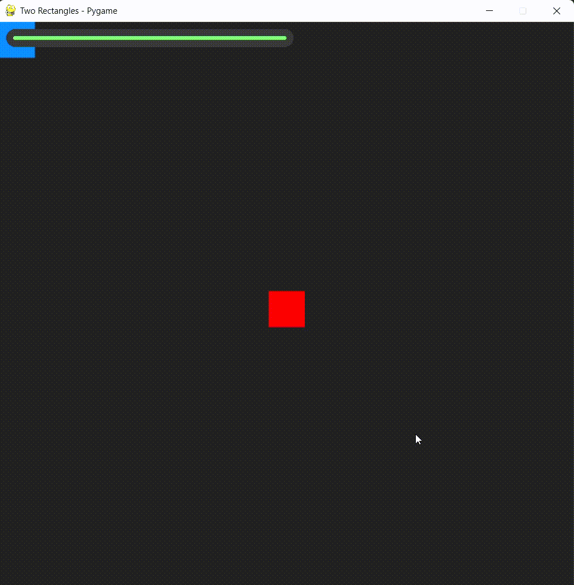
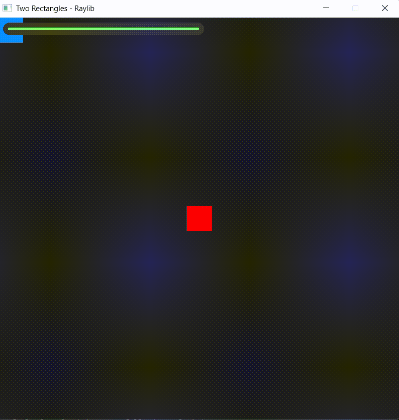

# Health Bar

This example showcases a simple game loop with a health-bar that goes down and a working death menu that appears when health reaches 0.

!!! info "Highlighted Lines"
    The highlighted lines in the code is all the UI code that makes everything possible.

### Choose your Backend

=== "Pygame"

    

    ```python title="game_pygame.py" linenums="1" hl_lines="74-93"
    from abc import ABC, abstractmethod

    import pygame as py
    import coshui as cui

    WIDTH, HEIGHT = 800, 800

    class Entity(ABC):
        def __init__(self, x, y, w, h, color):
            self.x = x
            self.y = y
            self.width = w
            self.height = h
            self.color = color

        @abstractmethod
        def draw(self, screen):
            pass

        @abstractmethod
        def update(self):
            pass

    class Player(Entity):
        def __init__(self, x, y, w, h, color):
            super().__init__(x, y, w, h, color)
            self.speed = 5
            self.health = 100

        def draw(self, screen):
            py.draw.rect(screen, self.color, (self.x, self.y, self.width, self.height))

        def update(self):
            keys = py.key.get_pressed()
            if keys[py.K_a]:
                self.x -= self.speed
            if keys[py.K_d]:
                self.x += self.speed
            if keys[py.K_w]:
                self.y -= self.speed
            if keys[py.K_s]:
                self.y += self.speed

    class Game():
        def __init__(self, width, height):
            self.width = width
            self.height = height
            self.screen = py.display.set_mode((self.width, self.height))
            py.display.set_caption("Two Rectangles - Pygame")

            self.clock = py.time.Clock()
            self.running = True

            self.player = Player(0, 0, 50, 50, (0, 120, 255))

            center_x = (self.width // 2) - 25
            center_y = (self.height // 2) - 25
            self.center_rect = py.Rect(center_x, center_y, 50, 50)
        
        def run(self):
            while self.running:
                for event in py.event.get():
                    if event.type == py.QUIT:
                        self.running = False
                
                self.update()
                
                self.screen.fill((30, 30, 30)) 

                py.draw.rect(self.screen, (255, 0, 0), self.center_rect)

                self.player.draw(self.screen)
                
                # Draw the UI
                with cui.CoshUIRenderer(cui.PygameBackend(self.screen)):
                    with cui.Container(id="root", padding=10):
                        with cui.Container(id="health_container", width=400, height=25, padding=10, style=cui.CoshStyling(background_color=(50, 50, 50), border_radius=20)):
                            # It's self.player.health * 3.8 because to get the right width it's: player.health * ((parent_width - (parent_padding * 2)) / 100) / 100
                            with cui.Container(id="health_bar", width=max(0, self.player.health * 3.8), height=cui.FILL, style=cui.CoshStyling(background_color=(100, 255, 100), border_radius=20)):
                                pass
                    if self.player.health <= 0:
                        with cui.Container(id="second_root", width=WIDTH, height=HEIGHT, positioning=cui.ABSOLUTE, align=cui.ALIGN_CENTER, justify=cui.JUSTIFY_CENTER):
                            with cui.Container(id="dead_container", direction=cui.COLUMN, align=cui.ALIGN_CENTER, justify=cui.JUSTIFY_CENTER, gap=20):
                                cui.Label(id="title", text="You Died!", font_size=74, text_color=(255, 10, 10))
                                cui.Button(id="restart_btn", text="Restart")
                                cui.Button(id="quit_btn", text="Quit")
                
                if cui.get_signal("quit_btn", cui.CLICKED):
                    self.running = False

                if cui.get_signal("restart_btn", cui.CLICKED):
                    self.player.x, self.player.y = 0, 0
                    self.player.health = 100

                py.display.flip()
                self.clock.tick(60)
                
            py.quit()

        def update(self):
            self.player.update()

            player_rect = py.Rect(self.player.x, self.player.y, self.player.width, self.player.height)

            if player_rect.colliderect(self.center_rect):
                self.player.health = max(0, self.player.health - 1)

    def main():
        py.init()
        game = Game(WIDTH, HEIGHT)
        game.run()

    if __name__ == "__main__":
        main()
    ```

=== "Raylib"

    

    ```python title="game_raylib.py" linenums="1" hl_lines="69-81 85-90"
    from abc import ABC, abstractmethod

    import raylibpy as rl
    import coshui as cui

    WIDTH, HEIGHT = 800, 800

    class Entity(ABC):
        def __init__(self, x, y, w, h, color):
            self.x = x
            self.y = y
            self.width = w
            self.height = h
            self.color = color

        @abstractmethod
        def draw(self):
            pass

        @abstractmethod
        def update(self):
            pass

    class Player(Entity):
        def __init__(self, x, y, w, h, color):
            super().__init__(x, y, w, h, color)
            self.speed = 5
            self.health = 100

        def draw(self):
            rl.draw_rectangle(int(self.x), int(self.y), int(self.width), int(self.height), self.color)

        def update(self):
            if rl.is_key_down(rl.KEY_A):
                self.x -= self.speed
            if rl.is_key_down(rl.KEY_D):
                self.x += self.speed
            if rl.is_key_down(rl.KEY_W):
                self.y -= self.speed
            if rl.is_key_down(rl.KEY_S):
                self.y += self.speed

    class Game:
        def __init__(self, width, height):
            self.width = width
            self.height = height
            
            rl.init_window(self.width, self.height, "Two Rectangles - Raylib")
            rl.set_target_fps(60)

            self.player = Player(0, 0, 50, 50, rl.Color(0, 120, 255, 255))

            center_x = (self.width // 2) - 25
            center_y = (self.height // 2) - 25
            self.center_rect = rl.Rectangle(center_x, center_y, 50, 50)
            self.center_color = rl.Color(255, 0, 0, 255)

        def run(self):
            while not rl.window_should_close():
                self.update()

                rl.begin_drawing()
                rl.clear_background(rl.Color(30, 30, 30, 255))

                rl.draw_rectangle_rec(self.center_rect, self.center_color)

                self.player.draw()
                
                # Draw the UI
                with cui.CoshUIRenderer(cui.RaylibBackend()):
                    with cui.Container(id="root", padding=10):
                        with cui.Container(id="health_container", width=400, height=25, padding=10, style=cui.CoshStyling(background_color=(50, 50, 50), border_radius=20)):
                            # It's self.player.health * 3.8 because to get the right width it's: player.health * ((parent_width - (parent_padding * 2)) / 100) / 100
                            with cui.Container(id="health_bar", width=max(0, self.player.health * 3.8), height=cui.FILL, style=cui.CoshStyling(background_color=(100, 255, 100), border_radius=20)):
                                pass
                    if self.player.health <= 0:
                        with cui.Container(id="second_root", width=WIDTH, height=HEIGHT, positioning=cui.ABSOLUTE, align=cui.ALIGN_CENTER, justify=cui.JUSTIFY_CENTER):
                            with cui.Container(id="dead_container", direction=cui.COLUMN, align=cui.ALIGN_CENTER, justify=cui.JUSTIFY_CENTER, gap=20):
                                cui.Label(id="title", text="You Died!", font_size=74, text_color=(255, 10, 10))
                                cui.Button(id="restart_btn", text="Restart")
                                cui.Button(id="quit_btn", text="Quit")
                
                rl.end_drawing()
                
                if cui.get_signal("quit_btn", cui.CLICKED):
                    break
                
                if cui.get_signal("restart_btn", cui.CLICKED):
                    self.player.x, self.player.y = 0, 0
                    self.player.health = 100
                
            rl.close_window()

        def update(self):
            self.player.update()

            player_rect = rl.Rectangle(self.player.x, self.player.y, self.player.width, self.player.height)
            
            if rl.check_collision_recs(player_rect, self.center_rect):
                self.player.health = max(0, self.player.health - 1)

    def main():
        game = Game(WIDTH, HEIGHT)
        game.run()

    if __name__ == "__main__":
        main()
    ```

