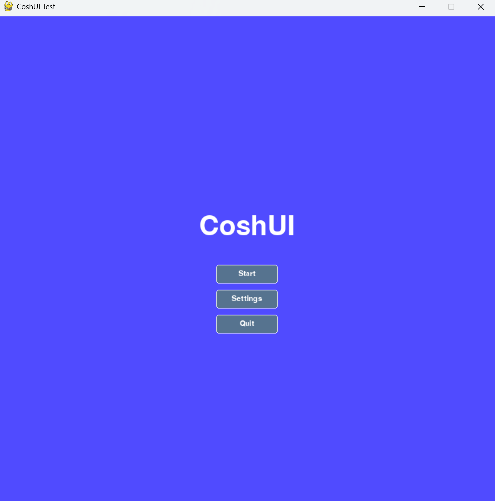

---
hide:
 -toc
 -navigation
---

# CoshUI

The declarative — backend-agnostic UI engine for Python.

---

## What is CoshUI?

Before the pitchforks fly, I have one thing to clarify. **CoshUI is not a replacement for massive desktop UI libraries like Tkinter, PyQt, or CustomTkinter.** 

If you're building a standard database management app, a spreadsheet tool, or an enterprise form layout, you should probably stick to those. They are great at what they do.

CoshUI was built for a completely different purpose. Game Development Loops.

Inside frameworks like **Pygame** or **Raylib**, the Python UI Libraries made for them are either old and outdated, overly complex, or both. CoshUI is a UI library inspired by CSS, Godot, Dear ImGui, and React — taking their architectural ideas for UI and creating somewhat of a mix.

---

## CoshUI API & Visual

Stop hardcoding raw pixel coordinates (`x=150, y=300`) for every single button. CoshUI lets you declare intent using Python's native `with` context managers — creating natural and responsive layouts that can be easy to read but also highly customizable.

=== "How the Code Looks"

    ```python title="pygame_test.py"
    import coshui as cui
    import pygame as py
    
    ...

    # Within Main Loop
    with cui.CoshUIRenderer(cui.PygameBackend(screen)):
        with cui.Container(id="container_1", width=cui.FILL, height=cui.FILL, padding=20, align=cui,ALIGN_CENTER, justify=cui.JUSTIFY_CENTER, style=cui.CoshStyling(background_color=(80, 75, 255))):
            with cui.Container(id="menu_stack", direction=cui.COLUMN, gap=10, align=cui.ALIGN_CENTER):
                cui.Label(id="title", text="CoshUI", font_size=64) 
                cui.Button(id="start_btn", text="Start Game")
                cui.Button(id="settings_btn", text="Settings")
                cui.Button(id="quit_btn", text="Quit")
    ```

=== "The "Cool Rectangles" It Renders"

    

---

## Why Use It?

!!! warning "A Fair Warning"
    CoshUI is built explicitly to be lightweight and modular. It handles the layout math, state synchronization and reconciliation, tween animations, and signal delegation, then hands an instruction manual of how to render each node to your backend wrapper. It does exactly what it needs to do — nothing more, nothing less.

<div class="grid cards" markdown>

-   :material-layers-triple:{ .lg .middle } **Backend Agnostic Architecture**
    
    ---

    The core layout engine doesn't care how pixels hit the screen. It compiles boundaries into light instruction tokens, easily swapping between **Pygame**, **Raylib**, or raw **OpenGL**.

-   :material-sync:{ .lg .middle } **State Persistence & Animation Loops**

    ---

    Features a centralized state storage registry that synchronizes and reconciliates with the last frame. Your animations cleanly intercept and modify state values *before* the layout rules execute.

-   :material-gesture-tap:{ .lg .middle } **Additive Signal Register**

    ---

    Say goodbye to messy callback chains. The interaction system reverses the render stack, maps rotated mouse vectors against node matrices, and streams events safely into a queryable signal register.

</div>

---

## Jump In

<div class="grid cards" markdown>

-   **Get Started**

    [:octicons-arrow-right-24: Installation Guide](introduction/installation.md){ data-preview }

-   **Build Your First UI**

    [:octicons-arrow-right-24: Your First UI Tutorial](introduction/your-first-ui.md){ data-preview }

-   **Read the Architecture**

    [:octicons-arrow-right-24: API Reference Docs](learn-the-api/getting-started.md){ data-preview }

-   **Check What is New**

    [:octicons-arrow-right-24: Chngelog Updates](changelog.md){ data-preview }
</div>