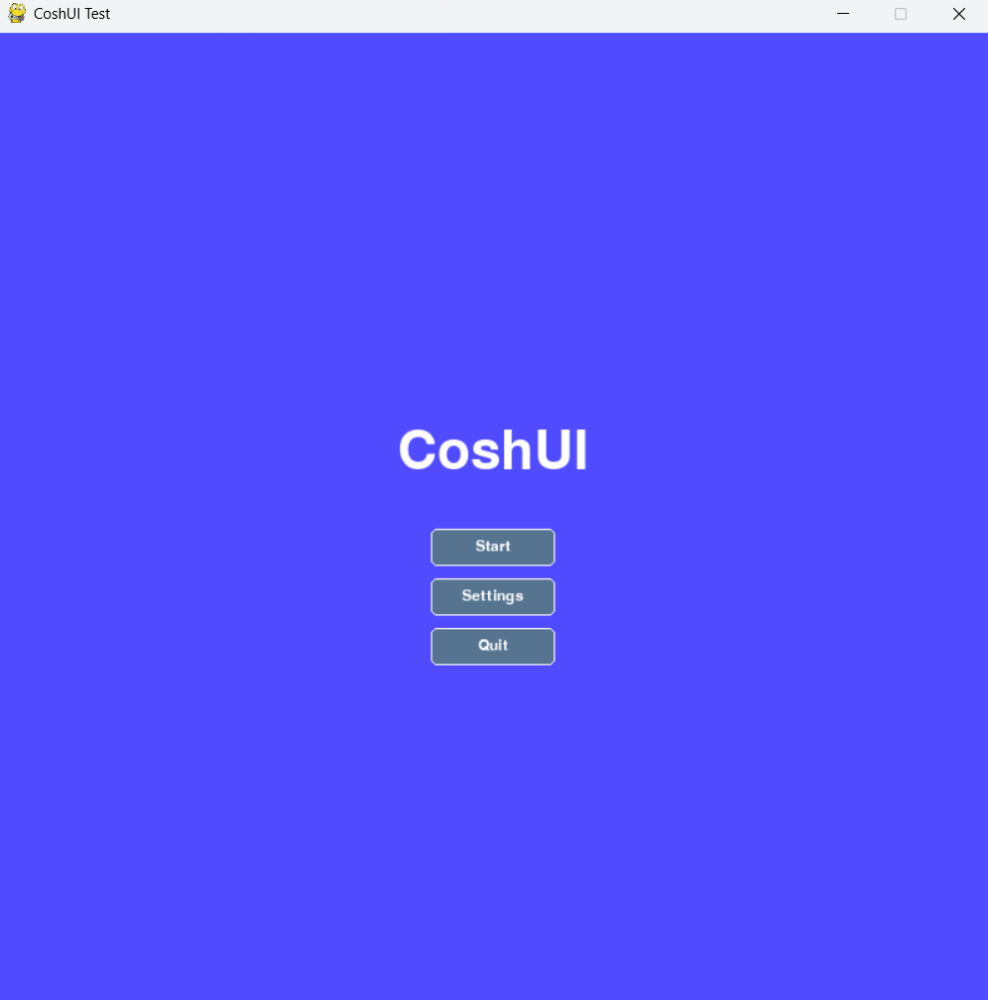

---
hide:
 - toc
 - navigation
 - title
---

<div style="margin-bottom: 1.5rem;" markdown>

## A UI library for Python Game-development
UI has been one of the hardest parts for Python game development. Users either have to ship their own UI tooling or use ones that are old, ugly, outdated, or too complex for the simple problem.  

CoshUI is different, it's something you add into your game loop — completely side stepping the complexity of external DSLs — and define the UI *you* want straight in Python.

</div>

---

<h2>An Example with Pygame</h2>
<p>CoshUI lets you build UIs that slot into any game loop easily.</p>

<div style="display: flex; align-items: center; justify-content: center;">

</div>

??? note "UI Code"
    The code highlighted within the code block is all that is needed to produce the image above.
    ```python title="pygame_main.py" hl_lines="22-31"
    import coshui as cui
    import pygame as py

    WIDTH, HEIGHT = 800, 800
    FPS = 60
    BLACK = (0, 0, 0)

    def main():
        py.init()
        screen = py.display.set_mode((WIDTH, HEIGHT))
        py.display.set_caption("Pygame CoshUI Test")
        clock = py.time.Clock()

        running = True
        while running:
            for event in py.event.get():
                if event.type == py.QUIT:
                    running = False

            screen.fill(BLACK)

            with cui.CoshUIRenderer(cui.PygameBackend(screen)):
                with cui.Container(id="container_1", width=cui.FILL, height=cui.FILL, padding=20, align=cui.ALIGN_CENTER, justify=cui.JUSTIFY_CENTER, style=cui.CoshStyling(background_color=(80, 75, 255))):
                    with cui.Container(id="menu_stack", direction=cui.COLUMN, gap=10, align=cui.ALIGN_CENTER):
                        cui.Label(id="title", text="CoshUI", font_size=64) 
                        cui.Button(id="start_btn", text="Start Game")
                        cui.Button(id="settings_btn", text="Settings")
                        cui.Button(id="quit_btn", text="Quit")

            if cui.get_signal("quit_btn", cui.CLICKED):
                running = False

            py.display.flip()
            clock.tick(FPS)

        py.quit()

    if __name__ == "__main__":
        main()
    ```
---

## Use anywhere
CoshUI is a hybrid between immediate and retained mode UI, meaning it slots into your game loop. It doesn't take over the loop nor does it lock you within a specific framework. It is fully backend agnostic, meaning code that runs in Pygame can also run in ModernGL with GLFW or Raylibpy by switching one line.

## Jump In

<div class="grid cards" markdown>

-   **Get Started**

    [:octicons-arrow-right-24: Installation Guide](introduction/installation.md){ data-preview }

-   **Build Your First UI**

    [:octicons-arrow-right-24: Your First UI Tutorial](introduction/your-first-ui.md){ data-preview }

-   **Read the Architecture**

    [:octicons-arrow-right-24: API Reference Docs](learn-the-api/getting-started.md){ data-preview }

-   **Check What is New**

    [:octicons-arrow-right-24: Changelog Updates](changelog.md){ data-preview }
</div>

