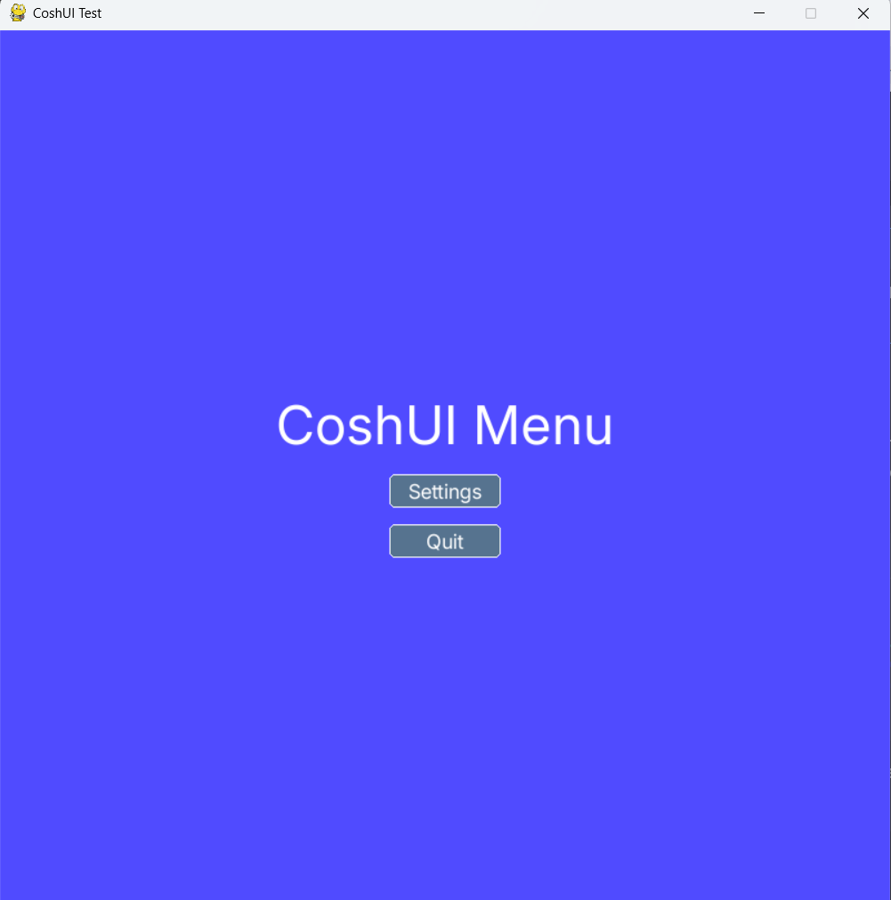
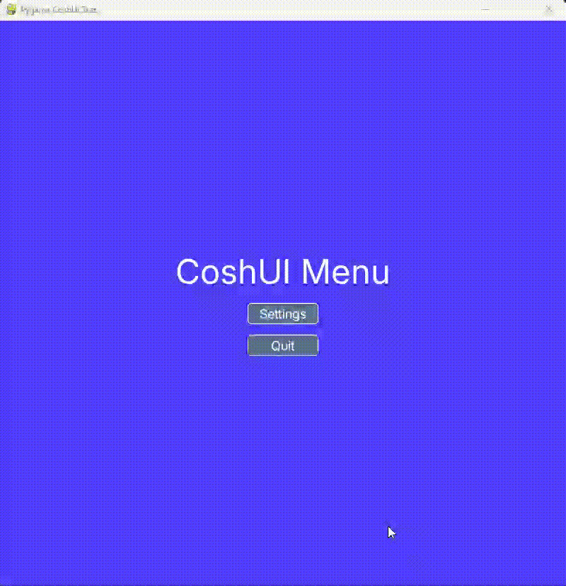
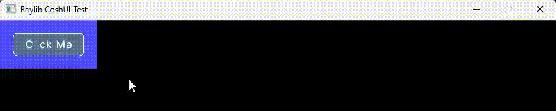
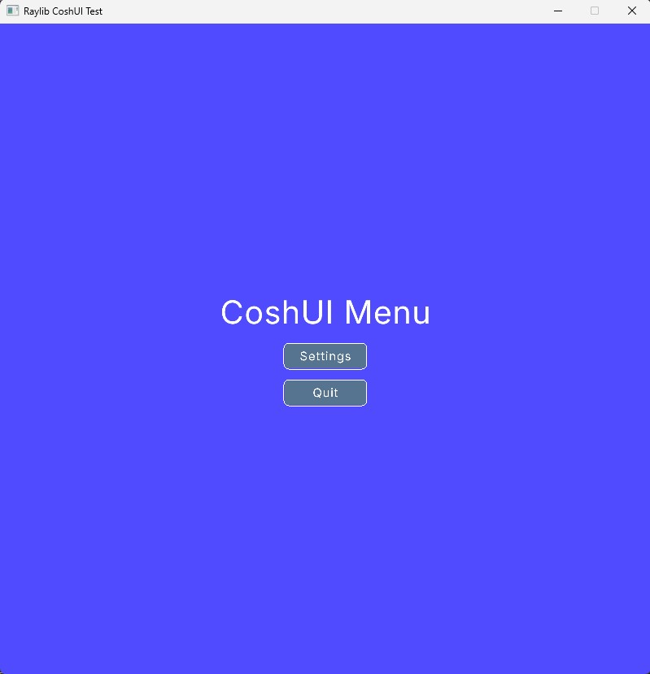
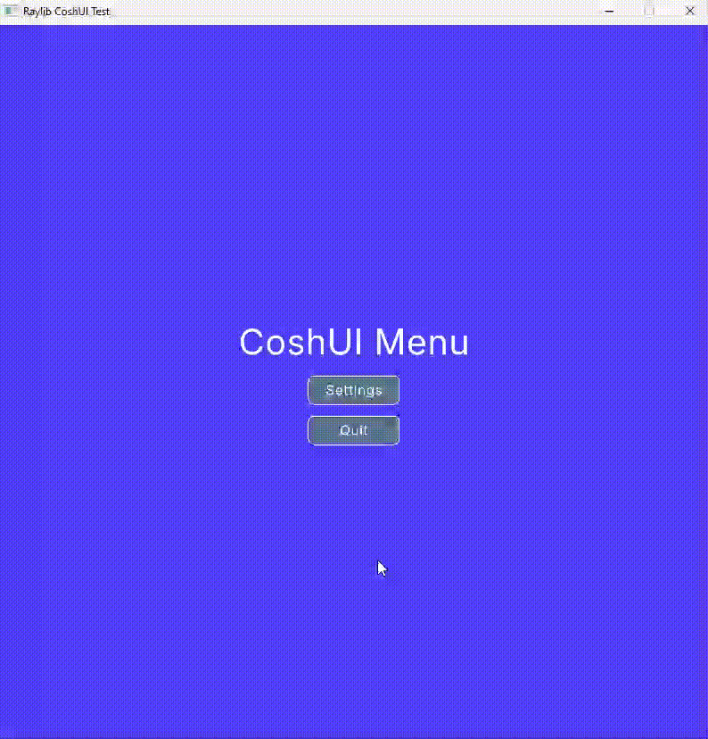

---
hide:
 -toc
---

# Your First UI

Choose the Backend you want to follow.

!!! info "Important"
    The file with the discussed code will be at the very end of each section.

### Backends

=== "Pygame"
    ## Prerequisites

    - `Python v3.10+`
    - `coshui` package
    - `pygame` dependency

    If you haven't met these requirements, please go [here](installation.md)

    ## Step By Step

    I'm guessing you've now just installed CoshUI and want to learn how to create your first UI. Well you're in luck, in CoshUI, getting started is not hard. I'll lead you through to quickly implementing your first ever UI using CoshUI.

    ### Step 1:
    **Start with creating your python file and importing `coshui` and `pygame`.**  

    ```python title="main.py"
    # For the sake of this tutorial, we'll be importing everything from coshui.
    from coshui import * 
    import pygame
    ```

    ### Step 2:
    **Create your constants, your main() function, initialize `pygame`, and start your main loop.**

    ```python title="main.py"
    WIDTH, HEIGHT = 800, 800
    FPS = 60
    BLACK = (0, 0, 0)

    def main():
        pygame.init()
        screen = pygame.display.set_mode((WIDTH, HEIGHT))
        pygame.display.set_caption("CoshUI Test")
        clock = pygame.time.Clock()

        running = True
        while running:
            for event in pygame.event.get():
                if event.type == pygame.QUIT:
                    running = False
    
            screen.fill(BLACK)

            pygame.display.flip()
            clock.tick(FPS)

        pygame.quit()

    if __name__ == "__main__":
        main()
    ```

    ### Step 3:
    **Once you have the boilerplate down, it's time to create your first UI. Between `screen.fill(BLACK)` and `pygame.display.flip()`, write `with CoshUIRenderer(PygameBackend(screen))`.**

    ```python title="main.py" hl_lines="15-16"
    def main():
        pygame.init()
        screen = pygame.display.set_mode((WIDTH, HEIGHT))
        pygame.display.set_caption("CoshUI Test")
        clock = pygame.time.Clock()

        running = True
        while running:
            for event in pygame.event.get():
                if event.type == pygame.QUIT:
                    running = False
    
            screen.fill(BLACK)

            with CoshUIRenderer(PygameBackend(screen)):
                pass

            pygame.display.flip()
            clock.tick(FPS)

        pygame.quit()
    ```

    **The `CoshUIRenderer` context is where your entire UI structure will live.**
    
    !!! warning "Multiple CoshUIRenderers"
        You **cannot** have multiple CoshUIRenderers. If you have multiple CoshUIRenderers running at once in the same loop, their layouts **WILL** overlap and UI interactions **WILL** break.

    **Now you may notice the `PygameBackend` takes in the `screen` variable, since pygame draws everything on its own `Surface` object, we pass on that surface to the backend for use.**

    ### Step 4:
    **With CoshUIRenderer down, we can finally create our UI structure. We'll start by creating a `Container` context and create a `Button` node within it.**

    ```python title="main.py"
        with CoshUIRenderer(PygameBackend(screen)):
            with Container(id="container_1", padding=20, style=CoshStyling(background_color=(80, 75, 255))):
                Button(id="btn", text="Click Me")
    ```

    **If you run this code, you should have a blue-ish colored container that has 20 padding with a button that says "Click Me" on the top left.**
    
    <figure markdown="span">
        
    </figure>
    
    !!! note "ID Requirement"
        It is best practice to give every Node you create an `id`. In the current version **{{ version }}** if a Node has no id, it is not **persistent** (we will get into this later).

    ### Step 5:   
    **Hopefully you've understood how CoshUI's context manager API works. With that, let's create a Start Menu with a working Quit Button and Settings Button that triggers a modal.**

    ```python title="main.py"
        with CoshUIRenderer(PygameBackend(screen)):
            with Container(id="container_1", width=FILL, height=FILL, style=CoshStyling(background_color=(80, 75, 255)), align=ALIGN_CENTER, justify=JUSTIFY_CENTER):
                with Container(id="main_container", direction=COLUMN, align=ALIGN_CENTER, justify=JUSTIFY_CENTER, gap=15):
                    Label(id="main_label", text="CoshUI Menu", font_size=48)
                    Button(id="settings_button", text="Settings")
                    Button(id="quit_button", text="Quit")
    ```

    **With that, we should have a decent looking Menu.**

    <figure markdown="span">
        { width=1000 }
    </figure>

    ### Step 6:
    **Now it's time to add a little bit of *interaction* to our UI. Using CoshUI's built-in interaction system, we can use the `get_signal()` function to capture events.**
    
    ```python title="main.py"
        with CoshUIRenderer(PygameBackend(screen)):
            with Container(id="container_1", width=FILL, height=FILL, style=CoshStyling(background_color=(80, 75, 255)), align=ALIGN_CENTER, justify=JUSTIFY_CENTER):
                with Container(id="main_container", direction=COLUMN, align=ALIGN_CENTER, justify=JUSTIFY_CENTER, gap=15):
                    Label(id="main_label", text="CoshUI Menu", font_size=48)
                    Button(id="settings_button", text="Settings")
                    Button(id="quit_button", text="Quit")

        if get_signal("quit_button", CLICKED):
            running = False
    ```

    !!! tip "Different Interactions"
        There are 6 different interactions that you can pass in for CoshUI, namely `CLICKED`, `RELEASED`, `PRESSED`, `HOVERED`, `HOVER_ENTER`, and lastly `HOVER_EXIT`. To learn more, go [here.](../learn-the-api/interactions/index.md)

    ### Step 7:
    **With our Quit Button working, we can move on to making a settings menu.**

    ```python title="main.py" hl_lines="4 7 31-32"
    WIDTH, HEIGHT = 800, 800
    FPS = 60
    BLACK = (0, 0, 0)
    settings_open = False

    def main():
        global settings_open
        pygame.init()
        screen = pygame.display.set_mode((WIDTH, HEIGHT))
        pygame.display.set_caption("CoshUI Test")
        clock = pygame.time.Clock()

        running = True
        while running:
            for event in pygame.event.get():
                if event.type == pygame.QUIT:
                    running = False

            screen.fill(BLACK)

            with CoshUIRenderer(PygameBackend(screen)):
                with Container(id="container_1", width=FILL, height=FILL, style=CoshStyling(background_color=(80, 75, 255)), align=ALIGN_CENTER, justify=JUSTIFY_CENTER):
                    with Container(id="main_container", direction=COLUMN, align=ALIGN_CENTER, justify=JUSTIFY_CENTER, gap=15):
                        Label(id="main_label", text="CoshUI Menu", font_size=48)
                        Button(id="settings_button", text="Settings")
                        Button(id="quit_button", text="Quit")

            if get_signal("quit_button", CLICKED):
                running = False

            if get_signal("settings_button", CLICKED):
                settings_open = not settings_open

            pygame.display.flip()
            clock.tick(FPS)

        pygame.quit()

    if __name__ == "__main__":
        main()
    ```

    **As you can see, we're toggling a boolean value whenever we click the settings button, which we can then use for conditional UI.**

    ### Step 8:
    **With our new settings_open boolean, we can add a quick if statement that opens up a modal.**

    ```python title="main.py" hl_lines="7-16"
        with CoshUIRenderer(PygameBackend(screen)):
            with Container(id="container_1", width=FILL, height=FILL, style=CoshStyling(background_color=(80, 75, 255)), align=ALIGN_CENTER, justify=JUSTIFY_CENTER):
                with Container(id="main_container", direction=COLUMN, align=ALIGN_CENTER, justify=JUSTIFY_CENTER, gap=15):
                    Label(id="main_label", text="CoshUI Menu", font_size=48)
                    Button(id="settings_button", text="Settings")
                    Button(id="quit_button", text="Quit")
                if settings_open:
                    with Modal(id="settings_modal", width=350, height=250, direction=COLUMN, align=ALIGN_CENTER, justify=JUSTIFY_START, gap=30, padding=20):
                        Label(id="settings_title", text="Settings", height=FILL)
                        with Container(id="sfx_container", width=FILL, height=FILL, justify=JUSTIFY_SPACE_BETWEEN, direction=ROW):
                            Label(id="sfx_label", text="SFX")
                            Checkbox(id="sfx_cb")
                        with Container(id="volume_container", width=FILL, height=FILL, justify=JUSTIFY_SPACE_BETWEEN, direction=ROW):
                            Label(id="volume_label", text="Volume")
                            Slider(id="volume_slider", width=100)
                        Button(id="close_button", text="Close", height=FILL, style=CoshStyling(background_color=(255, 50, 50)))
                            
        if get_signal("quit_button", CLICKED):
            running = False

        if get_signal("settings_button", CLICKED) or get_signal("close_button", CLICKED):
            settings_open = not settings_open
    ```

    <figure markdown="span">
        
    </figure>
    
    ### Step 9:
    **Great, we now have a settings menu we can open, but you might notice that our values aren't getting saved, let's use CoshUI's `Ref` object to bind to our values to make our values persistent and useable.**

    ```python title="main.py" hl_lines="5-6 22 25" 
    WIDTH, HEIGHT = 800, 800
    FPS = 60
    BLACK = (0, 0, 0)
    settings_open = False
    sfx_value = Ref(False)
    volume = Ref(0.0)

    ...

    # In UI tree
    with CoshUIRenderer(PygameBackend(screen)):
        with Container(id="container_1", width=FILL, height=FILL, style=CoshStyling(background_color=(80, 75, 255)), align=ALIGN_CENTER, justify=JUSTIFY_CENTER):
            with Container(id="main_container", direction=COLUMN, align=ALIGN_CENTER, justify=JUSTIFY_CENTER, gap=15):
                Label(id="main_label", text="CoshUI Menu", font_size=48)
                Button(id="settings_button", text="Settings")
                Button(id="quit_button", text="Quit")
            if settings_open:
                with Modal(id="settings_modal", width=350, height=250, direction=COLUMN, align=ALIGN_CENTER, justify=JUSTIFY_START, gap=30, padding=20):
                    Label(id="settings_title", text="Settings", height=FILL)
                    with Container(id="sfx_container", width=FILL, height=FILL, justify=JUSTIFY_SPACE_BETWEEN, direction=ROW):
                        Label(id="sfx_label", text="SFX")
                        Checkbox(id="sfx_cb", bind=sfx_value, checked=sfx_value.value)
                    with Container(id="volume_container", width=FILL, height=FILL, justify=JUSTIFY_SPACE_BETWEEN, direction=ROW):
                        Label(id="volume_label", text="Volume")
                        Slider(id="volume_slider", width=100, bind=volume, value=volume.value)
                    Button(id="close_button", text="Close", height=FILL, style=CoshStyling(background_color=(255, 50, 50)))         
    ```

    **As you can see, we bind the References to our Checkbox and Slider nodes, and we use that value within it's properties that determine it's state.**

    ### Step 10:
    **This tutorial is slowly coming to a close, but before everything ends, let's polish our UI a little bit by adding *animations* using CoshUI's built-in animation system.**

    ```python title="main.py" hl_lines="8 21-29"
    with CoshUIRenderer(PygameBackend(screen)):
        with Container(id="container_1", width=FILL, height=FILL, style=CoshStyling(background_color=(80, 75, 255)), align=ALIGN_CENTER, justify=JUSTIFY_CENTER):
            with Container(id="main_container", direction=COLUMN, align=ALIGN_CENTER, justify=JUSTIFY_CENTER, gap=15):
                Label(id="main_label", text="CoshUI Menu", font_size=48)
                Button(id="settings_button", text="Settings")
                Button(id="quit_button", text="Quit")
            if settings_open:
                with Modal(id="settings_modal", width=350, height=250, direction=COLUMN, align=ALIGN_CENTER, justify=JUSTIFY_START, gap=30, padding=20, style=CoshStyling(alpha=0)):
                    Label(id="settings_title", text="Settings", height=FILL)
                    with Container(id="sfx_container", width=FILL, height=FILL, justify=JUSTIFY_SPACE_BETWEEN, direction=ROW):
                        Label(id="sfx_label", text="SFX")
                        Checkbox(id="sfx_cb", bind=sfx_value, checked=sfx_value.value)
                    with Container(id="volume_container", width=FILL, height=FILL, justify=JUSTIFY_SPACE_BETWEEN, direction=ROW):
                        Label(id="volume_label", text="Volume")
                        Slider(id="volume_slider", width=100, bind=volume, value=volume.value)
                    Button(id="close_button", text="Close", height=FILL, style=CoshStyling(background_color=(255, 50, 50)))         
    
    if get_signal("quit_button", CLICKED):
        running = False

    if get_signal("settings_button", CLICKED) or get_signal("close_button", CLICKED):
        if settings_open:
            animate("alpha", "settings_modal::content", 0, 1.0, "ease_in",
                on_complete=lambda: globals().__setitem__('settings_open', False))
            animate("alpha", "settings_modal::header", 0, 1.0, "ease_in")
        else:
            settings_open = True
            animate("alpha", "settings_modal::content", 255, 1.0, "ease_in")
            animate("alpha", "settings_modal::header", 255, 1.0, "ease_in")
    ```

    **The lambda is a little confusing, but you can use a different function to set the settings_open value to false and pass it in to the on_complete callable. It's just a little easier using this one-liner.** 
    
    ---
    
    So there we have it, a simple main menu screen with a settings menu, interactive widgets, and persistent state in Pygame using CoshUI. From here, you can proceed to the [Learn The API](../learn-the-api/getting-started.md) section to see everything CoshUI has to offer.  
    
    Also, here is the entire code file that we've built up:

    ```python title="main.py"
    from coshui import *
    import pygame as py

    WIDTH, HEIGHT = 800, 800
    FPS = 60
    BLACK = (0, 0, 0)
    settings_open = False 
    sfx_value = Ref(False)
    volume = Ref(0.0)

    def main():
        global settings_open
        py.init()
        screen = py.display.set_mode((WIDTH, HEIGHT))
        py.display.set_caption("Pygame CoshUI Test")
        clock = py.time.Clock()

        running = True
        while running:
            for event in py.event.get():
                if event.type == py.QUIT:
                    running = False

            screen.fill(BLACK)

            with CoshUIRenderer(PygameBackend(screen)):
                with Container(id="container_1", width=FILL, height=FILL, style=CoshStyling(background_color=(80, 75, 255)), align=ALIGN_CENTER, justify=JUSTIFY_CENTER):
                    with Container(id="main_container", direction=COLUMN, align=ALIGN_CENTER, justify=JUSTIFY_CENTER, gap=15):
                        Label(id="main_label", text="CoshUI Menu", font_size=48)
                        Button(id="settings_button", text="Settings")
                        Button(id="quit_button", text="Quit")
                    if settings_open:
                        with Modal(id="settings_modal", width=350, height=250, direction=COLUMN, align=ALIGN_CENTER, justify=JUSTIFY_START, gap=30, padding=20, style=CoshStyling(alpha=0)):
                            Label(id="settings_title", text="Settings", height=FILL)
                            with Container(id="sfx_container", width=FILL, height=FILL, justify=JUSTIFY_SPACE_BETWEEN, direction=ROW):
                                Label(id="sfx_label", text="SFX")
                                Checkbox(id="sfx_cb", bind=sfx_value, checked=sfx_value.value)
                            with Container(id="volume_container", width=FILL, height=FILL, justify=JUSTIFY_SPACE_BETWEEN, direction=ROW):
                                Label(id="volume_label", text="Volume")
                                Slider(id="volume_slider", width=100, bind=volume, value=volume.value)
                            Button(id="close_button", text="Close", height=FILL, style=CoshStyling(background_color=(255, 50, 50)))         
            
            if get_signal("quit_button", CLICKED):
                running = False

            if get_signal("settings_button", CLICKED) or get_signal("close_button", CLICKED):
                if settings_open:
                    animate("alpha", "settings_modal::content", 0, 1.0, "ease_in",
                        on_complete=lambda: globals().__setitem__('settings_open', False))
                    animate("alpha", "settings_modal::header", 0, 1.0, "ease_in")
                else:
                    settings_open = True
                    animate("alpha", "settings_modal::content", 255, 1.0, "ease_in")
                    animate("alpha", "settings_modal::header", 255, 1.0, "ease_in")

            py.display.flip()
            clock.tick(FPS)

        py.quit()

    if __name__ == "__main__":
        main()
    ```

=== "Raylib"

    ## Prerequisites

    - `Python v3.10+`
    - `coshui` package
    - `raylibpy` dependency

    If you haven't met these requirements, please go [here](installation.md)

    ## Step By Step

    I'm guessing you've now just installed CoshUI and want to learn how to create your first UI. Well you're in luck, in CoshUI, getting started is not hard. I'll lead you through to quickly implementing your first ever UI using CoshUI.

    ### Step 1:
    **Start with creating your python file and importing `coshui` and `raylibpy`.**

    ```python title="main.py"
    # For the sake of this tutorial, we'll be importing everything from coshui.
    from coshui import *
    import raylibpy as rl
    ```

    ### Step 2:
    **Create your constants, your main() function, initialize the Raylib window, and start your main loop.**

    ```python title="main.py"
    WIDTH, HEIGHT = 800, 800
    FPS = 60

    def main():
        rl.init_window(WIDTH, HEIGHT, "CoshUI Test")
        rl.set_target_fps(FPS)

        while not rl.window_should_close():
            rl.clear_background(rl.BLACK)
            rl.begin_drawing()
            
            # Draw Updates Here

            rl.end_drawing()

        rl.close_window()

    if __name__ == "__main__":
        main()
    ```

    !!! note "No Event Loop"
        Unlike Pygame, Raylib handles its own event polling internally. You don't need a manual event loop — `rl.window_should_close()` handles the quit condition automatically.

    ### Step 3:
    **Once you have the boilerplate down, it's time to create your first UI. Between `rl.begin_drawing()` and `rl.end_drawing()`, write `with CoshUIRenderer(RaylibBackend())`.**

    ```python title="main.py" hl_lines="9-10"
    def main():
        rl.init_window(WIDTH, HEIGHT, "CoshUI Test")
        rl.set_target_fps(FPS)

        while not rl.window_should_close():
            rl.clear_background(rl.BLACK)
            rl.begin_drawing()

            with CoshUIRenderer(RaylibBackend()):
                pass

            rl.end_drawing()

        rl.close_window()
    ```

    **The `CoshUIRenderer` context is where your entire UI structure will live.**

    !!! warning "Multiple CoshUIRenderers"
        You **cannot** have multiple CoshUIRenderers. If you have multiple CoshUIRenderers running at once in the same loop, their layouts **WILL** overlap and UI interactions **WILL** break.

    !!! note "RaylibBackend vs PygameBackend"
        Unlike `PygameBackend` which takes a `screen` surface, `RaylibBackend()` takes no arguments — Raylib manages its own window and drawing context internally.

    ### Step 4:
    **With CoshUIRenderer down, we can finally create our UI structure. We'll start by creating a `Container` context and create a `Button` node within it.**

    ```python title="main.py"
        with CoshUIRenderer(RaylibBackend()):
            with Container(id="container_1", padding=20, style=CoshStyling(background_color=(80, 75, 255))):
                Button(id="btn", text="Click Me")
    ```

    **If you run this code, you should have a blue-ish colored container that has 20 padding with a button that says "Click Me" on the top left.**

    <figure markdown="span">
        
    </figure>

    !!! note "ID Requirement"
        It is best practice to give every Node you create an `id`. In the current version **{{ version }}** if a Node has no id, it is not **persistent** (we will get into this later).

    !!! note "Visual Differences"
        You may notice slight visual differences between the Pygame and Raylib backends — minor font rendering and border radius differences are expected due to how each framework handles drawing internally. The layout behavior is identical.

    ### Step 5:
    **Hopefully you've understood how CoshUI's context manager API works. With that, let's create a Start Menu with a working Quit Button and Settings Button that triggers a modal.**

    ```python title="main.py"
        with CoshUIRenderer(RaylibBackend()):
            with Container(id="container_1", width=FILL, height=FILL, style=CoshStyling(background_color=(80, 75, 255)), align=ALIGN_CENTER, justify=JUSTIFY_CENTER):
                with Container(id="main_container", direction=COLUMN, align=ALIGN_CENTER, justify=JUSTIFY_CENTER, gap=15):
                    Label(id="main_label", text="CoshUI Menu", font_size=48)
                    Button(id="settings_button", text="Settings")
                    Button(id="quit_button", text="Quit")
    ```

    **With that, we should have a decent looking Menu.**

    <figure markdown="span">
        { width=1000 }
    </figure>

    ### Step 6:
    **Now it's time to add a little bit of *interaction* to our UI. Using CoshUI's built-in interaction system, we can use the `get_signal()` function to capture events.**

    ```python title="main.py"
        with CoshUIRenderer(RaylibBackend()):
            with Container(id="container_1", width=FILL, height=FILL, style=CoshStyling(background_color=(80, 75, 255)), align=ALIGN_CENTER, justify=JUSTIFY_CENTER):
                with Container(id="main_container", direction=COLUMN, align=ALIGN_CENTER, justify=JUSTIFY_CENTER, gap=15):
                    Label(id="main_label", text="CoshUI Menu", font_size=48)
                    Button(id="settings_button", text="Settings")
                    Button(id="quit_button", text="Quit")

        rl.end_drawing()

        if get_signal("quit_button", CLICKED):
            break;
    ```

    !!! tip "Different Interactions"
        There are 6 different interactions that you can pass in for CoshUI, namely `CLICKED`, `RELEASED`, `PRESSED`, `HOVERED`, `HOVER_ENTER`, and lastly `HOVER_EXIT`. To learn more, go [here.](../learn-the-api/interactions/index.md)

    ### Step 7:
    **With our Quit Button working, we can move on to making a settings menu.**

    ```python title="main.py" hl_lines="3 6 26-27"
    WIDTH, HEIGHT = 800, 800
    FPS = 60
    settings_open = False

    def main():
        global settings_open
        rl.init_window(WIDTH, HEIGHT, "CoshUI Test")
        rl.set_target_fps(FPS)

        while not rl.window_should_close():
            rl.clear_background(rl.BLACK)
            rl.begin_drawing()

            with CoshUIRenderer(RaylibBackend()):
                with Container(id="container_1", width=FILL, height=FILL, style=CoshStyling(background_color=(80, 75, 255)), align=ALIGN_CENTER, justify=JUSTIFY_CENTER):
                    with Container(id="main_container", direction=COLUMN, align=ALIGN_CENTER, justify=JUSTIFY_CENTER, gap=15):
                        Label(id="main_label", text="CoshUI Menu", font_size=48)
                        Button(id="settings_button", text="Settings")
                        Button(id="quit_button", text="Quit")

            rl.end_drawing()

            if get_signal("quit_button", CLICKED):
                break;

            if get_signal("settings_button", CLICKED):
                settings_open = not settings_open

        rl.close_window()

    if __name__ == "__main__":
        main()
    ```

    **As you can see, we're toggling a boolean value whenever we click the settings button, which we can then use for conditional UI.**

    ### Step 8:
    **With our new settings_open boolean, we can add a quick if statement that opens up a modal.**

    ```python title="main.py" hl_lines="7-16"
        with CoshUIRenderer(RaylibBackend()):
            with Container(id="container_1", width=FILL, height=FILL, style=CoshStyling(background_color=(80, 75, 255)), align=ALIGN_CENTER, justify=JUSTIFY_CENTER):
                with Container(id="main_container", direction=COLUMN, align=ALIGN_CENTER, justify=JUSTIFY_CENTER, gap=15):
                    Label(id="main_label", text="CoshUI Menu", font_size=48)
                    Button(id="settings_button", text="Settings")
                    Button(id="quit_button", text="Quit")
                if settings_open:
                    with Modal(id="settings_modal", width=350, height=250, direction=COLUMN, align=ALIGN_CENTER, justify=JUSTIFY_START, gap=30, padding=20):
                        Label(id="settings_title", text="Settings", height=FILL)
                        with Container(id="sfx_container", width=FILL, height=FILL, justify=JUSTIFY_SPACE_BETWEEN, direction=ROW):
                            Label(id="sfx_label", text="SFX")
                            Checkbox(id="sfx_cb")
                        with Container(id="volume_container", width=FILL, height=FILL, justify=JUSTIFY_SPACE_BETWEEN, direction=ROW):
                            Label(id="volume_label", text="Volume")
                            Slider(id="volume_slider", width=100)
                        Button(id="close_button", text="Close", height=FILL, style=CoshStyling(background_color=(255, 50, 50)))

        rl.end_drawing()

        if get_signal("quit_button", CLICKED):
            break;

        if get_signal("settings_button", CLICKED) or get_signal("close_button", CLICKED):
            settings_open = not settings_open
    ```

    <figure markdown="span">
        
    </figure>

    ### Step 9:
    **Great, we now have a settings menu we can open, but you might notice that our values aren't getting saved, let's use CoshUI's `Ref` object to bind to our values to make our values persistent and useable.**

    ```python title="main.py" hl_lines="4-5 21 24"
    WIDTH, HEIGHT = 800, 800
    FPS = 60
    settings_open = False
    sfx_value = Ref(False)
    volume = Ref(0.0)

    ...

    # In UI tree
    with CoshUIRenderer(RaylibBackend()):
        with Container(id="container_1", width=FILL, height=FILL, style=CoshStyling(background_color=(80, 75, 255)), align=ALIGN_CENTER, justify=JUSTIFY_CENTER):
            with Container(id="main_container", direction=COLUMN, align=ALIGN_CENTER, justify=JUSTIFY_CENTER, gap=15):
                Label(id="main_label", text="CoshUI Menu", font_size=48)
                Button(id="settings_button", text="Settings")
                Button(id="quit_button", text="Quit")
            if settings_open:
                with Modal(id="settings_modal", width=350, height=250, direction=COLUMN, align=ALIGN_CENTER, justify=JUSTIFY_START, gap=30, padding=20):
                    Label(id="settings_title", text="Settings", height=FILL)
                    with Container(id="sfx_container", width=FILL, height=FILL, justify=JUSTIFY_SPACE_BETWEEN, direction=ROW):
                        Label(id="sfx_label", text="SFX")
                        Checkbox(id="sfx_cb", bind=sfx_value, checked=sfx_value.value)
                    with Container(id="volume_container", width=FILL, height=FILL, justify=JUSTIFY_SPACE_BETWEEN, direction=ROW):
                        Label(id="volume_label", text="Volume")
                        Slider(id="volume_slider", width=100, bind=volume, value=volume.value)
                    Button(id="close_button", text="Close", height=FILL, style=CoshStyling(background_color=(255, 50, 50)))
    ```

    **As you can see, we bind the References to our Checkbox and Slider nodes, and we use that value within it's properties that determine it's state.**

    ### Step 10:
    **This tutorial is slowly coming to a close, but before everything ends, let's polish our UI a little bit by adding *animations* using CoshUI's built-in animation system.**

    ```python title="main.py" hl_lines="8 24-31"
    with CoshUIRenderer(RaylibBackend()):
        with Container(id="container_1", width=FILL, height=FILL, style=CoshStyling(background_color=(80, 75, 255)), align=ALIGN_CENTER, justify=JUSTIFY_CENTER):
            with Container(id="main_container", direction=COLUMN, align=ALIGN_CENTER, justify=JUSTIFY_CENTER, gap=15):
                Label(id="main_label", text="CoshUI Menu", font_size=48)
                Button(id="settings_button", text="Settings")
                Button(id="quit_button", text="Quit")
            if settings_open:
                with Modal(id="settings_modal", width=350, height=250, direction=COLUMN, align=ALIGN_CENTER, justify=JUSTIFY_START, gap=30, padding=20, style=CoshStyling(alpha=0)):
                    Label(id="settings_title", text="Settings", height=FILL)
                    with Container(id="sfx_container", width=FILL, height=FILL, justify=JUSTIFY_SPACE_BETWEEN, direction=ROW):
                        Label(id="sfx_label", text="SFX")
                        Checkbox(id="sfx_cb", bind=sfx_value, checked=sfx_value.value)
                    with Container(id="volume_container", width=FILL, height=FILL, justify=JUSTIFY_SPACE_BETWEEN, direction=ROW):
                        Label(id="volume_label", text="Volume")
                        Slider(id="volume_slider", width=100, bind=volume, value=volume.value)
                    Button(id="close_button", text="Close", height=FILL, style=CoshStyling(background_color=(255, 50, 50)))

    rl.end_drawing()

    if get_signal("quit_button", CLICKED):
        break;

    if get_signal("settings_button", CLICKED) or get_signal("close_button", CLICKED):
        if settings_open:
            animate("alpha", "settings_modal::content", 0, 1.0, "ease_in",
                on_complete=lambda: globals().__setitem__('settings_open', False))
            animate("alpha", "settings_modal::header", 0, 1.0, "ease_in")
        else:
            settings_open = True
            animate("alpha", "settings_modal::content", 255, 1.0, "ease_in")
            animate("alpha", "settings_modal::header", 255, 1.0, "ease_in")
    ```

    **The lambda is a little confusing, but you can use a different function to set the settings_open value to false and pass it in to the on_complete callable. It's just a little easier using this one-liner.**

    ---

    So there we have it, a simple main menu screen with a settings menu, interactive widgets, and persistent state in Raylib using CoshUI. From here, you can proceed to the [Learn The API](../learn-the-api/getting-started.md) section to see everything CoshUI has to offer.

    Also, here is the entire code file that we've built up:

    ```python title="main.py"
    from coshui import *
    import raylibpy as rl

    WIDTH, HEIGHT = 800, 800
    FPS = 60
    settings_open = False
    sfx_value = Ref(False)
    volume = Ref(0.0)

    def main():
        global settings_open
        rl.init_window(WIDTH, HEIGHT, "Raylib CoshUI Test")
        rl.set_target_fps(FPS)

        while not rl.window_should_close():
            rl.clear_background(rl.BLACK)
            rl.begin_drawing()

            with CoshUIRenderer(RaylibBackend()):
                with Container(id="container_1", width=FILL, height=FILL, style=CoshStyling(background_color=(80, 75, 255)), align=ALIGN_CENTER, justify=JUSTIFY_CENTER):
                    with Container(id="main_container", direction=COLUMN, align=ALIGN_CENTER, justify=JUSTIFY_CENTER, gap=15):
                        Label(id="main_label", text="CoshUI Menu", font_size=48)
                        Button(id="settings_button", text="Settings")
                        Button(id="quit_button", text="Quit")
                    if settings_open:
                        with Modal(id="settings_modal", width=350, height=250, direction=COLUMN, align=ALIGN_CENTER, justify=JUSTIFY_START, gap=30, padding=20, style=CoshStyling(alpha=0)):
                            Label(id="settings_title", text="Settings", height=FILL)
                            with Container(id="sfx_container", width=FILL, height=FILL, justify=JUSTIFY_SPACE_BETWEEN, direction=ROW):
                                Label(id="sfx_label", text="SFX")
                                Checkbox(id="sfx_cb", bind=sfx_value, checked=sfx_value.value)
                            with Container(id="volume_container", width=FILL, height=FILL, justify=JUSTIFY_SPACE_BETWEEN, direction=ROW):
                                Label(id="volume_label", text="Volume")
                                Slider(id="volume_slider", width=100, bind=volume, value=volume.value)
                            Button(id="close_button", text="Close", height=FILL, style=CoshStyling(background_color=(255, 50, 50)))

            rl.end_drawing()

            if get_signal("quit_button", CLICKED):
                break;

            if get_signal("settings_button", CLICKED) or get_signal("close_button", CLICKED):
                if settings_open:
                    animate("alpha", "settings_modal::content", 0, 1.0, "ease_in",
                        on_complete=lambda: globals().__setitem__('settings_open', False))
                    animate("alpha", "settings_modal::header", 0, 1.0, "ease_in")
                else:
                    settings_open = True
                    animate("alpha", "settings_modal::content", 255, 1.0, "ease_in")
                    animate("alpha", "settings_modal::header", 255, 1.0, "ease_in")

        rl.close_window()

    if __name__ == "__main__":
        main()
    ```

=== "PyOpenGL"

    <figure markdown="span">
        **Coming Soon...**
    </figure>