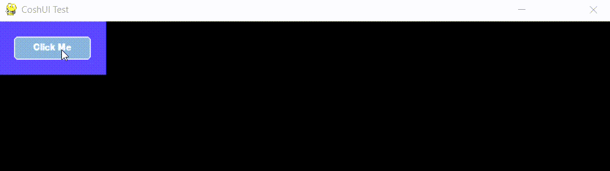

---
hide:
 -toc
---

# Your First UI

Choose the Backend you want to follow.

### Backends

=== "Pygame"

    ## Prerequisites

    - `Python v3.10+`
    - `coshui` package
    - `pygame` dependency

    If you haven't met these requirements, please go [here](installation.md)

    ## Step By Step

    I'm guessing you've now just installed CoshUI and want to learn how to create your first UI. Well you're in luck, in CoshUI, getting started is not hard. I'll lead you through to quickly implementing your first ever UI using CoshUI.

    ### Step 1:
    **Start with creating your python file and importing `coshui` and `pygame`.**  

    ```python title="main.py" linenums="1"
    # For the sake of this tutorial, we'll be importing 
    # everything set in __init__.py from the coshui package.
    import pygame
    from coshui import * 
    ```

    ### Step 2:
    **Create your constants, your main() function, initialize `pygame`, and start your main loop.**

    ```python title="main.py" linenums="6"
    WIDTH, HEIGHT = 800, 800
    FPS = 60
    BLACK = (0, 0, 0)

    def main():
        pygame.init()
        screen = pygame.display.set_mode((WIDTH, HEIGHT))
        pygame.display.set_caption("CoshUI Test")
        clock = pygame.time.Clock()

        running = True
        while running:
            for event in pygame.event.get():
                if event.type == pygame.QUIT:
                    running = False
    
            screen.fill(BLACK)

            pygame.display.flip()
            clock.tick(FPS)

        pygame.quit()

    if __name__ == "__main__":
        main()
    ```

    ### Step 3:
    **Once you have the boilerplate down, it's time to create your first UI. Between `screen.fill(BLACK)` and `pygame.display.flip()`, write `with CoshUIRenderer(PygameBackend(screen))`.**

    ```python title="main.py" linenums="10" hl_lines="15-16"
    def main():
        pygame.init()
        screen = pygame.display.set_mode((WIDTH, HEIGHT))
        pygame.display.set_caption("CoshUI Test")
        clock = pygame.time.Clock()

        running = True
        while running:
            for event in pygame.event.get():
                if event.type == pygame.QUIT:
                    running = False
    
            screen.fill(BLACK)

            with CoshUIRenderer(PygameBackend(screen)):
                pass

            pygame.display.flip()
            clock.tick(FPS)

        pygame.quit()
    ```

    **The `CoshUIRenderer` context is where your entire UI structure will live.**
    
    !!! warning "Multiple CoshUIRenderers"
        You can have multiple CoshUIRenderers, but it's best to keep it to only 1. If you have multiple CoshUIRenderers running at once in the same loop, their layouts **WILL** overlap.

    ### Step 4:
    **With CoshUIRenderer down, we can finally create our UI structure. We'll start by creating a `Container` context and create a `Button` node within it.**

    ```python title="main.py" linenums="24"
        with CoshUIRenderer(PygameBackend(screen)):
            with Container(id="container_1", layout=CoshLayout(padding=20), style=CoshStyling(background_color=(80, 75, 255))):
                Button(id="btn", text="Click Me")
    ```

    **If you run this code, you should have a light-blue colored container that has 20 padding with a button that says "Click Me" on the top left.**
    
    <figure markdown="span">
        
    </figure>
    
    !!! note "ID Requirement"
        It is best practice to give every Node you create an `id`. Though it's not fully required, if a Node has no id, it is not **persistent** (we will get into this later).

=== "PyOpenGL"

    ## Prerequisites

    - `Python v3.10+`
    - `coshui` package
    - `PyOpenGL` dependency

    If you haven't met these requirements, please go [here](installation.md)

    ## Step By Step

    I'm guessing you've now just installed CoshUI and want to learn how to create your first UI. Well you're in luck, in CoshUI, getting started is not hard. I'll lead you through quickly implementing your first ever UI using CoshUI.

    ### **Start with creating your python file and importing `coshui` and `OpenGL`.** 