---
hide:
 -toc
icon: octicons/terminal-16
---

# Your First UI

Choose the Backend you want to follow.

!!! info "Important"
    The file with the full, discussed code will be at the very end of each section.

### Backends

=== "Pygame"
    ## Prerequisites

    - `Python v3.10+`
    - `coshui` package
    - `pygame` dependency

    If you haven't met these requirements, please go [here.](installation.md)

    ---

    ## Basic Boilerplate
    To start us off, let's make the `Pygame` boilerplate that we'll use for this tutorial. If you're following along, make sure to copy this boilerplate into your file.
    
    **Do note that all UI related code that we will be working on will be within the highlighted line.**

    ```python title="pygame_test.py" hl_lines="21"
    import pygame as py
    import coshui as cui

    WIDTH, HEIGHT = 800, 800
    FPS = 60

    def main():
        py.init()
        screen = py.display.set_mode((WIDTH, HEIGHT))
        py.display.set_caption("Pygame CoshUI Test")
        clock = py.time.Clock()

        running = True
        while running:
            for event in py.event.get():
                if event.type == py.QUIT:
                    running = False

            screen.fill((0, 0, 0))

            # CoshUI Code Here

            py.display.flip()
            clock.tick(FPS)

        py.quit()

    if __name__ == "__main__":
        main()
    ```

    ---

    ## Setting Up CoshUIRenderer
    Let us move on to the *"body"* of CoshUI. `CoshUIRenderer()` is the "entry point" of the CoshUI engine, UI syntax will not work properly without it. To set it up, you must do this:
    !!! info "Highlight in Boilerplate"
        Remember to put this code within the highlighted part of the boilerplate.

    ```python title="pygame_test.py"
    with cui.CoshUIRenderer(cui.PygameBackend(screen)):
        pass
    ```

    All UI code runs within this context manager (`with` block). It registers all CoshUI nodes, determines their order of rendering, and gives you the ability to animate and interact with them for free.

    !!! note "Immediate and Retained Hybrid"
        A note to keep in mind is that CoshUI is inherently an "immediate mode" UI library, meaning it rebuilds every Node per frame. It gets away with signals and animations because it has an internal reconciliation layer that saves and sets state per frame.

    <details class="cui-collapse">
    <summary><span class="cui-collapse-chevron">▸</span>CoshUIRenderer Parameters</summary>
    <div class="cui-collapse-content" markdown="1">

    Before we move on, I'd like to discuss the *parameters* `CoshUIRenderer()` takes. It takes a `CoshBackend` instance for its first parameter and a `CoshMode` instance for its second. `CoshBackend` is easy to deduce, it's the backend that we pass based on what rendering pipeline we're using, but `CoshMode` might be a little confusing.

    `CoshMode` is defaulted to `NORMAL`, which makes it run normally. But one thing you can do is set it to `DEBUG`:
    ```python title="pygame_test.py"
    with cui.CoshUIRenderer(cui.PygameBackend(screen), cui.DEBUG):
        pass
    ```

    If set to `DEBUG`, it will open up a tkinter window that lets you see the entire UI structure and click individual Nodes to see their properties for that frame (similar to DevTools on a browser). This is helpful for whenever need to check values for each Node. 

    <figure align="center" markdown="span">
        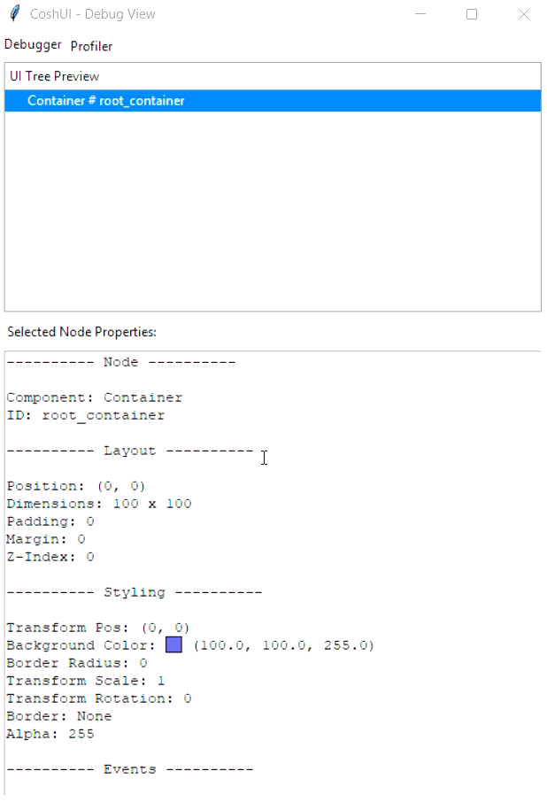{ width="500" }
        <figcaption>Gif of CoshUI's debugger.</figcaption>
    </figure>

    </div>
    </details>

    ---

    ## Declaring Your First Element
    Learning new UI libraries can be scary because of the new API you have to learn, but CoshUI is built to be easy to pick up without much resistance when building or migrating the UI. If you have experience with HTML then this might seem very familiar, if you don't then that's completely okay. Let's create our first `Container` as a Node instead of a Parent. Here's how that works:

    ```python title="pygame_test.py"
    with cui.CoshUIRenderer(cui.PygameBackend(screen)):
        cui.Container(id="root_container", width=100, height=100)
    ```
    
    If you've added that to your code and ran it, you might be confused as to why nothing is showing, well no need to worry about that for now, your `Container` is currently invisible because it has no color. We'll get into styling in the next section. 
    
    Back to our example above, that `Container` instance creates a box that is 100x100 in size on the top-left of the screen. An interesting part about `Containers` is that they can actually act as context managers that take in children like this:

    ```python title="pygame_test.py"
    with cui.CoshUIRenderer(cui.PygameBackend(screen)):
        with cui.Container(id="root_container", width=100, height=100):
            cui.Container(id="child_container", width=50, height=50)
    ```
    This arrangement creates a `Container` ***within*** the `root_container` that is 50x50 in size.

    !!! note "Node Types"
        From this, there might be some people thinking CoshUI is all about `Containers`, but the `Container` is one of many Nodes/Widgets in CoshUI. We'll get to the others soon.

    ---

    ## Styling Your First Element
    In other UI libraries, styling is mostly an afterthought. In CoshUI, styling is a primary part of the experience. To style a Node, you need to utilize CoshUI's `CoshStyling` object. It holds the properties that each Node needs to be visually distinct. 
    
    So let's first add a color to our `Container`. To set it, you can do this:

    ```python title="pygame_test.py"
    with cui.CoshUIRenderer(cui.PygameBackend(screen)):
        cui.Container(
            id="root_container", 
            width=100, height=100, 
            style=cui.CoshStyling(background_color=(100, 100, 255))
        )
    ```
    When run, this should show your 100x100 ***light blue-ish*** `Container` at the top-left of your window. 

    <figure markdown>
        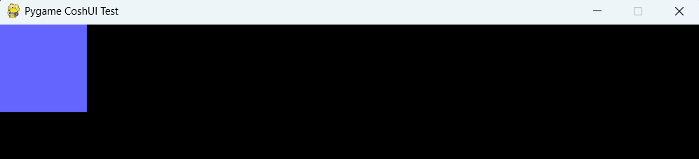
        <figcaption>Image of Blue 100x100 Container.</figcaption>
    </figure>

    <details class="cui-collapse">
    <summary><span class="cui-collapse-chevron">▸</span>CoshStyling Parameters</summary>
    <div class="cui-collapse-content" markdown="1">

    The `CoshStyling` object is what determines the visual identity of a Node. It offers a few parameters that let you change the entire look of a Node.

    #### Background Color and Alpha
    Background Color is almost a no-brainer. Its main purpose is to declare the color of the Node. It can be set like this: `background_color=(R, G, B)` or `background_color=(R, G, B, A)`.

    Alpha is also — again — a no-brainer. It determines the *transparency* of a Node. It can be set like this: `alpha=0-255`.

    You may notice, background color lets you set the alpha within it. Not to worry though, if the `alpha` field is set when the alpha value is set in `background_color`, the `alpha` field takes priority.

    #### Border
    Border sets an outline around a Node. It can be set like this: `border=((R, G, B), weight)` or `border=(R, G, B, weight)`

    #### Border Radius
    Border radius determines the *roundness* of a Node's corner. You can either set all corners or each individual corner like this: `border_radius=20` or `border_radius=(top-left, top-right, bottom-right, bottom-left)`

    #### Transforms
    CoshUI has ["transform" properties](../learn-the-api/getting-started.md#definition-of-terms){ data-preview }. Basically properties that only affect rendering, not layout.

    The first is `transform_position`, which lets you offset the node relative to its position. Basically (0, 50) means it moves 50 pixels downward from its current position. It can be set like this: `transform_position=(x, y)`

    The next one is `transform_scale`, which changes the **scale** of a Node with the default being 1.0. It can be set like this: `transform_scale=2.0` which makes the Node 2x bigger relative to its center.

    The last one is `transform_rotation`, which rotates the Node based counter-clockwise on the passed degree. It can be set like this: `transform_rotation=45.0` which tilts the node 45 degrees counter-clockwise.

    To learn more about styling, check the [Styling](../learn-the-api/styling/index.md){ data-preview } section in the API.  

    </div>
    </details>

    <details class="cui-collapse">
    <summary><span class="cui-collapse-chevron">▸</span>Reusable Styling Through Classes</summary>
    <div class="cui-collapse-content" markdown="1">
    
    If you've noticed, styling can be somewhat tedious, especially if it's the same styles applied to multiple Nodes. To make it easier, CoshUI has a *class* system that you can utilize to apply the same styles to many Nodes without re-declaring the same `CoshStyling` object. To use it you have to declare the class and the `CoshStyling` object **before** the main while loop like this:

    ```python title="pygame_test.py"
    # This is called BEFORE the while loop.
    cui.add_class(
        "example_class", 
        cui.CoshStyling(background_color=(255, 100, 100), border_radius=10, border=((255, 255, 255), 5))
    )
    ```

    with that, you can now pass in that style to a Node by passing it through the `classes` field with the string itself (`classes="example_class"`) or a list (`classes=["example_class"]`). Here's an example:

    ```python title="pygame_test.py"
    with cui.CoshUIRenderer(cui.PygameBackend(screen)):
        cui.Container(
            id="root_container", 
            width=100, height=100, 
            classes="example_class"
        )
    ```

    The cool thing about classes is that you can pass in ***multiple*** classes at the same time, so if you declare multiple classes with different styling for each, the Node will take in all of it like this: 

    ```python title="pygame_test.py"
    # Outside the while loop
    cui.add_class(
        "example_class", 
        cui.CoshStyling(background_color=(255, 100, 100), border_radius=10, border=((255, 255, 255), 5))
    )
    cui.add_class(
        "example_class2", 
        cui.CoshStyling(alpha=150)
    )

    # in CoshUIRenderer
    with cui.CoshUIRenderer(cui.PygameBackend(screen)):
        cui.Container(
            id="root_container", 
            width=100, height=100, 
            classes="example_class example_class2"
        )
    ```

    You can pass multiple classes like this where you just add in a space to the string, but if your class name itself has a space (for some reason), it's better to pass it through a list like this:

    ```python title="pygame_test.py"
    classes=["example_class", "example_class2"]
    ```

    !!! question "Class Ordering"
        A question appears with multiple classes, what styles get added if there are conflicting styles? In CoshUI, the classes that are added ***later*** in the `classes` field will override the ones added before. In the example above, if the two classes had conflicting properties, the one added latest will override the ones before. And of course, explicit styling (styles directly added  through the `style` field) takes highest priority.

        **Example:**
        ```python title="pygame_test.py"
        cui.add_class(
            "blue",
            cui.CoshStyling(background_color=(0, 0, 255))
        )

        cui.add_class(
            "red",
            cui.CoshStyling(background_color=(255, 0, 0))
        )

        cui.Container(
            classes="red blue"
        )
        ```
        In this example, the color of the Container will be blue.

    If you want to learn more about reusable styling, check out the [Classes](../learn-the-api/styling/classes.md){ data-preview } section in the API.

    </div>
    </details>

    ---
    
    ## Layout Fundamentals
    Before moving on, let's learn a little bit about the layout properties you can set which gives you maximum control over your UI. 
    
    As this is a little much to take on all at once, I've made every part collapsible so it's easier to digest one at a time.

    <details class="cui-collapse">
    <summary><span class="cui-collapse-chevron">▸</span>Width and Height</summary>
    <div class="cui-collapse-content" markdown="1">

    As shown in earlier sections, you can set width and height. These two properties are [Universal Properties](../learn-the-api/getting-started.md#definition-of-terms){ data-preview }, meaning they exist and can be set in every Node within CoshUI. They determine the size of your Node based on pixels. Here are the 4 ways to set width and height:

    ```python title="pygame_test.py"
    # Fixed
    cui.Container(
        width=100
    )
    # Fill
    cui.Container(
        width=cui.FILL
    )
    # AUTO
    cui.Container(
        width=cui.AUTO
    )
    # Percentage
    cui.Container(
        width=cui.PERCENTAGE(75)
    )
    ```

    To learn more, check out the [Width and Height](../learn-the-api/layout/width-and-height.md#introduction){ data-preview } section in the API.

    </div>
    </details>

    <details class="cui-collapse">
    <summary><span class="cui-collapse-chevron">▸</span>Padding and Margin</summary>
    <div class="cui-collapse-content" markdown="1">

    Margin is a [Universal Property](../learn-the-api/getting-started.md#definition-of-terms){ data-preview } whilst padding is a [Local Property](../learn-the-api/getting-started.md#definition-of-terms){ data-preview } and can only be set within `ParentNodes` (Nodes that can take in children). An example of a `ParentNode` would be `Container`. Margin is the property that dictates the space other nodes need to give around that specific Node, while padding dictates the distance the children should be from the edges of that `ParentNode`. You can set padding and margin like this:

    ```python title="pygame_test.py"
    cui.Container(padding=10,  margin=10)
    ```

    To learn more, check out the [Padding and Margin](../learn-the-api/layout/padding-and-margin.md#introduction){ data-preview } section in the API.

    </div>
    </details>

    <details class="cui-collapse">
    <summary><span class="cui-collapse-chevron">▸</span>Positioning</summary>
    <div class="cui-collapse-content" markdown="1">

    Positioning is a simple toggle in CoshUI. It determines whether a Node will be added to the layout calculations or not. The default is `RELATIVE`, meaning it will take up space and other Nodes will respect that space, setting it to `ABSOLUTE` makes it so that Node no longer gets added to layout calculations. Other Nodes will take that Node's space, kind of like it doesn't exist anymore to them. This also opens up the `x` and `y` parameters discussed next. Setting `positioning` is like this:

    ```python title="pygame_test.py"
    # ABSOLUTE
    cui.Container(positioning=cui.ABSOLUTE)
    # RELATIVE (This is default so there's no point in setting this)
    cui.Container(positioning=cui.RELATIVE)
    ```

    To learn more, check out the [Positioning](../learn-the-api/layout/absolute-vs-relative.md#introduction){ data-preview } section in the API.

    </div>
    </details>

    <details class="cui-collapse">
    <summary><span class="cui-collapse-chevron">▸</span>Position</summary>
    <div class="cui-collapse-content" markdown="1">

    Position in CoshUI refers to the `x` and `y` properties, and these are a bit *special*. It can only be mutated when the `positioning` parameter is set to `ABSOLUTE`, if not then adding values to `x` and `y` does nothing. What `x` and `y` do is directly offsets the position (relative to the parent) of the node *layout-wise*. To set `x` and `y`, you need to first set `positioning` to `ABSOLUTE` first, like this:

    ```python title="pygame_test.py"
    cui.Container(positioning=cui.ABSOLUTE, x=50, y=100)
    ```

    To learn more, check out the [Position](../learn-the-api/layout/position.md#introduction){ data-preview } section in the API.

    </div>
    </details>

    <details class="cui-collapse">
    <summary><span class="cui-collapse-chevron">▸</span>Align and Justify</summary>
    <div class="cui-collapse-content" markdown="1">

    The `align` and `justify` properties for CoshUI are [Local Properties](../learn-the-api/getting-started.md#definition-of-terms){ data-preview }, they are accessible only through `ParentNodes` like `Container` or `Grid`. They determine the position of that Nodes children within itself. They can be set like this:

    ```python title="pygame_test.py"
    # Note that these are only accessible through ParentNodes.
    cui.Container(align=cui.ALIGN_CENTER, justify=cui.JUSTIFY_CENTER)

    # These are the values you can set align and justify to.
    align=cui.ALIGN_START
    align=cui.ALIGN_CENTER
    align=cui.ALIGN_END
    justify=cui.JUSTIFY_START
    justify=cui.JUSTIFY_CENTER
    justify=cui.JUSTIFY_END
    justify=cui.JUSTIFY_SPACE_AROUND
    justify=cui.JUSTIFY_SPACE_BETWEEN
    justify=cui.JUSTIFY_SPACE_EVENLY
    ```

    As this is a complex topic, it is encouraged to check the [Align and Justify](../learn-the-api/layout/align-and-justify.md#introduction){ data-preview } section in the API.

    </div>
    </details>

    <details class="cui-collapse">
    <summary><span class="cui-collapse-chevron">▸</span>Gap</summary>
    <div class="cui-collapse-content" markdown="1">

    The `gap` property only exists in `ParentNodes`. It's a simple property, it all it does is determine the gap children will have between each other. Here's how to set it:

    ```python title="pygame_test.py"
    with cui.Container(gap=10):
        ...
    ```

    The example above makes it so the children of the `Container` will have a gap of 10 pixels between each other.

    </div>
    </details>

    <details class="cui-collapse">
    <summary><span class="cui-collapse-chevron">▸</span>Direction</summary>
    <div class="cui-collapse-content" markdown="1">

    The `direction` property is a property that only the `Container` widget possesses, it determines whether children will be placed horizontally or vertically. It's default value is `ROW` and setting it is simple:

    ```python title="pygame_test.py"
    with cui.Container(direction=cui.COLUMN):
        ...
    ```

    You can set it to both `ROW` and `COLUMN`, but `ROW` is default so there's no point in setting it unless you want to be explicit.

    </div>
    </details>

    ---

    ## Introducing Signals
    If you've used other UI frameworks, interaction systems usually use callback systems, which can be rather complex and a bit of a mess to set up. In CoshUI however, you can use what's called a "signal". Every Node will emit one, so if a Node is hovered over it will emit a `HOVERED` signal, if it is clicked it will emit a `CLICKED` signal. This comes automatically so users only need to poll those signals to check whether an event has happened to a Node or not, which lets you run your code if it has. 
    
    Let's declare a `Button()` — one of CoshUI's many widgets — and see how it works. Let's also make it so the Container's width and height fill the entire screen, here's how that will work:

    ```python title="pygame_test.py"
    with cui.CoshUIRenderer(cui.PygameBackend(screen)):
        with cui.Container(
            id="root_container", 
            width=cui.FILL, height=cui.FILL, 
            style=cui.CoshStyling(background_color=(100, 100, 255))
        ):
            cui.Button(id="example_button", text="Click to Print")
    ```
    If you run it, you might be able to notice the button having its own hover and click animations. That's an example of the signal system in action. Now to make it yourself, you need to make an `if` statement with the `get_signal()` function that CoshUI provides:

    ```python title="pygame_test.py"
    with cui.CoshUIRenderer(cui.PygameBackend(screen)):
        with cui.Container(
            id="root_container", 
            width=cui.FILL, height=cui.FILL, 
            style=cui.CoshStyling(background_color=(100, 100, 255))
        ):
            cui.Button(id="example_button", text="Click to Print")
    
    if cui.get_signal("example_button", cui.CLICKED):
        print("Hello World!")
    ```
    From the example, you can see that `get_signal()` takes in 2 parameters, the id of the Node you want to capture signals from and the event you want to poll. Once you click the button, it will now print `Hello World!` in the terminal.

    A nice thing about the signal system is that it works for every Node, not just buttons. If you want to see if a `Container` was clicked, you can poll it as long as it has an id. It's also additive, meaning if you make a signal on the same Node, it doesn't override others. 

    **Example:**
    ```python title="pygame_test.py"
    with cui.CoshUIRenderer(cui.PygameBackend(screen)):
        cui.Container(
            id="root_container", 
            width=cui.FILL, height=cui.FILL, 
            style=cui.CoshStyling(background_color=(100, 100, 255))
        )
    
    if cui.get_signal("root_container", cui.CLICKED):
        print("Hello World!")
    ```

    <details class="cui-collapse">
    <summary><span class="cui-collapse-chevron">▸</span>Mouse Filters</summary>
    <div class="cui-collapse-content" markdown="1">
    
    In CoshUI, there are ways to customize *how* a Node receives and consumes interaction events. We can achieve that with the `mouse_filter` field which is a [Universal Property](../learn-the-api/getting-started.md#definition-of-terms){ data-preview }. 

    The first value you can set `mouse_filter` to is `IGNORE`:

    ```python title="pygame_test.py"
    cui.Container(mouse_filter=cui.IGNORE)
    ```
    This makes it so the Node doesn't emit any signals while also letting Nodes below it receive the event.

    Next value is `PASS`:

    ```python title="pygame_test.py"
    cui.Container(mouse_filter=cui.PASS)
    ```
    This lets the interaction event *pass through* the Node whilst also emitting the signal.

    Last value is `STOP`:

    ```python title="pygame_test.py"
    cui.Container(mouse_filter=cui.STOP)
    ```
    This is the default value and makes it so it receives the event and consumes it, stopping the event from propagating to Nodes below.

    </div>
    </details>

    <details class="cui-collapse">
    <summary><span class="cui-collapse-chevron">▸</span>Different Interactions</summary>
    <div class="cui-collapse-content" markdown="1">

    As you may have already guessed, but there are quite a few interactions that can be passed in to the signal system. Here's what they are:

    ```python title="pygame_test.py"
    # Checks if the node was just clicked.
    cui.CLICKED
    
    # Checks if the node was just released from a click event.
    cui.RELEASED

    # Checks if the node is being clicked that frame.
    cui.PRESSED

    # Checks if the cursor entered the Node's boundaries.
    cui.HOVER_ENTER 

    # Checks if the cursor exited the Node's boundaries.
    cui.HOVER_EXIT 

    # Checks if the cursor is within the Node's boundaries. 
    cui.HOVERED 
    ```

    These can be passed to the second parameter of the `get_signal()` function. To learn more, check the [Signals](../learn-the-api/interactions/signals.md) section in the API.

    </div>
    </details>

    ---

    ## Introducing Animations
    When using other UI libraries, I'm willing to bet most of them have little to no built-in animation systems. Some may have external libraries that help with animations but for the most part, animations are either fully missing or not even considered a first-class citizen. 
    
    CoshUI is different, it has its own animation system built upon the reconciliation structure. You've most probably seen it work in the previous section as the `Button()` widget has built-in animations. 
    
    So let's address how to animate Nodes. CoshUI has an `animate()` function that takes in 5 parameters, `n_property`, `target_id`, `end_value`, `duration`, and finally `easing`. Here's an example of how it works:

    ```python title="pygame_test.py"
    if cui.get_signal("example_button", cui.CLICKED):
        cui.animate("transform_position", "example_button", (0, 50), 1.5, "ease_out_bounce")
    ```
    The example above shows a use case for animation, it makes it so if the button is clicked, it will animate its rendered position downwards 50 pixels in 1.5 seconds with an easing curve of "ease_out_bounce".

    <figure markdown>
        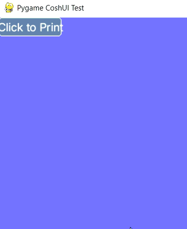
        <figcaption>Gif of button being clicked then falling.</figcaption>
    </figure>

    <details class="cui-collapse">
    <summary><span class="cui-collapse-chevron">▸</span>Properties and Easing Curves</summary>
    <div class="cui-collapse-content" markdown="1">

    As explained, CoshUI's animation system has many parameters, and some of them aren't very straightforward, especially the Node properties you can animate and the easing curves. Here's a comprehensive list of properties you can pass to CoshUI's `animate()` function.

    | Properties | Description |
    | :--- | :--- |
    | `background_color` | Smoothly shifts the Node's background to a new RGB color. |
    | `alpha` | Fades the Node in or out by easing its transparency toward the target value. |
    | `transform_position` | Glides the Node to a new offset position, without affecting layout. |
    | `transform_scale` | Grows or shrinks the Node toward the target scale, relative to its center. |
    | `transform_rotation` | Spins the Node counter-clockwise toward the target rotation, in degrees. |

    When it comes to easing curves, CoshUI's list is quite small currently but should be enough for most use cases. A quick note would be the `_in` suffix on the easing means the movement is applied at the beginning and the `_out` suffix means the movement is applied at the end. Here is CoshUI's list:

    | Easing Curves | Description |
    | :--- | :--- |
    | `linear` | Moves at a constant speed from start to finish — no acceleration or deceleration. |
    | `ease_in` | Starts slow and speeds up toward the end. |
    | `ease_out` | Starts fast and slows down toward the end. |
    | `ease_in_out` | Starts slow, speeds up in the middle, then slows down again at the end. |
    | `ease_in_bounce` | Bounces a few times right at the start before settling into motion. |
    | `ease_out_bounce` | Settles in with a few bounces at the end, like a ball coming to rest. |
    | `ease_in_elastic` | Winds up with a springy overshoot before snapping into motion. |
    | `ease_out_elastic` | Overshoots the target and wobbles back like a spring before settling. |

    To learn more about animations, check out the [Animation](../learn-the-api/animations/index.md) section in the API.

    </div>
    </details>

    ---

    ## Creating A Menu Screen
    Now that we've decently discussed CoshUI's capabilities, let's get on to actually creating something. We'll use the same boilerplate with the same `root_container` Container as declared but lets get back on track to actually making a basic version of something that you or someone might try making for a game. 

    ```python title="pygame_test.py"
    with cui.CoshUIRenderer(cui.PygameBackend(screen)):
        with cui.Container(id="root_container", width=cui.FILL, height=cui.FILL):
            pass
    ```
    With this container that fills the entire screen, we can then add a `Label()` widget acting as our game's title.

    ```python title="pygame_test.py"
    with cui.CoshUIRenderer(cui.PygameBackend(screen)):
        with cui.Container(id="root_container", width=cui.FILL, height=cui.FILL):
            cui.Label(id="title", text="CoshUI Test")
    ```
    If you run the file, you'll see our "CoshUI Test" label at the top-left. What we want is to put this at the very center, so let's use the `align` and `justify` parameters to put it to the center like this: 

    ```python title="pygame_test.py"
    with cui.CoshUIRenderer(cui.PygameBackend(screen)):
        with cui.Container(id="root_container", width=cui.FILL, height=cui.FILL, align=cui.ALIGN_CENTER, justify=cui.JUSTIFY_CENTER):
            cui.Label(id="title", text="CoshUI Test")
    ```
    If you followed everything correctly (or copy pasted the code), it should show "CoshUI Test" being at the middle of the screen. Let's add a couple of buttons to make it *look* like a menu screen shall we? Let's also wrap the `Label()` in a container so we can set the direction to `COLUMN` instead of `ROW`:

    ```python title="pygame_test.py"
    with cui.CoshUIRenderer(cui.PygameBackend(screen)):
        with cui.Container(id="root_container", width=cui.FILL, height=cui.FILL, align=cui.ALIGN_CENTER, justify=cui.JUSTIFY_CENTER):
            with cui.Container(id="menu_container", direction=cui.COLUMN, align=cui.ALIGN_CENTER, justify=cui.JUSTIFY_CENTER):
                cui.Label(id="title", text="CoshUI Test")
                cui.Button(id="start_btn", text="Start")
                cui.Button(id="quit_btn", text="Quit")
    ```

    <figure>
        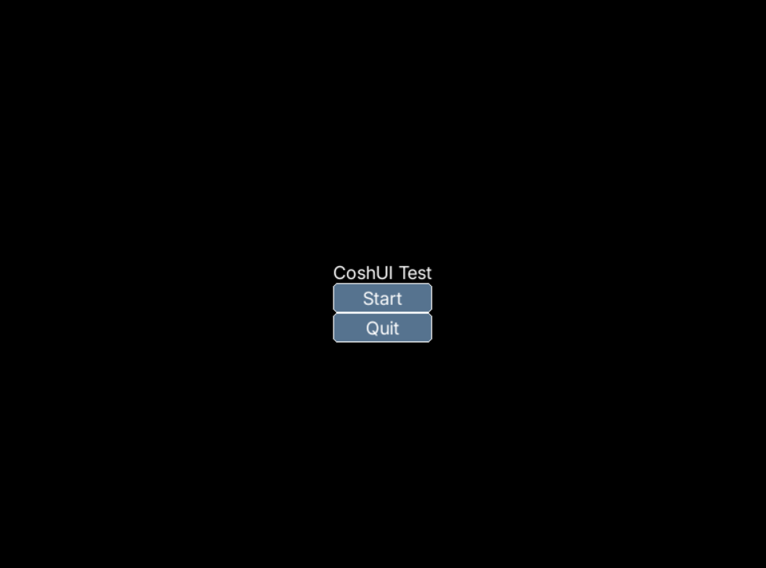
        <figcaption>Early Menu Screen</figcaption>
    </figure>

    If the image loaded properly, that's how you menu screen should look like. You might think: "This doesn't really look that good...", but that's okay, these are the default values. CoshUI supports styling overrides for the default styling. So lets start that:

    ```python title="pygame_test.py"
    with cui.CoshUIRenderer(cui.PygameBackend(screen)):
        with cui.Container(id="root_container", width=cui.FILL, height=cui.FILL, align=cui.ALIGN_CENTER, justify=cui.JUSTIFY_CENTER):
            with cui.Container(id="menu_container", direction=cui.COLUMN, align=cui.ALIGN_CENTER, justify=cui.JUSTIFY_CENTER, gap=10):
                cui.Label(id="title", text="CoshUI Test", font_size=56)
                cui.Button(id="start_btn", text="Start")
                cui.Button(id="quit_btn", text="Quit")
    ```
    We've added a small gap between all the children and also made the title bigger which mirrors most basic menu screens. Now let's style our buttons, if you've read the "Reusable Styling Through Classes" in this page's [Styling Your First Element](#styling-your-first-element), you'd know we can create classes to reuse. Let's do just that for buttons:

    ```python title="pygame_test.py"
    cui.add_class(
        "menu_buttons", 
        cui.CoshStyling(background_color=(220, 165, 255), border=None, border_radius=(10, 0, 10, 0))
    )
    ```
    Reminder to place this code ***before*** the while loop. If you've set up the class, then you can do this to add the custom styling to your buttons:

    ```python title="pygame_test.py"
    with cui.CoshUIRenderer(cui.PygameBackend(screen)):
        with cui.Container(id="root_container", width=cui.FILL, height=cui.FILL, align=cui.ALIGN_CENTER, justify=cui.JUSTIFY_CENTER):
            with cui.Container(id="menu_container", direction=cui.COLUMN, align=cui.ALIGN_CENTER, justify=cui.JUSTIFY_CENTER, gap=10):
                cui.Label(id="title", text="CoshUI Test", font_size=56)
                cui.Button(id="start_btn", text="Start", classes="menu_buttons")
                cui.Button(id="quit_btn", text="Quit", classes="menu_buttons")
    ```

    <figure>
        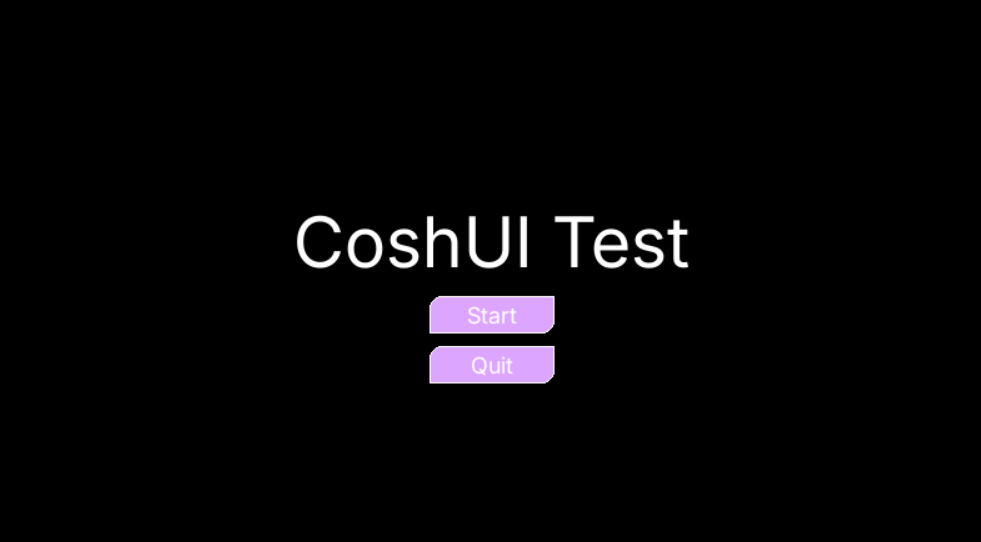
        <figcaption>Menu Screen with Custom Buttons</figcaption>
    </figure>

    Now lets add some interaction such as making it so when you click the "Quit" button it closes the window:

    ```python title="pygame_test.py"
    with cui.CoshUIRenderer(cui.PygameBackend(screen)):
        with cui.Container(id="root_container", width=cui.FILL, height=cui.FILL, align=cui.ALIGN_CENTER, justify=cui.JUSTIFY_CENTER):
            with cui.Container(id="menu_container", direction=cui.COLUMN, align=cui.ALIGN_CENTER, justify=cui.JUSTIFY_CENTER, gap=10):
                cui.Label(id="title", text="CoshUI Test", font_size=56)
                cui.Button(id="start_btn", text="Start", classes="menu_buttons")
                cui.Button(id="quit_btn", text="Quit", classes="menu_buttons")

    if cui.get_signal("quit_btn", cui.CLICKED):
        running = False
    ```

    With that, the quit button should be fully functional. Before this tutorial ends though, let's add some functionality to our "Start" button, something simple like a fade out effect with CoshUI's animation system:

    ```python title="pygame_test.py"
    with cui.CoshUIRenderer(cui.PygameBackend(screen)):
        with cui.Container(id="root_container", width=cui.FILL, height=cui.FILL, align=cui.ALIGN_CENTER, justify=cui.JUSTIFY_CENTER):
            with cui.Container(id="menu_container", direction=cui.COLUMN, align=cui.ALIGN_CENTER, justify=cui.JUSTIFY_CENTER, gap=10):
                cui.Label(id="title", text="CoshUI Test", font_size=56)
                cui.Button(id="start_btn", text="Start", classes="menu_buttons")
                cui.Button(id="quit_btn", text="Quit", classes="menu_buttons")

    if cui.get_signal("start_btn", cui.CLICKED):
        cui.animate("alpha", "menu_container", 0, 1.5, "linear")
    if cui.get_signal("quit_btn", cui.CLICKED):
        running = False
    ```

    <figure>
        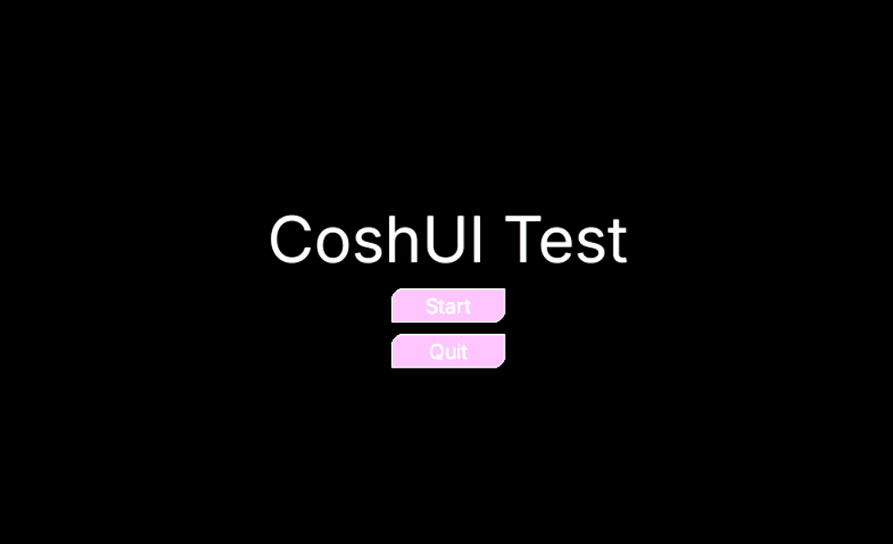
        <figcaption>Menu Screen fading when clicking Start</figcaption>
    </figure>

    Now you might worry about the the UI still being rendered when alpha is set to 0 but you don't need to as Elements get skipped when `alpha` is set to 0 or if `background_color` has no value, so your frame budget will be less than what's necessarily there.

    ---

    ## Final Remarks 
    And with that, that should give you the basic understanding of how to use CoshUI. This tutorial can't cover everything like image rendering or other widgets such as `Grid`, `Modal`, `Slider`, and more. So if you want to dive even deeper and create cooler things with CoshUI, you can head on over to the [Learn The API](../learn-the-api/getting-started.md){ data-preview } section for more.

    And of course, here's the final code file we worked on:

    ```python title="pygame_test.py"
    import pygame as py
    import coshui as cui

    WIDTH, HEIGHT = 800, 800
    FPS = 60

    def main():
        py.init()
        screen = py.display.set_mode((WIDTH, HEIGHT))
        py.display.set_caption("Pygame CoshUI Test")
        clock = py.time.Clock()

        cui.add_class(
            "menu_buttons", 
            cui.CoshStyling(background_color=(220, 165, 255), border=None, border_radius=(10, 0, 10, 0))
        )
        
        running = True
        while running:
            for event in py.event.get():
                if event.type == py.QUIT:
                    running = False

            screen.fill((0, 0, 0))

            with cui.CoshUIRenderer(cui.PygameBackend(screen)):
                with cui.Container(id="root_container", width=cui.FILL, height=cui.FILL, align=cui.ALIGN_CENTER, justify=cui.JUSTIFY_CENTER):
                    with cui.Container(id="menu_container", direction=cui.COLUMN, align=cui.ALIGN_CENTER, justify=cui.JUSTIFY_CENTER, gap=10):
                        cui.Label(id="title", text="CoshUI Test", font_size=56)
                        cui.Button(id="start_btn", text="Start", classes="menu_buttons")
                        cui.Button(id="quit_btn", text="Quit", classes="menu_buttons")

            if cui.get_signal("start_btn", cui.CLICKED):
                cui.animate("alpha", "menu_container", 0, 1.5, "linear")
            if cui.get_signal("quit_btn", cui.CLICKED):
                running = False

            py.display.flip()
            clock.tick(FPS)

        py.quit()

    if __name__ == "__main__":
        main()
    ```

=== "Raylib"

    ## Prerequisites

    - `Python v3.10+`
    - `coshui` package
    - `raylibpy` dependency

    If you haven't met these requirements, please go [here.](installation.md)

    ---

    ## Basic Boilerplate
    To start us off, let's make the `Raylib` boilerplate that we'll use for this tutorial. If you're following along, make sure to copy this boilerplate into your file.
    
    **Do note that all UI related code that we will be working on will be within the highlighted line.**

    ```python title="raylib_test.py" hl_lines="15"
    import raylibpy as rl
    import coshui as cui

    WIDTH, HEIGHT = 800, 800
    FPS = 60

    def main():
        rl.init_window(WIDTH, HEIGHT, "Raylib CoshUI Test")
        rl.set_target_fps(FPS)

        while not rl.window_should_close():
            rl.begin_drawing()
            rl.clear_background(rl.BLACK)
            
            # CoshUI Code Here

            rl.end_drawing()

        rl.close_window()

    if __name__ == "__main__":
        main()
    ```

    ---

    ## Setting Up CoshUIRenderer
    Let us move on to the *"body"* of CoshUI. `CoshUIRenderer()` is the "entry point" of the CoshUI engine, UI syntax will not work properly without it. To set it up, you must do this:
    !!! info "Highlight in Boilerplate"
        Remember to put this code within the highlighted part of the boilerplate.

    ```python title="raylib_test.py"
    with cui.CoshUIRenderer(cui.RaylibBackend()):
        pass
    ```

    All UI code runs within this context manager (`with` block). It registers all CoshUI nodes, determines their order of rendering, and gives you the ability to animate and interact with them for free.

    !!! note "Immediate and Retained Hybrid"
        A note to keep in mind is that CoshUI is inherently an "immediate mode" UI library, meaning it rebuilds every Node per frame. It gets away with signals and animations because it has an internal reconciliation layer that saves and sets state per frame.

    <details class="cui-collapse">
    <summary><span class="cui-collapse-chevron">▸</span>CoshUIRenderer Parameters</summary>
    <div class="cui-collapse-content" markdown="1">

    Before we move on, I'd like to discuss the *parameters* `CoshUIRenderer()` takes. It takes a `CoshBackend` instance for its first parameter and a `CoshMode` instance for its second. `CoshBackend` is easy to deduce, it's the backend that we pass based on what rendering pipeline we're using, but `CoshMode` might be a little confusing.

    `CoshMode` is defaulted to `NORMAL`, which makes it run normally. But one thing you can do is set it to `DEBUG`:
    ```python title="raylib_test.py"
    with cui.CoshUIRenderer(cui.RaylibBackend(), cui.DEBUG):
        pass
    ```

    If set to `DEBUG`, it will open up a tkinter window that lets you see the entire UI structure and click individual Nodes to see their properties for that frame (similar to DevTools on a browser). This is helpful for whenever need to check values for each Node. 

    <figure align="center" markdown="span">
        { width="500" }
        <figcaption>Gif of CoshUI's debugger.</figcaption>
    </figure>

    </div>
    </details>

    ---

    ## Declaring Your First Element
    Learning new UI libraries can be scary because of the new API you have to learn, but CoshUI is built to be easy to pick up without much resistance when building or migrating the UI. If you have experience with HTML then this might seem very familiar, if you don't then that's completely okay. Let's create our first `Container` as a Node instead of a Parent. Here's how that works:

    ```python title="raylib_test.py"
    with cui.CoshUIRenderer(cui.RaylibBackend()):
        cui.Container(id="root_container", width=100, height=100)
    ```
    
    If you've added that to your code and ran it, you might be confused as to why nothing is showing, well no need to worry about that for now, your `Container` is currently invisible because it has no color. We'll get into styling in the next section. 
    
    Back to our example above, that `Container` instance creates a box that is 100x100 in size on the top-left of the screen. An interesting part about `Containers` is that they can actually act as context managers that take in children like this:

    ```python title="raylib_test.py"
    with cui.CoshUIRenderer(cui.RaylibBackend()):
        with cui.Container(id="root_container", width=100, height=100):
            cui.Container(id="child_container", width=50, height=50)
    ```
    This arrangement creates a `Container` ***within*** the `root_container` that is 50x50 in size.

    !!! note "Node Types"
        From this, there might be some people thinking CoshUI is all about `Containers`, but the `Container` is one of many Nodes/Widgets in CoshUI. We'll get to the others soon.

    ---

    ## Styling Your First Element
    In other UI libraries, styling is mostly an afterthought. In CoshUI, styling is a primary part of the experience. To style a Node, you need to utilize CoshUI's `CoshStyling` object. It holds the properties that each Node needs to be visually distinct. 
    
    So let's first add a color to our `Container`. To set it, you can do this:

    ```python title="raylib_test.py"
    with cui.CoshUIRenderer(cui.RaylibBackend()):
        cui.Container(
            id="root_container", 
            width=100, height=100, 
            style=cui.CoshStyling(background_color=(100, 100, 255))
        )
    ```
    When run, this should show your 100x100 ***light blue-ish*** `Container` at the top-left of your window. 

    <figure markdown>
        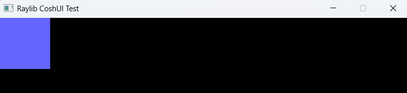
        <figcaption>Image of Blue 100x100 Container.</figcaption>
    </figure>

    <details class="cui-collapse">
    <summary><span class="cui-collapse-chevron">▸</span>CoshStyling Parameters</summary>
    <div class="cui-collapse-content" markdown="1">

    The `CoshStyling` object is what determines the visual identity of a Node. It offers a few parameters that let you change the entire look of a Node.

    #### Background Color and Alpha
    Background Color is almost a no-brainer. Its main purpose is to declare the color of the Node. It can be set like this: `background_color=(R, G, B)` or `background_color=(R, G, B, A)`.

    Alpha is also — again — a no-brainer. It determines the *transparency* of a Node. It can be set like this: `alpha=0-255`.

    You may notice, background color lets you set the alpha within it. Not to worry though, if the `alpha` field is set when the alpha value is set in `background_color`, the `alpha` field takes priority.

    #### Border
    Border sets an outline around a Node. It can be set like this: `border=((R, G, B), weight)` or `border=(R, G, B, weight)`

    #### Border Radius
    Border radius determines the *roundness* of a Node's corner. You can either set all corners or each individual corner like this: `border_radius=20` or `border_radius=(top-left, top-right, bottom-right, bottom-left)`

    #### Transforms
    CoshUI has ["transform" properties](../learn-the-api/getting-started.md#definition-of-terms){ data-preview }. Basically properties that only affect rendering, not layout.

    The first is `transform_position`, which lets you offset the node relative to its position. Basically (0, 50) means it moves 50 pixels downward from its current position. It can be set like this: `transform_position=(x, y)`

    The next one is `transform_scale`, which changes the **scale** of a Node with the default being 1.0. It can be set like this: `transform_scale=2.0` which makes the Node 2x bigger relative to its center.

    The last one is `transform_rotation`, which rotates the Node based counter-clockwise on the passed degree. It can be set like this: `transform_rotation=45.0` which tilts the node 45 degrees counter-clockwise.

    To learn more about styling, check the [Styling](../learn-the-api/styling/index.md){ data-preview } section in the API.  

    </div>
    </details>

    <details class="cui-collapse">
    <summary><span class="cui-collapse-chevron">▸</span>Reusable Styling Through Classes</summary>
    <div class="cui-collapse-content" markdown="1">
    
    If you've noticed, styling can be somewhat tedious, especially if it's the same styles applied to multiple Nodes. To make it easier, CoshUI has a *class* system that you can utilize to apply the same styles to many Nodes without re-declaring the same `CoshStyling` object. To use it you have to declare the class and the `CoshStyling` object **before** the main while loop like this:

    ```python title="raylib_test.py"
    # This is called BEFORE the while loop.
    cui.add_class(
        "example_class", 
        cui.CoshStyling(background_color=(255, 100, 100), border_radius=10, border=((255, 255, 255), 5))
    )
    ```

    with that, you can now pass in that style to a Node by passing it through the `classes` field with the string itself (`classes="example_class"`) or a list (`classes=["example_class"]`). Here's an example:

    ```python title="raylib_test.py"
    with cui.CoshUIRenderer(cui.RaylibBackend()):
        cui.Container(
            id="root_container", 
            width=100, height=100, 
            classes="example_class"
        )
    ```

    The cool thing about classes is that you can pass in ***multiple*** classes at the same time, so if you declare multiple classes with different styling for each, the Node will take in all of it like this: 

    ```python title="raylib_test.py"
    # Outside the while loop
    cui.add_class(
        "example_class", 
        cui.CoshStyling(background_color=(255, 100, 100), border_radius=10, border=((255, 255, 255), 5))
    )
    cui.add_class(
        "example_class2", 
        cui.CoshStyling(alpha=150)
    )

    # in CoshUIRenderer
    with cui.CoshUIRenderer(cui.RaylibBackend()):
        cui.Container(
            id="root_container", 
            width=100, height=100, 
            classes="example_class example_class2"
        )
    ```

    You can pass multiple classes like this where you just add in a space to the string, but if your class name itself has a space (for some reason), it's better to pass it through a list like this:

    ```python title="raylib_test.py"
    classes=["example_class", "example_class2"]
    ```

    !!! question "Class Ordering"
        A question appears with multiple classes, what styles get added if there are conflicting styles? In CoshUI, the classes that are added ***later*** in the `classes` field will override the ones added before. In the example above, if the two classes had conflicting properties, the one added latest will override the ones before. And of course, explicit styling (styles directly added  through the `style` field) takes highest priority.

        **Example:**
        ```python title="raylib_test.py"
        cui.add_class(
            "blue",
            cui.CoshStyling(background_color=(0, 0, 255))
        )

        cui.add_class(
            "red",
            cui.CoshStyling(background_color=(255, 0, 0))
        )

        cui.Container(
            classes="red blue"
        )
        ```
        In this example, the color of the Container will be blue.

    If you want to learn more about reusable styling, check out the [Classes](../learn-the-api/styling/classes.md){ data-preview } section in the API.

    </div>
    </details>

    ---

    ## Layout Fundamentals
    Before moving on, let's learn a little bit about the layout properties you can set which gives you maximum control over your UI. 
    
    As this is a little much to take on all at once, I've made every part collapsible so it's easier to digest one at a time.

    <details class="cui-collapse">
    <summary><span class="cui-collapse-chevron">▸</span>Width and Height</summary>
    <div class="cui-collapse-content" markdown="1">

    As shown in earlier sections, you can set width and height. These two properties are [Universal Properties](../learn-the-api/getting-started.md#definition-of-terms){ data-preview }, meaning they exist and can be set in every Node within CoshUI. They determine the size of your Node based on pixels. Here are the 4 ways to set width and height:

    ```python title="raylib_test.py"
    # Fixed
    cui.Container(
        width=100
    )
    # Fill
    cui.Container(
        width=cui.FILL
    )
    # AUTO
    cui.Container(
        width=cui.AUTO
    )
    # Percentage
    cui.Container(
        width=cui.PERCENTAGE(75)
    )
    ```

    To learn more, check out the [Width and Height](../learn-the-api/layout/width-and-height.md#introduction){ data-preview } section in the API.

    </div>
    </details>

    <details class="cui-collapse">
    <summary><span class="cui-collapse-chevron">▸</span>Padding and Margin</summary>
    <div class="cui-collapse-content" markdown="1">

    Margin is a [Universal Property](../learn-the-api/getting-started.md#definition-of-terms){ data-preview } whilst padding is a [Local Property](../learn-the-api/getting-started.md#definition-of-terms){ data-preview } and can only be set within `ParentNodes` (Nodes that can take in children). An example of a `ParentNode` would be `Container`. Margin is the property that dictates the space other nodes need to give around that specific Node, while padding dictates the distance the children should be from the edges of that `ParentNode`. You can set padding and margin like this:

    ```python title="raylib_test.py"
    cui.Container(padding=10,  margin=10)
    ```

    To learn more, check out the [Padding and Margin](../learn-the-api/layout/padding-and-margin.md#introduction){ data-preview } section in the API.

    </div>
    </details>

    <details class="cui-collapse">
    <summary><span class="cui-collapse-chevron">▸</span>Positioning</summary>
    <div class="cui-collapse-content" markdown="1">

    Positioning is a simple toggle in CoshUI. It determines whether a Node will be added to the layout calculations or not. The default is `RELATIVE`, meaning it will take up space and other Nodes will respect that space, setting it to `ABSOLUTE` makes it so that Node no longer gets added to layout calculations. Other Nodes will take that Node's space, kind of like it doesn't exist anymore to them. This also opens up the `x` and `y` parameters discussed next. Setting `positioning` is like this:

    ```python title="raylib_test.py"
    # ABSOLUTE
    cui.Container(positioning=cui.ABSOLUTE)
    # RELATIVE (This is default so there's no point in setting this)
    cui.Container(positioning=cui.RELATIVE)
    ```

    To learn more, check out the [Positioning](../learn-the-api/layout/absolute-vs-relative.md#introduction){ data-preview } section in the API.

    </div>
    </details>

    <details class="cui-collapse">
    <summary><span class="cui-collapse-chevron">▸</span>Position</summary>
    <div class="cui-collapse-content" markdown="1">

    Position in CoshUI refers to the `x` and `y` properties, and these are a bit *special*. It can only be mutated when the `positioning` parameter is set to `ABSOLUTE`, if not then adding values to `x` and `y` does nothing. What `x` and `y` do is directly offsets the position (relative to the parent) of the node *layout-wise*. To set `x` and `y`, you need to first set `positioning` to `ABSOLUTE` first, like this:

    ```python title="raylib_test.py"
    cui.Container(positioning=cui.ABSOLUTE, x=50, y=100)
    ```

    To learn more, check out the [Position](../learn-the-api/layout/position.md#introduction){ data-preview } section in the API.

    </div>
    </details>

    <details class="cui-collapse">
    <summary><span class="cui-collapse-chevron">▸</span>Align and Justify</summary>
    <div class="cui-collapse-content" markdown="1">

    The `align` and `justify` properties for CoshUI are [Local Properties](../learn-the-api/getting-started.md#definition-of-terms){ data-preview }, they are accessible only through `ParentNodes` like `Container` or `Grid`. They determine the position of that Nodes children within itself. They can be set like this:

    ```python title="raylib_test.py"
    # Note that these are only accessible through ParentNodes.
    cui.Container(align=cui.ALIGN_CENTER, justify=cui.JUSTIFY_CENTER)

    # These are the values you can set align and justify to.
    align=cui.ALIGN_START
    align=cui.ALIGN_CENTER
    align=cui.ALIGN_END
    justify=cui.JUSTIFY_START
    justify=cui.JUSTIFY_CENTER
    justify=cui.JUSTIFY_END
    justify=cui.JUSTIFY_SPACE_AROUND
    justify=cui.JUSTIFY_SPACE_BETWEEN
    justify=cui.JUSTIFY_SPACE_EVENLY
    ```

    As this is a complex topic, it is encouraged to check the [Align and Justify](../learn-the-api/layout/align-and-justify.md#introduction){ data-preview } section in the API.

    </div>
    </details>

    <details class="cui-collapse">
    <summary><span class="cui-collapse-chevron">▸</span>Gap</summary>
    <div class="cui-collapse-content" markdown="1">

    The `gap` property only exists in `ParentNodes`. It's a simple property, it all it does is determine the gap children will have between each other. Here's how to set it:

    ```python title="raylib_test.py"
    with cui.Container(gap=10):
        ...
    ```

    The example above makes it so the children of the `Container` will have a gap of 10 pixels between each other.

    </div>
    </details>

    <details class="cui-collapse">
    <summary><span class="cui-collapse-chevron">▸</span>Direction</summary>
    <div class="cui-collapse-content" markdown="1">

    The `direction` property is a property that only the `Container` widget possesses, it determines whether children will be placed horizontally or vertically. It's default value is `ROW` and setting it is simple:

    ```python title="raylib_test.py"
    with cui.Container(direction=cui.COLUMN):
        ...
    ```

    You can set it to both `ROW` and `COLUMN`, but `ROW` is default so there's no point in setting it unless you want to be explicit.

    </div>
    </details>

    ---

    ## Introducing Signals
    If you've used other UI frameworks, interaction systems usually use callback systems, which can be rather complex and a bit of a mess to set up. In CoshUI however, you can use what's called a "signal". Every Node will emit one, so if a Node is hovered over it will emit a `HOVERED` signal, if it is clicked it will emit a `CLICKED` signal. This comes automatically so users only need to poll those signals to check whether an event has happened to a Node or not, which lets you run your code if it has. 
    
    Let's declare a `Button()` — one of CoshUI's many widgets — and see how it works. Let's also make it so the Container's width and height fill the entire screen, here's how that will work:

    ```python title="raylib_test.py"
    with cui.CoshUIRenderer(cui.RaylibBackend()):
        with cui.Container(
            id="root_container", 
            width=cui.FILL, height=cui.FILL, 
            style=cui.CoshStyling(background_color=(100, 100, 255))
        ):
            cui.Button(id="example_button", text="Click to Print")
    ```
    If you run it, you might be able to notice the button having its own hover and click animations. That's an example of the signal system in action. Now to make it yourself, you need to make an `if` statement with the `get_signal()` function that CoshUI provides:

    ```python title="raylib_test.py"
    with cui.CoshUIRenderer(cui.RaylibBackend()):
        with cui.Container(
            id="root_container", 
            width=cui.FILL, height=cui.FILL, 
            style=cui.CoshStyling(background_color=(100, 100, 255))
        ):
            cui.Button(id="example_button", text="Click to Print")
    
    if cui.get_signal("example_button", cui.CLICKED):
        print("Hello World!")
    ```
    From the example, you can see that `get_signal()` takes in 2 parameters, the id of the Node you want to capture signals from and the event you want to poll. Once you click the button, it will now print `Hello World!` in the terminal.

    A nice thing about the signal system is that it works for every Node, not just buttons. If you want to see if a `Container` was clicked, you can poll it as long as it has an id. It's also additive, meaning if you make a signal on the same Node, it doesn't override others. 

    **Example:**
    ```python title="raylib_test.py"
    with cui.CoshUIRenderer(cui.RaylibBackend()):
        cui.Container(
            id="root_container", 
            width=cui.FILL, height=cui.FILL, 
            style=cui.CoshStyling(background_color=(100, 100, 255))
        )
    
    if cui.get_signal("root_container", cui.CLICKED):
        print("Hello World!")
    ```

    <details class="cui-collapse">
    <summary><span class="cui-collapse-chevron">▸</span>Mouse Filters</summary>
    <div class="cui-collapse-content" markdown="1">
    
    In CoshUI, there are ways to customize *how* a Node receives and consumes interaction events. We can achieve that with the `mouse_filter` field which is a [Universal Property](../learn-the-api/getting-started.md#definition-of-terms){ data-preview }. 

    The first value you can set `mouse_filter` to is `IGNORE`:

    ```python title="raylib_test.py"
    cui.Container(mouse_filter=cui.IGNORE)
    ```
    This makes it so the Node doesn't emit any signals while also letting Nodes below it receive the event.

    Next value is `PASS`:

    ```python title="raylib_test.py"
    cui.Container(mouse_filter=cui.PASS)
    ```
    This lets the interaction event *pass through* the Node whilst also emitting the signal.

    Last value is `STOP`:

    ```python title="raylib_test.py"
    cui.Container(mouse_filter=cui.STOP)
    ```
    This is the default value and makes it so it receives the event and consumes it, stopping the event from propagating to Nodes below.

    </div>
    </details>

    <details class="cui-collapse">
    <summary><span class="cui-collapse-chevron">▸</span>Different Interactions</summary>
    <div class="cui-collapse-content" markdown="1">

    As you may have already guessed, but there are quite a few interactions that can be passed in to the signal system. Here's what they are:

    ```python title="raylib_test.py"
    # Checks if the node was just clicked.
    cui.CLICKED
    
    # Checks if the node was just released from a click event.
    cui.RELEASED

    # Checks if the node is being clicked that frame.
    cui.PRESSED

    # Checks if the cursor entered the Node's boundaries.
    cui.HOVER_ENTER 

    # Checks if the cursor exited the Node's boundaries.
    cui.HOVER_EXIT 

    # Checks if the cursor is within the Node's boundaries. 
    cui.HOVERED 
    ```

    These can be passed to the second parameter of the `get_signal()` function. To learn more, check the [Signals](../learn-the-api/interactions/signals.md) section in the API.

    </div>
    </details>

    ---

    ## Introducing Animations
    When using other UI libraries, I'm willing to bet most of them have little to no built-in animation systems. Some may have external libraries that help with animations but for the most part, animations are either fully missing or not even considered a first-class citizen. 
    
    CoshUI is different, it has its own animation system built upon the reconciliation structure. You've most probably seen it work in the previous section as the `Button()` widget has built-in animations. 
    
    So let's address how to animate Nodes. CoshUI has an `animate()` function that takes in 5 parameters, `n_property`, `target_id`, `end_value`, `duration`, and finally `easing`. Here's an example of how it works:

    ```python title="raylib_test.py"
    if cui.get_signal("example_button", cui.CLICKED):
        cui.animate("transform_position", "example_button", (0, 50), 1.5, "ease_out_bounce")
    ```
    The example above shows a use case for animation, it makes it so if the button is clicked, it will animate its rendered position downwards 50 pixels in 1.5 seconds with an easing curve of "ease_out_bounce".

    <figure markdown>
        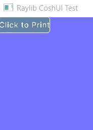{ width="250" }
        <figcaption>Gif of button being clicked then falling.</figcaption>
    </figure>

    <details class="cui-collapse">
    <summary><span class="cui-collapse-chevron">▸</span>Properties and Easing Curves</summary>
    <div class="cui-collapse-content" markdown="1">

    As explained, CoshUI's animation system has many parameters, and some of them aren't very straightforward, especially the Node properties you can animate and the easing curves. Here's a comprehensive list of properties you can pass to CoshUI's `animate()` function.

    | Properties | Description |
    | :--- | :--- |
    | `background_color` | Smoothly shifts the Node's background to a new RGB color. |
    | `alpha` | Fades the Node in or out by easing its transparency toward the target value. |
    | `transform_position` | Glides the Node to a new offset position, without affecting layout. |
    | `transform_scale` | Grows or shrinks the Node toward the target scale, relative to its center. |
    | `transform_rotation` | Spins the Node counter-clockwise toward the target rotation, in degrees. |

    When it comes to easing curves, CoshUI's list is quite small currently but should be enough for most use cases. A quick note would be the `_in` suffix on the easing means the movement is applied at the beginning and the `_out` suffix means the movement is applied at the end. Here is CoshUI's list:

    | Easing Curves | Description |
    | :--- | :--- |
    | `linear` | Moves at a constant speed from start to finish — no acceleration or deceleration. |
    | `ease_in` | Starts slow and speeds up toward the end. |
    | `ease_out` | Starts fast and slows down toward the end. |
    | `ease_in_out` | Starts slow, speeds up in the middle, then slows down again at the end. |
    | `ease_in_bounce` | Bounces a few times right at the start before settling into motion. |
    | `ease_out_bounce` | Settles in with a few bounces at the end, like a ball coming to rest. |
    | `ease_in_elastic` | Winds up with a springy overshoot before snapping into motion. |
    | `ease_out_elastic` | Overshoots the target and wobbles back like a spring before settling. |

    To learn more about animations, check out the [Animation](../learn-the-api/animations/index.md) section in the API.

    </div>
    </details>

    ---

    ## Creating A Menu Screen
    Now that we've decently discussed CoshUI's capabilities, let's get on to actually creating something. We'll use the same boilerplate with the same `root_container` Container as declared but lets get back on track to actually making a basic version of something that you or someone might try making for a game. 

    ```python title="raylib_test.py"
    with cui.CoshUIRenderer(cui.RaylibBackend()):
        with cui.Container(id="root_container", width=cui.FILL, height=cui.FILL):
            pass
    ```
    With this container that fills the entire screen, we can then add a `Label()` widget acting as our game's title.

    ```python title="raylib_test.py"
    with cui.CoshUIRenderer(cui.RaylibBackend()):
        with cui.Container(id="root_container", width=cui.FILL, height=cui.FILL):
            cui.Label(id="title", text="CoshUI Test")
    ```
    If you run the file, you'll see our "CoshUI Test" label at the top-left. What we want is to put this at the very center, so let's use the `align` and `justify` parameters to put it to the center like this: 

    ```python title="raylib_test.py"
    with cui.CoshUIRenderer(cui.RaylibBackend()):
        with cui.Container(id="root_container", width=cui.FILL, height=cui.FILL, align=cui.ALIGN_CENTER, justify=cui.JUSTIFY_CENTER):
            cui.Label(id="title", text="CoshUI Test")
    ```
    If you followed everything correctly (or copy pasted the code), it should show "CoshUI Test" being at the middle of the screen. Let's add a couple of buttons to make it *look* like a menu screen shall we? Let's also wrap the `Label()` in a container so we can set the direction to `COLUMN` instead of `ROW`:

    ```python title="raylib_test.py"
    with cui.CoshUIRenderer(cui.RaylibBackend()):
        with cui.Container(id="root_container", width=cui.FILL, height=cui.FILL, align=cui.ALIGN_CENTER, justify=cui.JUSTIFY_CENTER):
            with cui.Container(id="menu_container", direction=cui.COLUMN, align=cui.ALIGN_CENTER, justify=cui.JUSTIFY_CENTER):
                cui.Label(id="title", text="CoshUI Test")
                cui.Button(id="start_btn", text="Start")
                cui.Button(id="quit_btn", text="Quit")
    ```

    <figure>
        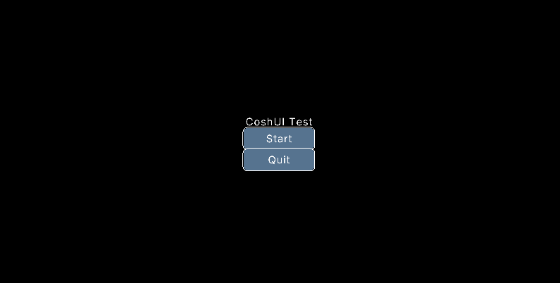{ width="100%" }
        <figcaption>Early Menu Screen</figcaption>
    </figure>

    If the image loaded properly, that's how you menu screen should look like. You might think: "This doesn't really look that good...", but that's okay, these are the default values. CoshUI supports styling overrides for the default styling. So lets start that:

    ```python title="raylib_test.py"
    with cui.CoshUIRenderer(cui.RaylibBackend()):
        with cui.Container(id="root_container", width=cui.FILL, height=cui.FILL, align=cui.ALIGN_CENTER, justify=cui.JUSTIFY_CENTER):
            with cui.Container(id="menu_container", direction=cui.COLUMN, align=cui.ALIGN_CENTER, justify=cui.JUSTIFY_CENTER, gap=10):
                cui.Label(id="title", text="CoshUI Test", font_size=56)
                cui.Button(id="start_btn", text="Start")
                cui.Button(id="quit_btn", text="Quit")
    ```
    We've added a small gap between all the children and also made the title bigger which mirrors most basic menu screens. Now let's style our buttons, if you've read the "Reusable Styling Through Classes" in this page's [Styling Your First Element](#styling-your-first-element), you'd know we can create classes to reuse. Let's do just that for buttons:

    ```python title="raylib_test.py"
    cui.add_class(
        "menu_buttons", 
        cui.CoshStyling(background_color=(220, 165, 255), border=None, border_radius=(10, 0, 10, 0))
    )
    ```
    Reminder to place this code ***before*** the while loop. If you've set up the class, then you can do this to add the custom styling to your buttons:

    ```python title="raylib_test.py"
    with cui.CoshUIRenderer(cui.RaylibBackend()):
        with cui.Container(id="root_container", width=cui.FILL, height=cui.FILL, align=cui.ALIGN_CENTER, justify=cui.JUSTIFY_CENTER):
            with cui.Container(id="menu_container", direction=cui.COLUMN, align=cui.ALIGN_CENTER, justify=cui.JUSTIFY_CENTER, gap=10):
                cui.Label(id="title", text="CoshUI Test", font_size=56)
                cui.Button(id="start_btn", text="Start", classes="menu_buttons")
                cui.Button(id="quit_btn", text="Quit", classes="menu_buttons")
    ```

    <figure>
        { width="100%" }
        <figcaption>Menu Screen with Custom Buttons</figcaption>
    </figure>

    Now lets add some interaction such as making it so when you click the "Quit" button it closes the window:

    ```python title="raylib_test.py"
    with cui.CoshUIRenderer(cui.RaylibBackend()):
        with cui.Container(id="root_container", width=cui.FILL, height=cui.FILL, align=cui.ALIGN_CENTER, justify=cui.JUSTIFY_CENTER):
            with cui.Container(id="menu_container", direction=cui.COLUMN, align=cui.ALIGN_CENTER, justify=cui.JUSTIFY_CENTER, gap=10):
                cui.Label(id="title", text="CoshUI Test", font_size=56)
                cui.Button(id="start_btn", text="Start", classes="menu_buttons")
                cui.Button(id="quit_btn", text="Quit", classes="menu_buttons")

    if cui.get_signal("quit_btn", cui.CLICKED):
        break
    ```

    With that, the quit button should be fully functional. Before this tutorial ends though, let's add some functionality to our "Start" button, something simple like a fade out effect with CoshUI's animation system:

    ```python title="raylib_test.py"
    with cui.CoshUIRenderer(cui.RaylibBackend()):
        with cui.Container(id="root_container", width=cui.FILL, height=cui.FILL, align=cui.ALIGN_CENTER, justify=cui.JUSTIFY_CENTER):
            with cui.Container(id="menu_container", direction=cui.COLUMN, align=cui.ALIGN_CENTER, justify=cui.JUSTIFY_CENTER, gap=10):
                cui.Label(id="title", text="CoshUI Test", font_size=56)
                cui.Button(id="start_btn", text="Start", classes="menu_buttons")
                cui.Button(id="quit_btn", text="Quit", classes="menu_buttons")

    if cui.get_signal("start_btn", cui.CLICKED):
        cui.animate("alpha", "menu_container", 0, 1.5, "linear")
    if cui.get_signal("quit_btn", cui.CLICKED):
        break
    ```

    <figure>
        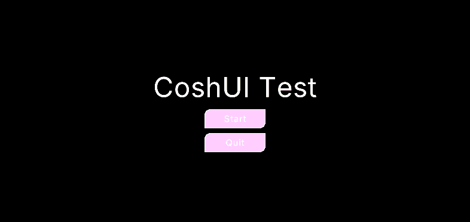
        <figcaption>Menu Screen fading when clicking Start</figcaption>
    </figure>

    Now you might worry about the the UI still being rendered when alpha is set to 0 but you don't need to as Elements get skipped when `alpha` is set to 0 or if `background_color` has no value, so your frame budget will be less than what's necessarily there.

    ---
    
    ## Final Remarks 
    And with that, that should give you the basic understanding of how to use CoshUI. This tutorial can't cover everything like image rendering or other widgets such as `Grid`, `Modal`, `Slider`, and more. So if you want to dive even deeper and create cooler things with CoshUI, you can head on over to the [Learn The API](../learn-the-api/getting-started.md){ data-preview } section for more.

    And of course, here's the final code file we worked on:

    ```python title="raylib_test.py"
    import raylibpy as rl
    import coshui as cui

    WIDTH, HEIGHT = 800, 800
    FPS = 60

    def main():
        rl.init_window(WIDTH, HEIGHT, "Raylib CoshUI Test")
        rl.set_target_fps(FPS)

        cui.add_class(
            "menu_buttons", 
            cui.CoshStyling(background_color=(220, 165, 255), border=None, border_radius=(10, 0, 10, 0))
        )

        while not rl.window_should_close():
            rl.begin_drawing()
            rl.clear_background(rl.BLACK)

            with cui.CoshUIRenderer(cui.RaylibBackend()):
                with cui.Container(id="root_container", width=cui.FILL, height=cui.FILL, align=cui.ALIGN_CENTER, justify=cui.JUSTIFY_CENTER):
                    with cui.Container(id="menu_container", direction=cui.COLUMN, align=cui.ALIGN_CENTER, justify=cui.JUSTIFY_CENTER, gap=10):
                        cui.Label(id="title", text="CoshUI Test", font_size=56)
                        cui.Button(id="start_btn", text="Start", classes="menu_buttons")
                        cui.Button(id="quit_btn", text="Quit", classes="menu_buttons")

            # This can be after end_drawing() but there's no difference really.
            if cui.get_signal("start_btn", cui.CLICKED):
                cui.animate("alpha", "menu_container", 0, 1.5, "linear")
            if cui.get_signal("quit_btn", cui.CLICKED):
                break

            rl.end_drawing()

        rl.close_window()

    if __name__ == "__main__":
        main()
    ```

=== "PyOpenGL | GLFW"

    ## Prerequisites

    - `Python v3.10+`
    - `coshui` package
    - `PyOpenGL` dependency
    - `PyOpenGL_accelerate` dependency (this is optional)

    If you haven't met these requirements, please go [here.](installation.md)

    ---

    ## Basic Boilerplate
    To start us off, let's make the `PyOpenGL` with `GLFW` boilerplate that we'll use for this tutorial. If you're following along, make sure to copy this boilerplate into your file.
    
    **Do note that all UI related code that we will be working on will be within the highlighted line.**

    ```python title="pyopengl_glfw_test.py" hl_lines="20"
    import glfw
    from OpenGL.GL import *
    import coshui as cui

    def main():
        if not glfw.init(): return

        window = glfw.create_window(800, 800, "PyOpenGL::GLFW CoshUI Test", None, None)
        if not window:
            glfw.terminate()
            return

        glfw.make_context_current(window)

        glClearColor(0.0, 0.0, 0.0, 1.0)

        while not glfw.window_should_close(window):
            glClear(GL_COLOR_BUFFER_BIT | GL_DEPTH_BUFFER_BIT)

            # CoshUI Code Here

            glfw.swap_buffers(window)
            glfw.poll_events()

        glfw.terminate()

    if __name__ == "__main__":
        main()
    ```

    ---

    ## Setting Up CoshUIRenderer
    Let us move on to the *"body"* of CoshUI. `CoshUIRenderer()` is the "entry point" of the CoshUI engine, UI syntax will not work properly without it. To set it up for `PyOpenGL`, you must do this:

    ```python title="pyopengl_glfw_test.py"
    # Before the while loop
    backend = cui.PyOpenGLBackend(cui.GLFW)

    while not glfw.window_should_close(window):
        ...
    ```
    We must set up the backend *before* the main loop so compiling shaders and creation of arrays and buffers are done only **once**.

    !!! info "Highlight in Boilerplate"
        Remember to put this code within the highlighted part of the boilerplate.

    ```python title="pyopengl_glfw_test.py"
    with cui.CoshUIRenderer(backend):
        pass
    ```

    All UI code runs within this context manager (`with` block). It registers all CoshUI nodes, determines their order of rendering, and gives you the ability to animate and interact with them for free.

    !!! note "Immediate and Retained Hybrid"
        A note to keep in mind is that CoshUI is inherently an "immediate mode" UI library, meaning it rebuilds every Node per frame. It gets away with signals and animations because it has an internal reconciliation layer that saves and sets state per frame.

    <details class="cui-collapse">
    <summary><span class="cui-collapse-chevron">▸</span>CoshUIRenderer Parameters</summary>
    <div class="cui-collapse-content" markdown="1">

    Before we move on, I'd like to discuss the *parameters* `CoshUIRenderer()` takes. It takes a `CoshBackend` instance for its first parameter and a `CoshMode` instance for its second. `CoshBackend` is easy to deduce, it's the backend that we pass based on what rendering pipeline we're using, but `CoshMode` might be a little confusing.

    `CoshMode` is defaulted to `NORMAL`, which makes it run normally. But one thing you can do is set it to `DEBUG`:
    ```python title="pyopengl_glfw_test.py"
    with cui.CoshUIRenderer(backend, cui.DEBUG):
        pass
    ```

    If set to `DEBUG`, it will open up a tkinter window that lets you see the entire UI structure and click individual Nodes to see their properties for that frame (similar to DevTools on a browser). This is helpful for whenever need to check values for each Node. 

    <figure align="center" markdown="span">
        { width="500" }
        <figcaption>Gif of CoshUI's debugger.</figcaption>
    </figure>

    </div>
    </details>

    ---

    ## Declaring Your First Element
    Learning new UI libraries can be scary because of the new API you have to learn, but CoshUI is built to be easy to pick up without much resistance when building or migrating the UI. If you have experience with HTML then this might seem very familiar, if you don't then that's completely okay. Let's create our first `Container` as a Node instead of a Parent. Here's how that works:

    ```python title="pyopengl_glfw_test.py"
    with cui.CoshUIRenderer(backend):
        cui.Container(id="root_container", width=100, height=100)
    ```
    
    If you've added that to your code and ran it, you might be confused as to why nothing is showing, well no need to worry about that for now, your `Container` is currently invisible because it has no color. We'll get into styling in the next section. 
    
    Back to our example above, that `Container` instance creates a box that is 100x100 in size on the top-left of the screen. An interesting part about `Containers` is that they can actually act as context managers that take in children like this:

    ```python title="pyopengl_glfw_test.py"
    with cui.CoshUIRenderer(backend):
        with cui.Container(id="root_container", width=100, height=100):
            cui.Container(id="child_container", width=50, height=50)
    ```
    This arrangement creates a `Container` ***within*** the `root_container` that is 50x50 in size.

    !!! note "Node Types"
        From this, there might be some people thinking CoshUI is all about `Containers`, but the `Container` is one of many Nodes/Widgets in CoshUI. We'll get to the others soon.

    ---

    ## Styling Your First Element
    In other UI libraries, styling is mostly an afterthought. In CoshUI, styling is a primary part of the experience. To style a Node, you need to utilize CoshUI's `CoshStyling` object. It holds the properties that each Node needs to be visually distinct. 
    
    So let's first add a color to our `Container`. To set it, you can do this:

    ```python title="pyopengl_glfw_test.py"
    with cui.CoshUIRenderer(backend):
        cui.Container(
            id="root_container", 
            width=100, height=100, 
            style=cui.CoshStyling(background_color=(100, 100, 255))
        )
    ```
    When run, this should show your 100x100 ***light blue-ish*** `Container` at the top-left of your window. 

    <figure markdown>
        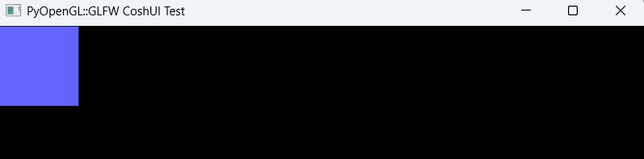
        <figcaption>Image of Blue 100x100 Container.</figcaption>
    </figure>

    <details class="cui-collapse">
    <summary><span class="cui-collapse-chevron">▸</span>CoshStyling Parameters</summary>
    <div class="cui-collapse-content" markdown="1">

    The `CoshStyling` object is what determines the visual identity of a Node. It offers a few parameters that let you change the entire look of a Node.

    #### Background Color and Alpha
    Background Color is almost a no-brainer. Its main purpose is to declare the color of the Node. It can be set like this: `background_color=(R, G, B)` or `background_color=(R, G, B, A)`.

    Alpha is also — again — a no-brainer. It determines the *transparency* of a Node. It can be set like this: `alpha=0-255`.

    You may notice, background color lets you set the alpha within it. Not to worry though, if the `alpha` field is set when the alpha value is set in `background_color`, the `alpha` field takes priority.

    #### Border
    Border sets an outline around a Node. It can be set like this: `border=((R, G, B), weight)` or `border=(R, G, B, weight)`

    #### Border Radius
    Border radius determines the *roundness* of a Node's corner. You can either set all corners or each individual corner like this: `border_radius=20` or `border_radius=(top-left, top-right, bottom-right, bottom-left)`

    #### Transforms
    CoshUI has ["transform" properties](../learn-the-api/getting-started.md#definition-of-terms){ data-preview }. Basically properties that only affect rendering, not layout.

    The first is `transform_position`, which lets you offset the node relative to its position. Basically (0, 50) means it moves 50 pixels downward from its current position. It can be set like this: `transform_position=(x, y)`

    The next one is `transform_scale`, which changes the **scale** of a Node with the default being 1.0. It can be set like this: `transform_scale=2.0` which makes the Node 2x bigger relative to its center.

    The last one is `transform_rotation`, which rotates the Node based counter-clockwise on the passed degree. It can be set like this: `transform_rotation=45.0` which tilts the node 45 degrees counter-clockwise.

    To learn more about styling, check the [Styling](../learn-the-api/styling/index.md){ data-preview } section in the API.  

    </div>
    </details>

    <details class="cui-collapse">
    <summary><span class="cui-collapse-chevron">▸</span>Reusable Styling Through Classes</summary>
    <div class="cui-collapse-content" markdown="1">
    
    If you've noticed, styling can be somewhat tedious, especially if it's the same styles applied to multiple Nodes. To make it easier, CoshUI has a *class* system that you can utilize to apply the same styles to many Nodes without re-declaring the same `CoshStyling` object. To use it you have to declare the class and the `CoshStyling` object **before** the main while loop like this:

    ```python title="pyopengl_glfw_test.py"
    # This is called BEFORE the while loop.
    cui.add_class(
        "example_class", 
        cui.CoshStyling(background_color=(255, 100, 100), border_radius=10, border=((255, 255, 255), 5))
        )
    ```

    with that, you can now pass in that style to a Node by passing it through the `classes` field with the string itself (`classes="example_class"`) or a list (`classes=["example_class"]`). Here's an example:

    ```python title="pyopengl_glfw_test.py"
    with cui.CoshUIRenderer(backend):
        cui.Container(
            id="root_container", 
            width=100, height=100, 
            classes="example_class"
        )
    ```

    The cool thing about classes is that you can pass in ***multiple*** classes at the same time, so if you declare multiple classes with different styling for each, the Node will take in all of it like this: 

    ```python title="pyopengl_glfw_test.py"
    # Outside the while loop
    cui.add_class(
        "example_class", 
        cui.CoshStyling(background_color=(255, 100, 100), border_radius=10, border=((255, 255, 255), 5))
    )
    cui.add_class(
        "example_class2", 
        cui.CoshStyling(alpha=150)
    )

    # in CoshUIRenderer
    with cui.CoshUIRenderer(backend):
        cui.Container(
            id="root_container", 
            width=100, height=100, 
            classes="example_class example_class2"
        )
    ```

    You can pass multiple classes like this where you just add in a space to the string, but if your class name itself has a space (for some reason), it's better to pass it through a list like this:

    ```python title="pyopengl_glfw_test.py"
    classes=["example_class", "example_class2"]
    ```

    !!! question "Class Ordering"
        A question appears with multiple classes, what styles get added if there are conflicting styles? In CoshUI, the classes that are added ***later*** in the `classes` field will override the ones added before. In the example above, if the two classes had conflicting properties, the one added latest will override the ones before. And of course, explicit styling (styles directly added through the `style` field) takes highest priority.

        **Example:**
        ```python title="pyopengl_glfw_test.py"
        cui.add_class(
            "blue",
            cui.CoshStyling(background_color=(0, 0, 255))
        )

        cui.add_class(
            "red",
            cui.CoshStyling(background_color=(255, 0, 0))
        )

        cui.Container(
            classes="red blue"
        )
        ```
        In this example, the color of the Container will be blue.

    If you want to learn more about reusable styling, check out the [Classes](../learn-the-api/styling/classes.md){ data-preview } section in the API.

    </div>
    </details>

    ---

    ## Layout Fundamentals
    Before moving on, let's learn a little bit about the layout properties you can set which gives you maximum control over your UI. 
    
    As this is a little much to take on all at once, I've made every part collapsible so it's easier to digest one at a time.

    <details class="cui-collapse">
    <summary><span class="cui-collapse-chevron">▸</span>Width and Height</summary>
    <div class="cui-collapse-content" markdown="1">

    As shown in earlier sections, you can set width and height. These two properties are [Universal Properties](../learn-the-api/getting-started.md#definition-of-terms){ data-preview }, meaning they exist and can be set in every Node within CoshUI. They determine the size of your Node based on pixels. Here are the 4 ways to set width and height:

    ```python title="pyopengl_glfw_test.py"
    # Fixed
    cui.Container(
        width=100
    )
    # Fill
    cui.Container(
        width=cui.FILL
    )
    # AUTO
    cui.Container(
        width=cui.AUTO
    )
    # Percentage
    cui.Container(
        width=cui.PERCENTAGE(75)
    )
    ```

    To learn more, check out the [Width and Height](../learn-the-api/layout/width-and-height.md#introduction){ data-preview } section in the API.

    </div>
    </details>

    <details class="cui-collapse">
    <summary><span class="cui-collapse-chevron">▸</span>Padding and Margin</summary>
    <div class="cui-collapse-content" markdown="1">

    Margin is a [Universal Property](../learn-the-api/getting-started.md#definition-of-terms){ data-preview } whilst padding is a [Local Property](../learn-the-api/getting-started.md#definition-of-terms){ data-preview } and can only be set within `ParentNodes` (Nodes that can take in children). An example of a `ParentNode` would be `Container`. Margin is the property that dictates the space other nodes need to give around that specific Node, while padding dictates the distance the children should be from the edges of that `ParentNode`. You can set padding and margin like this:

    ```python title="pyopengl_glfw_test.py"
    cui.Container(padding=10, margin=10)
    ```

    To learn more, check out the [Padding and Margin](../learn-the-api/layout/padding-and-margin.md#introduction){ data-preview } section in the API.

    </div>
    </details>

    <details class="cui-collapse">
    <summary><span class="cui-collapse-chevron">▸</span>Positioning</summary>
    <div class="cui-collapse-content" markdown="1">

    Positioning is a simple toggle in CoshUI. It determines whether a Node will be added to the layout calculations or not. The default is `RELATIVE`, meaning it will take up space and other Nodes will respect that space, setting it to `ABSOLUTE` makes it so that Node no longer gets added to layout calculations. Other Nodes will take that Node's space, kind of like it doesn't exist anymore to them. This also opens up the `x` and `y` parameters discussed next. Setting `positioning` is like this:

    ```python title="pyopengl_glfw_test.py"
    # ABSOLUTE
    cui.Container(positioning=cui.ABSOLUTE)
    # RELATIVE (This is default so there's no point in setting this)
    cui.Container(positioning=cui.RELATIVE)
    ```

    To learn more, check out the [Positioning](../learn-the-api/layout/absolute-vs-relative.md#introduction){ data-preview } section in the API.

    </div>
    </details>

    <details class="cui-collapse">
    <summary><span class="cui-collapse-chevron">▸</span>Position</summary>
    <div class="cui-collapse-content" markdown="1">

    Position in CoshUI refers to the `x` and `y` properties, and these are a bit *special*. It can only be mutated when the `positioning` parameter is set to `ABSOLUTE`, if not then adding values to `x` and `y` does nothing. What `x` and `y` do is directly offsets the position (relative to the parent) of the node *layout-wise*. To set `x` and `y`, you need to first set `positioning` to `ABSOLUTE` first, like this:

    ```python title="pyopengl_glfw_test.py"
    cui.Container(positioning=cui.ABSOLUTE, x=50, y=100)
    ```

    To learn more, check out the [Position](../learn-the-api/layout/position.md#introduction){ data-preview } section in the API.

    </div>
    </details>

    <details class="cui-collapse">
    <summary><span class="cui-collapse-chevron">▸</span>Align and Justify</summary>
    <div class="cui-collapse-content" markdown="1">

    The `align` and `justify` properties for CoshUI are [Local Properties](../learn-the-api/getting-started.md#definition-of-terms){ data-preview }, they are accessible only through `ParentNodes` like `Container` or `Grid`. They determine the position of that Nodes children within itself. They can be set like this:

    ```python title="pyopengl_glfw_test.py"
    # Note that these are only accessible through ParentNodes.
    cui.Container(align=cui.ALIGN_CENTER, justify=cui.JUSTIFY_CENTER)

    # These are the values you can set align and justify to.
    align=cui.ALIGN_START
    align=cui.ALIGN_CENTER
    align=cui.ALIGN_END
    justify=cui.JUSTIFY_START
    justify=cui.JUSTIFY_CENTER
    justify=cui.JUSTIFY_END
    justify=cui.JUSTIFY_SPACE_AROUND
    justify=cui.JUSTIFY_SPACE_BETWEEN
    justify=cui.JUSTIFY_SPACE_EVENLY
    ```

    As this is a complex topic, it is encouraged to check the [Align and Justify](../learn-the-api/layout/align-and-justify.md#introduction){ data-preview } section in the API.

    </div>
    </details>

    <details class="cui-collapse">
    <summary><span class="cui-collapse-chevron">▸</span>Gap</summary>
    <div class="cui-collapse-content" markdown="1">

    The `gap` property only exists in `ParentNodes`. It's a simple property, all it does is determine the gap children will have between each other. Here's how to set it:

    ```python title="pyopengl_glfw_test.py"
    with cui.Container(gap=10):
        ...
    ```

    The example above makes it so the children of the `Container` will have a gap of 10 pixels between each other.

    </div>
    </details>

    <details class="cui-collapse">
    <summary><span class="cui-collapse-chevron">▸</span>Direction</summary>
    <div class="cui-collapse-content" markdown="1">

    The `direction` property is a property that only the `Container` widget possesses, it determines whether children will be placed horizontally or vertically. It's default value is `ROW` and setting it is simple:

    ```python title="pyopengl_glfw_test.py"
    with cui.Container(direction=cui.COLUMN):
        ...
    ```

    You can set it to both `ROW` and `COLUMN`, but `ROW` is default so there's no point in setting it unless you want to be explicit.

    </div>
    </details>

    ---

    ## Introducing Signals
    If you've used other UI frameworks, interaction systems usually use callback systems, which can be rather complex and a bit of a mess to set up. In CoshUI however, you can use what's called a "signal". Every Node will emit one, so if a Node is hovered over it will emit a `HOVERED` signal, if it is clicked it will emit a `CLICKED` signal. This comes automatically so users only need to poll those signals to check whether an event has happened to a Node or not, which lets you run your code if it has. 
    
    Let's declare a `Button()` — one of CoshUI's many widgets — and see how it works. Let's also make it so the Container's width and height fill the entire screen, here's how that will work:

    ```python title="pyopengl_glfw_test.py"
    with cui.CoshUIRenderer(backend):
        with cui.Container(
            id="root_container", 
            width=cui.FILL, height=cui.FILL, 
            style=cui.CoshStyling(background_color=(100, 100, 255))
        ):
            cui.Button(id="example_button", text="Click to Print")
    ```
    If you run it, you might be able to notice the button having its own hover and click animations. That's an example of the signal system in action. Now to make it yourself, you need to make an `if` statement with the `get_signal()` function that CoshUI provides:

    ```python title="pyopengl_glfw_test.py"
    with cui.CoshUIRenderer(backend):
        with cui.Container(
            id="root_container", 
            width=cui.FILL, height=cui.FILL, 
            style=cui.CoshStyling(background_color=(100, 100, 255))
        ):
            cui.Button(id="example_button", text="Click to Print")
    
    if cui.get_signal("example_button", cui.CLICKED):
        print("Hello World!")
    ```
    From the example, you can see that `get_signal()` takes in 2 parameters, the id of the Node you want to capture signals from and the event you want to poll. Once you click the button, it will now print `Hello World!` in the terminal.

    A nice thing about the signal system is that it works for every Node, not just buttons. If you want to see if a `Container` was clicked, you can poll it as long as it has an id. It's also additive, meaning if you make a signal on the same Node, it doesn't override others. 

    **Example:**
    ```python title="pyopengl_glfw_test.py"
    with cui.CoshUIRenderer(backend):
        cui.Container(
            id="root_container", 
            width=cui.FILL, height=cui.FILL, 
            style=cui.CoshStyling(background_color=(100, 100, 255))
        )
    
    if cui.get_signal("root_container", cui.CLICKED):
        print("Hello World!")
    ```

    <details class="cui-collapse">
    <summary><span class="cui-collapse-chevron">▸</span>Mouse Filters</summary>
    <div class="cui-collapse-content" markdown="1">
    
    In CoshUI, there are ways to customize *how* a Node receives and consumes interaction events. We can achieve that with the `mouse_filter` field which is a [Universal Property](../learn-the-api/getting-started.md#definition-of-terms){ data-preview }. 

    The first value you can set `mouse_filter` to is `IGNORE`:

    ```python title="pyopengl_glfw_test.py"
    cui.Container(mouse_filter=cui.IGNORE)
    ```
    This makes it so the Node doesn't emit any signals while also letting Nodes below it receive the event.

    Next value is `PASS`:

    ```python title="pyopengl_glfw_test.py"
    cui.Container(mouse_filter=cui.PASS)
    ```
    This lets the interaction event *pass through* the Node whilst also emitting the signal.

    Last value is `STOP`:

    ```python title="pyopengl_glfw_test.py"
        cui.Container(mouse_filter=cui.STOP)
    ```
    This is the default value and makes it so it receives the event and consumes it, stopping the event from propagating to Nodes below.

    </div>
    </details>

    <details class="cui-collapse">
    <summary><span class="cui-collapse-chevron">▸</span>Different Interactions</summary>
    <div class="cui-collapse-content" markdown="1">

    As you may have already guessed, there are quite a few interactions that can be passed in to the signal system. Here's what they are:

    ```python title="pyopengl_glfw_test.py"
    # Checks if the node was just clicked.
    cui.CLICKED
    
    # Checks if the node was just released from a click event.
    cui.RELEASED

    # Checks if the node is being clicked that frame.
    cui.PRESSED

    # Checks if the cursor entered the Node's boundaries.
    cui.HOVER_ENTER 

    # Checks if the cursor exited the Node's boundaries.
    cui.HOVER_EXIT 

    # Checks if the cursor is within the Node's boundaries. 
    cui.HOVERED 
    ```

    These can be passed to the second parameter of the `get_signal()` function. To learn more, check the [Signals](../learn-the-api/interactions/signals.md) section in the API.

    </div>
    </details>

    ---

    ## Introducing Animations
    When using other UI libraries, I'm willing to bet most of them have little to no built-in animation systems. Some may have external libraries that help with animations but for the most part, animations are either fully missing or not even considered a first-class citizen. 
    
    CoshUI is different, it has its own animation system built upon the reconciliation structure. You've most probably seen it work in the previous section as the `Button()` widget has built-in animations. 
    
    So let's address how to animate Nodes. CoshUI has an `animate()` function that takes in 5 parameters, `n_property`, `target_id`, `end_value`, `duration`, and finally `easing`. Here's an example of how it works:

    ```python title="pyopengl_glfw_test.py"
    if cui.get_signal("example_button", cui.CLICKED):
        cui.animate("transform_position", "example_button", (0, 50), 1.5, "ease_out_bounce")
    ```
    The example above shows a use case for animation, it makes it so if the button is clicked, it will animate its rendered position downwards 50 pixels in 1.5 seconds with an easing curve of "ease_out_bounce".

    <figure markdown>
        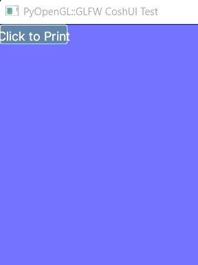
        <figcaption>Gif of button being clicked then falling.</figcaption>
    </figure>

    <details class="cui-collapse">
    <summary><span class="cui-collapse-chevron">▸</span>Properties and Easing Curves</summary>
    <div class="cui-collapse-content" markdown="1">

    As explained, CoshUI's animation system has many parameters, and some of them aren't very straightforward, especially the Node properties you can animate and the easing curves. Here's a comprehensive list of properties you can pass to CoshUI's `animate()` function.

    | Properties | Description |
    | :--- | :--- |
    | `background_color` | Smoothly shifts the Node's background to a new RGB color. |
    | `alpha` | Fades the Node in or out by easing its transparency toward the target value. |
    | `transform_position` | Glides the Node to a new offset position, without affecting layout. |
    | `transform_scale` | Grows or shrinks the Node toward the target scale, relative to its center. |
    | `transform_rotation` | Spins the Node counter-clockwise toward the target rotation, in degrees. |

    When it comes to easing curves, CoshUI's list is quite small currently but should be enough for most use cases. A quick note would be the `_in` suffix on the easing means the movement is applied at the beginning and the `_out` suffix means the movement is applied at the end. Here is CoshUI's list:

    | Easing Curves | Description |
    | :--- | :--- |
    | `linear` | Moves at a constant speed from start to finish — no acceleration or deceleration. |
    | `ease_in` | Starts slow and speeds up toward the end. |
    | `ease_out` | Starts fast and slows down toward the end. |
    | `ease_in_out` | Starts slow, speeds up in the middle, then slows down again at the end. |
    | `ease_in_bounce` | Bounces a few times right at the start before settling into motion. |
    | `ease_out_bounce` | Settles in with a few bounces at the end, like a ball coming to rest. |
    | `ease_in_elastic` | Winds up with a springy overshoot before snapping into motion. |
    | `ease_out_elastic` | Overshoots the target and wobbles back like a spring before settling. |

    To learn more about animations, check out the [Animation](../learn-the-api/animations/index.md) section in the API.

    </div>
    </details>

    ---

    ## Creating A Menu Screen
    Now that we've decently discussed CoshUI's capabilities, let's get on to actually creating something. We'll use the same boilerplate with the same `root_container` Container as declared but lets get back on track to actually making a basic version of something that you or someone might try making for a game. 

    ```python title="pyopengl_glfw_test.py"
    with cui.CoshUIRenderer(backend):
        with cui.Container(id="root_container", width=cui.FILL, height=cui.FILL):
            pass
    ```
    With this container that fills the entire screen, we can then add a `Label()` widget acting as our game's title.

    ```python title="pyopengl_glfw_test.py"
    with cui.CoshUIRenderer(backend):
        with cui.Container(id="root_container", width=cui.FILL, height=cui.FILL):
            cui.Label(id="title", text="CoshUI Test")
    ```
    If you run the file, you'll see our "CoshUI Test" label at the top-left. What we want is to put this at the very center, so let's use the `align` and `justify` parameters to put it to the center like this: 

    ```python title="pyopengl_glfw_test.py"
    with cui.CoshUIRenderer(backend):
        with cui.Container(id="root_container", width=cui.FILL, height=cui.FILL, align=cui.ALIGN_CENTER, justify=cui.JUSTIFY_CENTER):
            cui.Label(id="title", text="CoshUI Test")
    ```
    If you followed everything correctly (or copy pasted the code), it should show "CoshUI Test" being at the middle of the screen. Let's add a couple of buttons to make it *look* like a menu screen shall we? Let's also wrap the `Label()` in a container so we can set the direction to `COLUMN` instead of `ROW`:

    ```python title="pyopengl_glfw_test.py"
    with cui.CoshUIRenderer(backend):
        with cui.Container(id="root_container", width=cui.FILL, height=cui.FILL, align=cui.ALIGN_CENTER, justify=cui.JUSTIFY_CENTER):
            with cui.Container(id="menu_container", direction=cui.COLUMN, align=cui.ALIGN_CENTER, justify=cui.JUSTIFY_CENTER):
                cui.Label(id="title", text="CoshUI Test")
                cui.Button(id="start_btn", text="Start")
                cui.Button(id="quit_btn", text="Quit")
    ```

    <figure>
        
        <figcaption>Early Menu Screen</figcaption>
    </figure>

    If the image loaded properly, that's how your menu screen should look like. You might think: "This doesn't really look that good...", but that's okay, these are the default values. CoshUI supports styling overrides for the default styling. So lets start that:

    ```python title="pyopengl_glfw_test.py"
    with cui.CoshUIRenderer(backend):
        with cui.Container(id="root_container", width=cui.FILL, height=cui.FILL, align=cui.ALIGN_CENTER, justify=cui.JUSTIFY_CENTER):
            with cui.Container(id="menu_container", direction=cui.COLUMN, align=cui.ALIGN_CENTER, justify=cui.JUSTIFY_CENTER, gap=10):
                cui.Label(id="title", text="CoshUI Test", font_size=56)
                cui.Button(id="start_btn", text="Start")
                cui.Button(id="quit_btn", text="Quit")
    ```
    We've added a small gap between all the children and also made the title bigger which mirrors most basic menu screens. Now let's style our buttons, if you've read the "Reusable Styling Through Classes" in this page's [Styling Your First Element](#styling-your-first-element), you'd know we can create classes to reuse. Let's do just that for buttons:

    ```python title="pyopengl_glfw_test.py"
    cui.add_class(
        "menu_buttons", 
        cui.CoshStyling(background_color=(220, 165, 255), border=None, border_radius=(10, 0, 10, 0))
    )
    ```
    Reminder to place this code ***before*** the while loop. If you've set up the class, then you can do this to add the custom styling to your buttons:

    ```python title="pyopengl_glfw_test.py"
    with cui.CoshUIRenderer(backend):
        with cui.Container(id="root_container", width=cui.FILL, height=cui.FILL, align=cui.ALIGN_CENTER, justify=cui.JUSTIFY_CENTER):
            with cui.Container(id="menu_container", direction=cui.COLUMN, align=cui.ALIGN_CENTER, justify=cui.JUSTIFY_CENTER, gap=10):
                cui.Label(id="title", text="CoshUI Test", font_size=56)
                cui.Button(id="start_btn", text="Start", classes="menu_buttons")
                cui.Button(id="quit_btn", text="Quit", classes="menu_buttons")
    ```

    <figure>
        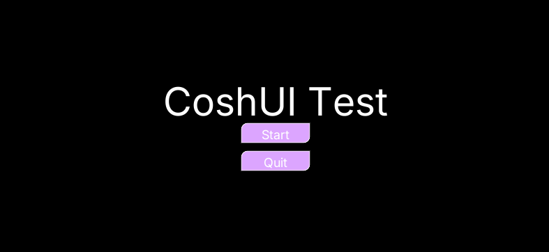
        <figcaption>Menu Screen with Custom Buttons</figcaption>
    </figure>

    Now lets add some interaction such as making it so when you click the "Quit" button it closes the window:

    ```python title="pyopengl_glfw_test.py"
    with cui.CoshUIRenderer(backend):
        with cui.Container(id="root_container", width=cui.FILL, height=cui.FILL, align=cui.ALIGN_CENTER, justify=cui.JUSTIFY_CENTER):
            with cui.Container(id="menu_container", direction=cui.COLUMN, align=cui.ALIGN_CENTER, justify=cui.JUSTIFY_CENTER, gap=10):
                cui.Label(id="title", text="CoshUI Test", font_size=56)
                cui.Button(id="start_btn", text="Start", classes="menu_buttons")
                cui.Button(id="quit_btn", text="Quit", classes="menu_buttons")

    if cui.get_signal("quit_btn", cui.CLICKED):
        break
    ```

    With that, the quit button should be fully functional. Before this tutorial ends though, let's add some functionality to our "Start" button, something simple like a fade out effect with CoshUI's animation system:

    ```python title="pyopengl_glfw_test.py"
    with cui.CoshUIRenderer(backend):
        with cui.Container(id="root_container", width=cui.FILL, height=cui.FILL, align=cui.ALIGN_CENTER, justify=cui.JUSTIFY_CENTER):
            with cui.Container(id="menu_container", direction=cui.COLUMN, align=cui.ALIGN_CENTER, justify=cui.JUSTIFY_CENTER, gap=10):
                cui.Label(id="title", text="CoshUI Test", font_size=56)
                cui.Button(id="start_btn", text="Start", classes="menu_buttons")
                cui.Button(id="quit_btn", text="Quit", classes="menu_buttons")

    if cui.get_signal("start_btn", cui.CLICKED):
        cui.animate("alpha", "menu_container", 0, 1.5, "linear")
    if cui.get_signal("quit_btn", cui.CLICKED):
        break
    ```

    <figure markdown>
        
        <figcaption>Menu Screen fading when clicking Start</figcaption>
    </figure>

    Now you might worry about the UI still being rendered when alpha is set to 0 but you don't need to as Elements get skipped when `alpha` is set to 0 or if `background_color` has no value, so your frame budget will be less than what's necessarily there.

    ---

    ## Final Remarks 
    And with that, that should give you the basic understanding of how to use CoshUI. This tutorial can't cover everything like image rendering or other widgets such as `Grid`, `Modal`, `Slider`, and more. So if you want to dive even deeper and create cooler things with CoshUI, you can head on over to the [Learn The API](../learn-the-api/getting-started.md){ data-preview } section for more.

    And of course, here's the final code file we worked on:

    ```python title="pyopengl_glfw_test.py"
    import glfw
    from OpenGL.GL import *
    import coshui as cui

    def main():
        if not glfw.init(): return

        window = glfw.create_window(800, 800, "PyOpenGL::GLFW CoshUI Test", None, None)
        if not window:
            glfw.terminate()
            return

        glfw.make_context_current(window)
        
        glClearColor(0.0, 0.0, 0.0, 1.0)

        backend = cui.PyOpenGLBackend(cui.GLFW)

        cui.add_class(
            "menu_buttons", 
            cui.CoshStyling(background_color=(220, 165, 255), border=None, border_radius=(10, 0, 10, 0))
        )

        while not glfw.window_should_close(window):
            glClear(GL_COLOR_BUFFER_BIT | GL_DEPTH_BUFFER_BIT)

            with cui.CoshUIRenderer(backend):
                with cui.Container(id="root_container", width=cui.FILL, height=cui.FILL, align=cui.ALIGN_CENTER, justify=cui.JUSTIFY_CENTER):
                    with cui.Container(id="menu_container", direction=cui.COLUMN, align=cui.ALIGN_CENTER, justify=cui.JUSTIFY_CENTER, gap=10):
                        cui.Label(id="title", text="CoshUI Test", font_size=56)
                        cui.Button(id="start_btn", text="Start", classes="menu_buttons")
                        cui.Button(id="quit_btn", text="Quit", classes="menu_buttons")

            if cui.get_signal("start_btn", cui.CLICKED):
                cui.animate("alpha", "menu_container", 0, 1.5, "linear")
            if cui.get_signal("quit_btn", cui.CLICKED):
                break

            glfw.swap_buffers(window)
            glfw.poll_events()

        glfw.terminate()

    if __name__ == "__main__":
        main()
    ```

=== "ModernGL | GLFW"

    ## Prerequisites

    - `Python v3.10+`
    - `coshui` package
    - `moderngl` dependency

    If you haven't met these requirements, please go [here.](installation.md)

    ---

    ## Basic Boilerplate
    To start us off, let's make the `ModernGL` with `GLFW` boilerplate that we'll use for this tutorial. If you're following along, make sure to copy this boilerplate into your file.
    
    **Do note that all UI related code that we will be working on will be within the highlighted line.**

    ```python title="moderngl_glfw_test.py" hl_lines="20"
    import moderngl
    import glfw
    import coshui as cui    

    def main():
        if not glfw.init(): return

        window = glfw.create_window(800, 800, "ModernGL::GLFW CoshUI Test", None, None)
        if not window:
            glfw.terminate()
            return

        glfw.make_context_current(window)

        ctx = moderngl.create_context()

        while not glfw.window_should_close(window):
            ctx.clear(0.0, 0.0, 0.0, 1.0)

            # CoshUI Code Here

            glfw.swap_buffers(window)
            glfw.poll_events()

        glfw.terminate()

    if __name__ == "__main__":
        main()
    ```

    ---

    ## Setting Up CoshUIRenderer
    Let us move on to the *"body"* of CoshUI. `CoshUIRenderer()` is the "entry point" of the CoshUI engine, UI syntax will not work properly without it. To set it up for `ModernGL`, you must do this:

    ```python title="moderngl_glfw_test.py"
    # Before the while loop
    backend = cui.ModernGLBackend(ctx, cui.GLFW)

    while not glfw.window_should_close(window):
        ...
    ```
    We must set up the backend *before* the main loop so compiling shaders and creation of arrays and buffers are done only **once**.

    !!! info "Highlight in Boilerplate"
        Remember to put this code within the highlighted part of the boilerplate.

    ```python title="moderngl_glfw_test.py"
    with cui.CoshUIRenderer(backend):
        pass
    ```

    All UI code runs within this context manager (`with` block). It registers all CoshUI nodes, determines their order of rendering, and gives you the ability to animate and interact with them for free.

    !!! note "Immediate and Retained Hybrid"
        A note to keep in mind is that CoshUI is inherently an "immediate mode" UI library, meaning it rebuilds every Node per frame. It gets away with signals and animations because it has an internal reconciliation layer that saves and sets state per frame.

    <details class="cui-collapse">
    <summary><span class="cui-collapse-chevron">▸</span>CoshUIRenderer Parameters</summary>
    <div class="cui-collapse-content" markdown="1">

    Before we move on, I'd like to discuss the *parameters* `CoshUIRenderer()` takes. It takes a `CoshBackend` instance for its first parameter and a `CoshMode` instance for its second. `CoshBackend` is easy to deduce, it's the backend that we pass based on what rendering pipeline we're using, but `CoshMode` might be a little confusing.

    `CoshMode` is defaulted to `NORMAL`, which makes it run normally. But one thing you can do is set it to `DEBUG`:
    ```python title="moderngl_glfw_test.py"
    with cui.CoshUIRenderer(backend, cui.DEBUG):
        pass
    ```

    If set to `DEBUG`, it will open up a tkinter window that lets you see the entire UI structure and click individual Nodes to see their properties for that frame (similar to DevTools on a browser). This is helpful for whenever need to check values for each Node. 

    <figure align="center" markdown="span">
        { width="500" }
        <figcaption>Gif of CoshUI's debugger.</figcaption>
    </figure>

    </div>
    </details>

    ---

    ## Declaring Your First Element
    Learning new UI libraries can be scared because of the new API you have to learn, but CoshUI is built to be easy to pick up without much resistance when building or migrating the UI. If you have experience with HTML then this might seem very familiar, if you don't then that's completely okay. Let's create our first `Container` as a Node instead of a Parent. Here's how that works:

    ```python title="moderngl_glfw_test.py"
    with cui.CoshUIRenderer(backend):
        cui.Container(id="root_container", width=100, height=100)
    ```
    
    If you've added that to your code and ran it, you might be confused as to why nothing is showing, well no need to worry about that for now, your `Container` is currently invisible because it has no color. We'll get into styling in the next section. 
    
    Back to our example above, that `Container` instance creates a box that is 100x100 in size on the top-left of the screen. An interesting part about `Containers` is that they can actually act as context managers that take in children like this:

    ```python title="moderngl_glfw_test.py"
    with cui.CoshUIRenderer(backend):
        with cui.Container(id="root_container", width=100, height=100):
            cui.Container(id="child_container", width=50, height=50)
    ```
    This arrangement creates a `Container` ***within*** the `root_container` that is 50x50 in size.

    !!! note "Node Types"
        From this, there might be some people thinking CoshUI is all about `Containers`, but the `Container` is one of many Nodes/Widgets in CoshUI. We'll get to the others soon.

    ---

    ## Styling Your First Element
    In other UI libraries, styling is mostly an afterthought. In CoshUI, styling is a primary part of the experience. To style a Node, you need to utilize CoshUI's `CoshStyling` object. It holds the properties that each Node needs to be visually distinct. 
    
    So let's first add a color to our `Container`. To set it, you can do this:

    ```python title="moderngl_glfw_test.py"
    with cui.CoshUIRenderer(backend):
        cui.Container(
            id="root_container", 
            width=100, height=100, 
            style=cui.CoshStyling(background_color=(100, 100, 255))
        )
    ```
    When run, this should show your 100x100 ***light blue-ish*** `Container` at the top-left of your window. 

    <figure markdown>
        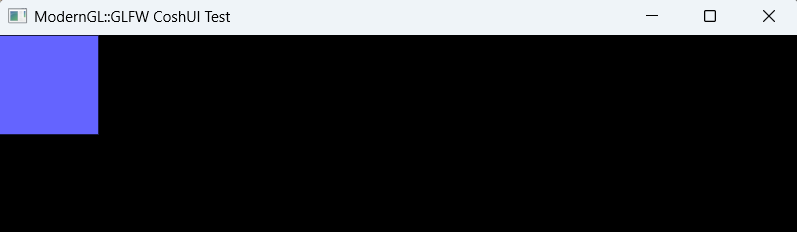
        <figcaption>Image of Blue 100x100 Container.</figcaption>
    </figure>

    <details class="cui-collapse">
    <summary><span class="cui-collapse-chevron">▸</span>CoshStyling Parameters</summary>
    <div class="cui-collapse-content" markdown="1">

    The `CoshStyling` object is what determines the visual identity of a Node. It offers a few parameters that let you change the entire look of a Node.

    #### Background Color and Alpha
    Background Color is almost a no-brainer. Its main purpose is to declare the color of the Node. It can be set like this: `background_color=(R, G, B)` or `background_color=(R, G, B, A)`.

    Alpha is also — again — a no-brainer. It determines the *transparency* of a Node. It can be set like this: `alpha=0-255`.

    You may notice, background color lets you set the alpha within it. Not to worry though, if the `alpha` field is set when the alpha value is set in `background_color`, the `alpha` field takes priority.

    #### Border
    Border sets an outline around a Node. It can be set like this: `border=((R, G, B), weight)` or `border=(R, G, B, weight)`

    #### Border Radius
    Border radius determines the *roundness* of a Node's corner. You can either set all corners or each individual corner like this: `border_radius=20` or `border_radius=(top-left, top-right, bottom-right, bottom-left)`

    #### Transforms
    CoshUI has ["transform" properties](../learn-the-api/getting-started.md#definition-of-terms){ data-preview }. Basically properties that only affect rendering, not layout.

    The first is `transform_position`, which lets you offset the node relative to its position. Basically (0, 50) means it moves 50 pixels downward from its current position. It can be set like this: `transform_position=(x, y)`

    The next one is `transform_scale`, which changes the **scale** of a Node with the default being 1.0. It can be set like this: `transform_scale=2.0` which makes the Node 2x bigger relative to its center.

    The last one is `transform_rotation`, which rotates the Node based counter-clockwise on the passed degree. It can be set like this: `transform_rotation=45.0` which tilts the node 45 degrees counter-clockwise.

    To learn more about styling, check the [Styling](../learn-the-api/styling/index.md){ data-preview } section in the API.  

    </div>
    </details>

    <details class="cui-collapse">
    <summary><span class="cui-collapse-chevron">▸</span>Reusable Styling Through Classes</summary>
    <div class="cui-collapse-content" markdown="1">
    
    If you've noticed, styling can be somewhat tedious, especially if it's the same styles applied to multiple Nodes. To make it easier, CoshUI has a *class* system that you can utilize to apply the same styles to many Nodes without re-declaring the same `CoshStyling` object. To use it you have to declare the class and the `CoshStyling` object **before** the main while loop like this:

    ```python title="moderngl_glfw_test.py"
    # This is called BEFORE the while loop.
    cui.add_class(
        "example_class", 
        cui.CoshStyling(background_color=(255, 100, 100), border_radius=10, border=((255, 255, 255), 5))
    )
    ```

    with that, you can now pass in that style to a Node by passing it through the `classes` field with the string itself (`classes="example_class"`) or a list (`classes=["example_class"]`). Here's an example:

    ```python title="moderngl_glfw_test.py"
    with cui.CoshUIRenderer(backend):
        cui.Container(
            id="root_container", 
            width=100, height=100, 
            classes="example_class"
        )
    ```

    The cool thing about classes is that you can pass in ***multiple*** classes at the same time, so if you declare multiple classes with different styling for each, the Node will take in all of it like this: 

    ```python title="moderngl_glfw_test.py"
    # Outside the while loop
    cui.add_class(
        "example_class", 
        cui.CoshStyling(background_color=(255, 100, 100), border_radius=10, border=((255, 255, 255), 5))
    )
    cui.add_class(
        "example_class2", 
        cui.CoshStyling(alpha=150)
    )

    # in CoshUIRenderer
    with cui.CoshUIRenderer(backend):
        cui.Container(
            id="root_container", 
            width=100, height=100, 
            classes="example_class example_class2"
        )
    ```

    You can pass multiple classes like this where you just add in a space to the string, but if your class name itself has a space (for some reason), it's better to pass it through a list like this:

    ```python title="moderngl_glfw_test.py"
    classes=["example_class", "example_class2"]
    ```

    !!! question "Class Ordering"
        A question appears with multiple classes, what styles get added if there are conflicting styles? In CoshUI, the classes that are added ***later*** in the `classes` field will override the ones added before. In the example above, if the two classes had conflicting properties, the one added latest will override the ones before. And of course, explicit styling (styles directly added through the `style` field) takes highest priority.

        **Example:**
        ```python title="moderngl_glfw_test.py"
        cui.add_class(
            "blue",
            cui.CoshStyling(background_color=(0, 0, 255))
        )

        cui.add_class(
            "red",
            cui.CoshStyling(background_color=(255, 0, 0))
        )

        cui.Container(
            classes="red blue"
        )
        ```
        In this example, the color of the Container will be blue.

    If you want to learn more about reusable styling, check out the [Classes](../learn-the-api/styling/classes.md){ data-preview } section in the API.

    </div>
    </details>

    ---

    ## Layout Fundamentals
    Before moving on, let's learn a little bit about the layout properties you can set which gives you maximum control over your UI. 
    
    As this is a little much to take on all at once, I've made every part collapsible so it's easier to digest one at a time.

    <details class="cui-collapse">
    <summary><span class="cui-collapse-chevron">▸</span>Width and Height</summary>
    <div class="cui-collapse-content" markdown="1">

    As shown in earlier sections, you can set width and height. These two properties are [Universal Properties](../learn-the-api/getting-started.md#definition-of-terms){ data-preview }, meaning they exist and can be set in every Node within CoshUI. They determine the size of your Node based on pixels. Here are the 4 ways to set width and height:

    ```python title="moderngl_glfw_test.py"
    # Fixed
    cui.Container(
        width=100
    )
    # Fill
    cui.Container(
        width=cui.FILL
    )
    # AUTO
    cui.Container(
        width=cui.AUTO
    )
    # Percentage
    cui.Container(
        width=cui.PERCENTAGE(75)
    )
    ```

    To learn more, check out the [Width and Height](../learn-the-api/layout/width-and-height.md#introduction){ data-preview } section in the API.

    </div>
    </details>

    <details class="cui-collapse">
    <summary><span class="cui-collapse-chevron">▸</span>Padding and Margin</summary>
    <div class="cui-collapse-content" markdown="1">

    Margin is a [Universal Property](../learn-the-api/getting-started.md#definition-of-terms){ data-preview } whilst padding is a [Local Property](../learn-the-api/getting-started.md#definition-of-terms){ data-preview } and can only be set within `ParentNodes` (Nodes that can take in children). An example of a `ParentNode` would be `Container`. Margin is the property that dictates the space other nodes need to give around that specific Node, while padding dictates the distance the children should be from the edges of that `ParentNode`. You can set padding and margin like this:

    ```python title="moderngl_glfw_test.py"
    cui.Container(padding=10, margin=10)
    ```

    To learn more, check out the [Padding and Margin](../learn-the-api/layout/padding-and-margin.md#introduction){ data-preview } section in the API.

    </div>
    </details>

    <details class="cui-collapse">
    <summary><span class="cui-collapse-chevron">▸</span>Positioning</summary>
    <div class="cui-collapse-content" markdown="1">

    Positioning is a simple toggle in CoshUI. It determines whether a Node will be added to the layout calculations or not. The default is `RELATIVE`, meaning it will take up space and other Nodes will respect that space, setting it to `ABSOLUTE` makes it so that Node no longer gets added to layout calculations. Other Nodes will take that Node's space, kind of like it doesn't exist anymore to them. This also opens up the `x` and `y` parameters discussed next. Setting `positioning` is like this:

    ```python title="moderngl_glfw_test.py"
    # ABSOLUTE
    cui.Container(positioning=cui.ABSOLUTE)
    # RELATIVE (This is default so there's no point in setting this)
    cui.Container(positioning=cui.RELATIVE)
    ```

    To learn more, check out the [Positioning](../learn-the-api/layout/absolute-vs-relative.md#introduction){ data-preview } section in the API.

    </div>
    </details>

    <details class="cui-collapse">
    <summary><span class="cui-collapse-chevron">▸</span>Position</summary>
    <div class="cui-collapse-content" markdown="1">

    Position in CoshUI refers to the `x` and `y` properties, and these are a bit *special*. It can only be mutated when the `positioning` parameter is set to `ABSOLUTE`, if not then adding values to `x` and `y` does nothing. What `x` and `y` do is directly offsets the position (relative to the parent) of the node *layout-wise*. To set `x` and `y`, you need to first set `positioning` to `ABSOLUTE` first, like this:

    ```python title="moderngl_glfw_test.py"
    cui.Container(positioning=cui.ABSOLUTE, x=50, y=100)
    ```

    To learn more, check out the [Position](../learn-the-api/layout/position.md#introduction){ data-preview } section in the API.

    </div>
    </details>

    <details class="cui-collapse">
    <summary><span class="cui-collapse-chevron">▸</span>Align and Justify</summary>
    <div class="cui-collapse-content" markdown="1">

    The `align` and `justify` properties for CoshUI are [Local Properties](../learn-the-api/getting-started.md#definition-of-terms){ data-preview }, they are accessible only through `ParentNodes` like `Container` or `Grid`. They determine the position of that Nodes children within itself. They can be set like this:

    ```python title="moderngl_glfw_test.py"
    # Note that these are only accessible through ParentNodes.
    cui.Container(align=cui.ALIGN_CENTER, justify=cui.JUSTIFY_CENTER)

    # These are the values you can set align and justify to.
    align=cui.ALIGN_START
    align=cui.ALIGN_CENTER
    align=cui.ALIGN_END
    justify=cui.JUSTIFY_START
    justify=cui.JUSTIFY_CENTER
    justify=cui.JUSTIFY_END
    justify=cui.JUSTIFY_SPACE_AROUND
    justify=cui.JUSTIFY_SPACE_BETWEEN
    justify=cui.JUSTIFY_SPACE_EVENLY
    ```

    As this is a complex topic, it is encouraged to check the [Align and Justify](../learn-the-api/layout/align-and-justify.md#introduction){ data-preview } section in the API.

    </div>
    </details>

    <details class="cui-collapse">
    <summary><span class="cui-collapse-chevron">▸</span>Gap</summary>
    <div class="cui-collapse-content" markdown="1">

    The `gap` property only exists in `ParentNodes`. It's a simple property, all it does is determine the gap children will have between each other. Here's how to set it:

    ```python title="moderngl_glfw_test.py"
    with cui.Container(gap=10):
        ...
    ```

    The example above makes it so the children of the `Container` will have a gap of 10 pixels between each other.

    </div>
    </details>

    <details class="cui-collapse">
    <summary><span class="cui-collapse-chevron">▸</span>Direction</summary>
    <div class="cui-collapse-content" markdown="1">

    The `direction` property is a property that only the `Container` widget possesses, it determines whether children will be placed horizontally or vertically. It's default value is `ROW` and setting it is simple:

    ```python title="moderngl_glfw_test.py"
    with cui.Container(direction=cui.COLUMN):
        ...
    ```

    You can set it to both `ROW` and `COLUMN`, but `ROW` is default so there's no point in setting it unless you want to be explicit.

    </div>
    </details>

    ---

    ## Introducing Signals
    If you've used other UI frameworks, interaction systems usually use callback systems, which can be rather complex and a bit of a mess to set up. In CoshUI however, you can use what's called a "signal". Every Node will emit one, so if a Node is hovered over it will emit a `HOVERED` signal, if it is clicked it will emit a `CLICKED` signal. This comes automatically so users only need to poll those signals to check whether an event has happened to a Node or not, which lets you run your code if it has. 
    
    Let's declare a `Button()` — one of CoshUI's many widgets — and see how it works. Let's also make it so the Container's width and height fill the entire screen, here's how that will work:

    ```python title="moderngl_glfw_test.py"
    with cui.CoshUIRenderer(backend):
        with cui.Container(
            id="root_container", 
            width=cui.FILL, height=cui.FILL, 
            style=cui.CoshStyling(background_color=(100, 100, 255))
        ):
            cui.Button(id="example_button", text="Click to Print")
    ```
    If you run it, you might be able to notice the button having its own hover and click animations. That's an example of the signal system in action. Now to make it yourself, you need to make an `if` statement with the `get_signal()` function that CoshUI provides:

    ```python title="moderngl_glfw_test.py"
    with cui.CoshUIRenderer(backend):
        with cui.Container(
            id="root_container", 
            width=cui.FILL, height=cui.FILL, 
            style=cui.CoshStyling(background_color=(100, 100, 255))
        ):
            cui.Button(id="example_button", text="Click to Print")

    if cui.get_signal("example_button", cui.CLICKED):
        print("Hello World!")
    ```
    From the example, you can see that `get_signal()` takes in 2 parameters, the id of the Node you want to capture signals from and the event you want to poll. Once you click the button, it will now print `Hello World!` in the terminal.

    A nice thing about the signal system is that it works for every Node, not just buttons. If you want to see if a `Container` was clicked, you can poll it as long as it has an id. It's also additive, meaning if you make a signal on the same Node, it doesn't override others. 

    **Example:**
    ```python title="moderngl_glfw_test.py"
    with cui.CoshUIRenderer(backend):
        cui.Container(
            id="root_container", 
            width=cui.FILL, height=cui.FILL, 
            style=cui.CoshStyling(background_color=(100, 100, 255))
        )

    if cui.get_signal("root_container", cui.CLICKED):
        print("Hello World!")
    ```

    <details class="cui-collapse">
    <summary><span class="cui-collapse-chevron">▸</span>Mouse Filters</summary>
    <div class="cui-collapse-content" markdown="1">
    
    In CoshUI, there are ways to customize *how* a Node receives and consumes interaction events. We can achieve that with the `mouse_filter` field which is a [Universal Property](../learn-the-api/getting-started.md#definition-of-terms){ data-preview }. 

    The first value you can set `mouse_filter` to is `IGNORE`:

    ```python title="moderngl_glfw_test.py"
    cui.Container(mouse_filter=cui.IGNORE)
    ```
    This makes it so the Node doesn't emit any signals while also letting Nodes below it receive the event.

    Next value is `PASS`:

    ```python title="moderngl_glfw_test.py"
    cui.Container(mouse_filter=cui.PASS)
    ```
    This lets the interaction event *pass through* the Node whilst also emitting the signal.

    Last value is `STOP`:

    ```python title="moderngl_glfw_test.py"
    cui.Container(mouse_filter=cui.STOP)
    ```
    This is the default value and makes it so it receives the event and consumes it, stopping the event from propagating to Nodes below.

    </div>
    </details>

    <details class="cui-collapse">
    <summary><span class="cui-collapse-chevron">▸</span>Different Interactions</summary>
    <div class="cui-collapse-content" markdown="1">

    As you may have already guessed, there are quite a few interactions that can be passed in to the signal system. Here's what they are:

    ```python title="moderngl_glfw_test.py"
    # Checks if the node was just clicked.
    cui.CLICKED

    # Checks if the node was just released from a click event.
    cui.RELEASED

    # Checks if the node is being clicked that frame.
    cui.PRESSED

    # Checks if the cursor entered the Node's boundaries.
    cui.HOVER_ENTER 

    # Checks if the cursor exited the Node's boundaries.
    cui.HOVER_EXIT 

    # Checks if the cursor is within the Node's boundaries. 
    cui.HOVERED 
    ```

    These can be passed to the second parameter of the `get_signal()` function. To learn more, check the [Signals](../learn-the-api/interactions/signals.md) section in the API.

    </div>
    </details>

    ---

    ## Introducing Animations
    When using other UI libraries, I'm willing to bet most of them have little to no built-in animation systems. Some may have external libraries that help with animations but for the most part, animations are either fully missing or not even considered a first-class citizen. 
    
    CoshUI is different, it has its own animation system built upon the reconciliation structure. You've most probably seen it work in the previous section as the `Button()` widget has built-in animations. 
    
    So let's address how to animate Nodes. CoshUI has an `animate()` function that takes in 5 parameters, `n_property`, `target_id`, `end_value`, `duration`, and finally `easing`. Here's an example of how it works:

    ```python title="moderngl_glfw_test.py"
    if cui.get_signal("example_button", cui.CLICKED):
        cui.animate("transform_position", "example_button", (0, 50), 1.5, "ease_out_bounce")
    ```
    The example above shows a use case for animation, it makes it so if the button is clicked, it will animate its rendered position downwards 50 pixels in 1.5 seconds with an easing curve of "ease_out_bounce".

    <figure markdown>
        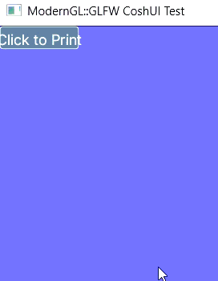
        <figcaption>Gif of button being clicked then falling.</figcaption>
    </figure>

    <details class="cui-collapse">
    <summary><span class="cui-collapse-chevron">▸</span>Properties and Easing Curves</summary>
    <div class="cui-collapse-content" markdown="1">

    As explained, CoshUI's animation system has many parameters, and some of them aren't very straightforward, especially the Node properties you can animate and the easing curves. Here's a comprehensive list of properties you can pass to CoshUI's `animate()` function.

    | Properties | Description |
    | :--- | :--- |
    | `background_color` | Smoothly shifts the Node's background to a new RGB color. |
    | `alpha` | Fades the Node in or out by easing its transparency toward the target value. |
    | `transform_position` | Glides the Node to a new offset position, without affecting layout. |
    | `transform_scale` | Grows or shrinks the Node toward the target scale, relative to its center. |
    | `transform_rotation` | Spins the Node counter-clockwise toward the target rotation, in degrees. |

    When it comes to easing curves, CoshUI's list is quite small currently but should be enough for most use cases. A quick note would be the `_in` suffix on the easing means the movement is applied at the beginning and the `_out` suffix means the movement is applied at the end. Here is CoshUI's list:

    | Easing Curves | Description |
    | :--- | :--- |
    | `linear` | Moves at a constant speed from start to finish — no acceleration or deceleration. |
    | `ease_in` | Starts slow and speeds up toward the end. |
    | `ease_out` | Starts fast and slows down toward the end. |
    | `ease_in_out` | Starts slow, speeds up in the middle, then slows down again at the end. |
    | `ease_in_bounce` | Bounces a few times right at the start before settling into motion. |
    | `ease_out_bounce` | Settles in with a few bounces at the end, like a ball coming to rest. |
    | `ease_in_elastic` | Winds up with a springy overshoot before snapping into motion. |
    | `ease_out_elastic` | Overshoots the target and wobbles back like a spring before settling. |

    To learn more about animations, check out the [Animation](../learn-the-api/animations/index.md) section in the API.

    </div>
    </details>

    ---

    ## Creating A Menu Screen
    Now that we've decently discussed CoshUI's capabilities, let's get on to actually creating something. We'll use the same boilerplate with the same `root_container` Container as declared but lets get back on track to actually making a basic version of something that you or someone might try making for a game. 

    ```python title="moderngl_glfw_test.py"
    with cui.CoshUIRenderer(backend):
        with cui.Container(id="root_container", width=cui.FILL, height=cui.FILL):
            pass
    ```
    With this container that fills the entire screen, we can then add a `Label()` widget acting as our game's title.

    ```python title="moderngl_glfw_test.py"
    with cui.CoshUIRenderer(backend):
        with cui.Container(id="root_container", width=cui.FILL, height=cui.FILL):
            cui.Label(id="title", text="CoshUI Test")
    ```
    If you run the file, you'll see our "CoshUI Test" label at the top-left. What we want is to put this at the very center, so let's use the `align` and `justify` parameters to put it to the center like this: 

    ```python title="moderngl_glfw_test.py"
    with cui.CoshUIRenderer(backend):
        with cui.Container(id="root_container", width=cui.FILL, height=cui.FILL, align=cui.ALIGN_CENTER, justify=cui.JUSTIFY_CENTER):
            cui.Label(id="title", text="CoshUI Test")
    ```
    If you followed everything correctly (or copy pasted the code), it should show "CoshUI Test" being at the middle of the screen. Let's add a couple of buttons to make it *look* like a menu screen shall we? Let's also wrap the `Label()` in a container so we can set the direction to `COLUMN` instead of `ROW`:

    ```python title="moderngl_glfw_test.py"
    with cui.CoshUIRenderer(backend):
        with cui.Container(id="root_container", width=cui.FILL, height=cui.FILL, align=cui.ALIGN_CENTER, justify=cui.JUSTIFY_CENTER):
            with cui.Container(id="menu_container", direction=cui.COLUMN, align=cui.ALIGN_CENTER, justify=cui.JUSTIFY_CENTER):
                cui.Label(id="title", text="CoshUI Test")
                cui.Button(id="start_btn", text="Start")
                cui.Button(id="quit_btn", text="Quit")
    ```

    <figure>
        
        <figcaption>Early Menu Screen</figcaption>
    </figure>

    If the image loaded properly, that's how your menu screen should look like. You might think: "This doesn't really look that good...", but that's okay, these are the default values. CoshUI supports styling overrides for the default styling. So lets start that:

    ```python title="moderngl_glfw_test.py"
    with cui.CoshUIRenderer(backend):
        with cui.Container(id="root_container", width=cui.FILL, height=cui.FILL, align=cui.ALIGN_CENTER, justify=cui.JUSTIFY_CENTER):
            with cui.Container(id="menu_container", direction=cui.COLUMN, align=cui.ALIGN_CENTER, justify=cui.JUSTIFY_CENTER, gap=10):
                cui.Label(id="title", text="CoshUI Test", font_size=56)
                cui.Button(id="start_btn", text="Start")
                cui.Button(id="quit_btn", text="Quit")
    ```
    We've added a small gap between all the children and also made the title bigger which mirrors most basic menu screens. Now let's style our buttons, if you've read the "Reusable Styling Through Classes" in this page's [Styling Your First Element](#styling-your-first-element), you'd know we can create classes to reuse. Let's do just that for buttons:

    ```python title="moderngl_glfw_test.py"
    cui.add_class(
        "menu_buttons", 
        cui.CoshStyling(background_color=(220, 165, 255), border=None, border_radius=(10, 0, 10, 0))
    )
    ```
    Reminder to place this code ***before*** the while loop. If you've set up the class, then you can do this to add the custom styling to your buttons:

    ```python title="moderngl_glfw_test.py"
    with cui.CoshUIRenderer(backend):
        with cui.Container(id="root_container", width=cui.FILL, height=cui.FILL, align=cui.ALIGN_CENTER, justify=cui.JUSTIFY_CENTER):
            with cui.Container(id="menu_container", direction=cui.COLUMN, align=cui.ALIGN_CENTER, justify=cui.JUSTIFY_CENTER, gap=10):
                cui.Label(id="title", text="CoshUI Test", font_size=56)
                cui.Button(id="start_btn", text="Start", classes="menu_buttons")
                cui.Button(id="quit_btn", text="Quit", classes="menu_buttons")
    ```

    <figure>
        
        <figcaption>Menu Screen with Custom Buttons</figcaption>
    </figure>

    Now lets add some interaction such as making it so when you click the "Quit" button it closes the window:

    ```python title="moderngl_glfw_test.py"
    with cui.CoshUIRenderer(backend):
        with cui.Container(id="root_container", width=cui.FILL, height=cui.FILL, align=cui.ALIGN_CENTER, justify=cui.JUSTIFY_CENTER):
            with cui.Container(id="menu_container", direction=cui.COLUMN, align=cui.ALIGN_CENTER, justify=cui.JUSTIFY_CENTER, gap=10):
                cui.Label(id="title", text="CoshUI Test", font_size=56)
                cui.Button(id="start_btn", text="Start", classes="menu_buttons")
                cui.Button(id="quit_btn", text="Quit", classes="menu_buttons")

    if cui.get_signal("quit_btn", cui.CLICKED):
        break
    ```

    With that, the quit button should be fully functional. Before this tutorial ends though, let's add some functionality to our "Start" button, something simple like a fade out effect with CoshUI's animation system:

    ```python title="moderngl_glfw_test.py"
    with cui.CoshUIRenderer(backend):
        with cui.Container(id="root_container", width=cui.FILL, height=cui.FILL, align=cui.ALIGN_CENTER, justify=cui.JUSTIFY_CENTER):
            with cui.Container(id="menu_container", direction=cui.COLUMN, align=cui.ALIGN_CENTER, justify=cui.JUSTIFY_CENTER, gap=10):
                cui.Label(id="title", text="CoshUI Test", font_size=56)
                cui.Button(id="start_btn", text="Start", classes="menu_buttons")
                cui.Button(id="quit_btn", text="Quit", classes="menu_buttons")

    if cui.get_signal("start_btn", cui.CLICKED):
        cui.animate("alpha", "menu_container", 0, 1.5, "linear")
    if cui.get_signal("quit_btn", cui.CLICKED):
        break
    ```

    <figure markdown>
        
        <figcaption>Menu Screen fading when clicking Start</figcaption>
    </figure>

    Now you might worry about the UI still being rendered when alpha is set to 0 but you don't need to as Elements get skipped when `alpha` is set to 0 or if `background_color` has no value, so your frame budget will be less than what's necessarily there.

    ---

    ## Final Remarks 
    And with that, that should give you the basic understanding of how to use CoshUI. This tutorial can't cover everything like image rendering or other widgets such as `Grid`, `Modal`, `Slider`, and more. So if you want to dive even deeper and create cooler things with CoshUI, you can head on over to the [Learn The API](../learn-the-api/getting-started.md){ data-preview } section for more.

    And of course, here's the final code file we worked on:

    ```python title="moderngl_glfw_test.py"
    import moderngl
    import glfw
    import coshui as cui

    def main():
        if not glfw.init(): return

        window = glfw.create_window(800, 800, "ModernGL::GLFW CoshUI Test", None, None)
        if not window:
            glfw.terminate()
            return

        glfw.make_context_current(window)
        
        ctx = moderngl.create_context()

        backend = cui.ModernGLBackend(ctx, cui.GLFW)

        cui.add_class(
            "menu_buttons", 
            cui.CoshStyling(background_color=(220, 165, 255), border=None, border_radius=(10, 0, 10, 0))
        )

        while not glfw.window_should_close(window):
            ctx.clear(0.0, 0.0, 0.0, 1.0)

            with cui.CoshUIRenderer(backend):
                with cui.Container(id="root_container", width=cui.FILL, height=cui.FILL, align=cui.ALIGN_CENTER, justify=cui.JUSTIFY_CENTER):
                    with cui.Container(id="menu_container", direction=cui.COLUMN, align=cui.ALIGN_CENTER, justify=cui.JUSTIFY_CENTER, gap=10):
                        cui.Label(id="title", text="CoshUI Test", font_size=56)
                        cui.Button(id="start_btn", text="Start", classes="menu_buttons")
                        cui.Button(id="quit_btn", text="Quit", classes="menu_buttons")

            if cui.get_signal("start_btn", cui.CLICKED):
                cui.animate("alpha", "menu_container", 0, 1.5, "linear")
            if cui.get_signal("quit_btn", cui.CLICKED):
                break

            glfw.swap_buffers(window)
            glfw.poll_events()

        glfw.terminate()

    if __name__ == "__main__":
        main()
    ```

=== "ModernGL | MGLW"

    ## Prerequisites

    - `Python v3.10+`
    - `coshui` package
    - `moderngl` dependency
    - `moderngl-window` dependency

    If you haven't met these requirements, please go [here.](installation.md)

    ---

    ## Basic Boilerplate
    To start us off, let's make the `ModernGL` with `MGLW` boilerplate that we'll use for this tutorial. If you're following along, make sure to copy this boilerplate into your file.
    
    **Do note that all UI related code that we will be working on will be within the highlighted line.**

    !!! warning "ModernGL Window"
        CoshUI works somewhat *weirdly* with ModernGL Window. Due to ModernGL Window's architecture being mostly enclosed, developing a work around for using the library has been incredibly tough. CoshUI has to utilize internal functions — as shown in the `on_mouse_position_event()` method where we set the internal `_mouse_pos` member variable — just to make the interaction system work. If you're using MGLW, be warned that although it works, CoshUI might have some future *issues* with the arrangement.

    ```python title="moderngl_mglw_test.py" hl_lines="19"
    import moderngl_window as mglw
    import coshui as cui

    class MyRenderer(mglw.WindowConfig):
        gl_version = (3, 3)
        title = "ModernGL::MGLW CoshUI Test"
        window_size = (800, 800)
        aspect_ratio = 16 / 9
        resizable = True

        def __init__(self, **kwargs):
            super().__init__(**kwargs)
            self.mouse_x = 0
            self.mouse_y = 0

        def on_render(self, time: float, frametime: float):
            self.ctx.clear(0.0, 0.0, 0.0)

            # CoshUI Code Here

        def on_resize(self, width: int, height: int):
            self.ctx.viewport = (0, 0, width, height)

        def on_mouse_position_event(self, x, y, dx, dy):
            self.mouse_x = x
            self.mouse_y = y

            # NOTE: This `on_mouse_position_event` method and this _mouse_pos = (x, y) is
            # necessary for CoshUI's interaction system to work. 
            mglw.window()._mouse_pos = (x, y)

    if __name__ == '__main__':
        mglw.run_window_config(MyRenderer)
    ```

    ---

    ## Setting Up CoshUIRenderer
    Let us move on to the *"body"* of CoshUI. `CoshUIRenderer()` is the "entry point" of the CoshUI engine, UI syntax will not work properly without it. To set it up for `ModernGL`, you must do this:

    ```python title="moderngl_mglw_test.py"
    def __init__(self, **kwargs):
        ...

        self.coshui_backend = cui.ModernGLBackend(self.ctx, cui.MGLW)

        ...
    ```
    We must set up the backend *inside* the `__init__` method so compiling shaders and creation of arrays and buffers are done only **once**.

    !!! info "Highlight in Boilerplate"
        Remember to put this code within the highlighted part of the boilerplate.

    ```python title="moderngl_mglw_test.py"
    with cui.CoshUIRenderer(self.coshui_backend):
        pass
    ```

    All UI code runs within this context manager (`with` block). It registers all CoshUI nodes, determines their order of rendering, and gives you the ability to animate and interact with them for free.

    !!! note "Immediate and Retained Hybrid"
        A note to keep in mind is that CoshUI is inherently an "immediate mode" UI library, meaning it rebuilds every Node per frame. It gets away with signals and animations because it has an internal reconciliation layer that saves and sets state per frame.

    <details class="cui-collapse">
    <summary><span class="cui-collapse-chevron">▸</span>CoshUIRenderer Parameters</summary>
    <div class="cui-collapse-content" markdown="1">

    Before we move on, I'd like to discuss the *parameters* `CoshUIRenderer()` takes. It takes a `CoshBackend` instance for its first parameter and a `CoshMode` instance for its second. `CoshBackend` is easy to deduce, it's the backend that we pass based on what rendering pipeline we're using, but `CoshMode` might be a little confusing.

    `CoshMode` is defaulted to `NORMAL`, which makes it run normally. But one thing you can do is set it to `DEBUG`:
    ```python title="moderngl_mglw_test.py"
    with cui.CoshUIRenderer(self.coshui_backend, cui.DEBUG):
        pass
    ```

    If set to `DEBUG`, it will open up a tkinter window that lets you see the entire UI structure and click individual Nodes to see their properties for that frame (similar to DevTools on a browser). This is helpful for whenever need to check values for each Node. 

    <figure align="center" markdown="span">
        { width="500" }
        <figcaption>Gif of CoshUI's debugger.</figcaption>
    </figure>

    </div>
    </details>

    ---

    ## Declaring Your First Element
    Learning new UI libraries can be scared because of the new API you have to learn, but CoshUI is built to be easy to pick up without much resistance when building or migrating the UI. If you have experience with HTML then this might seem very familiar, if you don't then that's completely okay. Let's create our first `Container` as a Node instead of a Parent. Here's how that works:

    ```python title="moderngl_mglw_test.py"
    with cui.CoshUIRenderer(self.coshui_backend):
        cui.Container(id="root_container", width=100, height=100)
    ```
    
    If you've added that to your code and ran it, you might be confused as to why nothing is showing, well no need to worry about that for now, your `Container` is currently invisible because it has no color. We'll get into styling in the next section. 
    
    Back to our example above, that `Container` instance creates a box that is 100x100 in size on the top-left of the screen. An interesting part about `Containers` is that they can actually act as context managers that take in children like this:

    ```python title="moderngl_mglw_test.py"
    with cui.CoshUIRenderer(self.coshui_backend):
        with cui.Container(id="root_container", width=100, height=100):
            cui.Container(id="child_container", width=50, height=50)
    ```
    This arrangement creates a `Container` ***within*** the `root_container` that is 50x50 in size.

    !!! note "Node Types"
        From this, there might be some people thinking CoshUI is all about `Containers`, but the `Container` is one of many Nodes/Widgets in CoshUI. We'll get to the others soon.

    ---

    ## Styling Your First Element
    In other UI libraries, styling is mostly an afterthought. In CoshUI, styling is a primary part of the experience. To style a Node, you need to utilize CoshUI's `CoshStyling` object. It holds the properties that each Node needs to be visually distinct. 
    
    So let's first add a color to our `Container`. To set it, you can do this:

    ```python title="moderngl_mglw_test.py"
    with cui.CoshUIRenderer(self.coshui_backend):
        cui.Container(
            id="root_container", 
            width=100, height=100, 
            style=cui.CoshStyling(background_color=(100, 100, 255))
        )
    ```
    When run, this should show your 100x100 ***light blue-ish*** `Container` at the top-left of your window. 

    <figure markdown>
        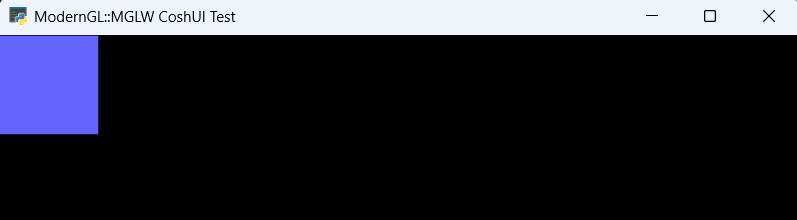
        <figcaption>Image of Blue 100x100 Container.</figcaption>
    </figure>

    <details class="cui-collapse">
    <summary><span class="cui-collapse-chevron">▸</span>CoshStyling Parameters</summary>
    <div class="cui-collapse-content" markdown="1">

    The `CoshStyling` object is what determines the visual identity of a Node. It offers a few parameters that let you change the entire look of a Node.

    #### Background Color and Alpha
    Background Color is almost a no-brainer. Its main purpose is to declare the color of the Node. It can be set like this: `background_color=(R, G, B)` or `background_color=(R, G, B, A)`.

    Alpha is also — again — a no-brainer. It determines the *transparency* of a Node. It can be set like this: `alpha=0-255`.

    You may notice, background color lets you set the alpha within it. Not to worry though, if the `alpha` field is set when the alpha value is set in `background_color`, the `alpha` field takes priority.

    #### Border
    Border sets an outline around a Node. It can be set like this: `border=((R, G, B), weight)` or `border=(R, G, B, weight)`

    #### Border Radius
    Border radius determines the *roundness* of a Node's corner. You can either set all corners or each individual corner like this: `border_radius=20` or `border_radius=(top-left, top-right, bottom-right, bottom-left)`

    #### Transforms
    CoshUI has ["transform" properties](../learn-the-api/getting-started.md#definition-of-terms){ data-preview }. Basically properties that only affect rendering, not layout.

    The first is `transform_position`, which lets you offset the node relative to its position. Basically (0, 50) means it moves 50 pixels downward from its current position. It can be set like this: `transform_position=(x, y)`

    The next one is `transform_scale`, which changes the **scale** of a Node with the default being 1.0. It can be set like this: `transform_scale=2.0` which makes the Node 2x bigger relative to its center.

    The last one is `transform_rotation`, which rotates the Node based counter-clockwise on the passed degree. It can be set like this: `transform_rotation=45.0` which tilts the node 45 degrees counter-clockwise.

    To learn more about styling, check the [Styling](../learn-the-api/styling/index.md){ data-preview } section in the API.  

    </div>
    </details>

    <details class="cui-collapse">
    <summary><span class="cui-collapse-chevron">▸</span>Reusable Styling Through Classes</summary>
    <div class="cui-collapse-content" markdown="1">
    
    If you've noticed, styling can be somewhat tedious, especially if it's the same styles applied to multiple Nodes. To make it easier, CoshUI has a *class* system that you can utilize to apply the same styles to many Nodes without re-declaring the same `CoshStyling` object. To use it you have to declare the class and the `CoshStyling` object **inside** the `__init__` method like this:

    ```python title="moderngl_mglw_test.py"
    # This is called INSIDE the __init__ method.
    cui.add_class(
        "example_class", 
        cui.CoshStyling(background_color=(255, 100, 100), border_radius=10, border=((255, 255, 255), 5))
    )
    ```

    with that, you can now pass in that style to a Node by passing it through the `classes` field with the string itself (`classes="example_class"`) or a list (`classes=["example_class"]`). Here's an example:

    ```python title="moderngl_mglw_test.py"
    with cui.CoshUIRenderer(self.coshui_backend):
        cui.Container(
            id="root_container", 
            width=100, height=100, 
            classes="example_class"
        )
    ```

    The cool thing about classes is that you can pass in ***multiple*** classes at the same time, so if you declare multiple classes with different styling for each, the Node will take in all of it like this: 

    ```python title="moderngl_mglw_test.py"
    # Inside the __init__ method
    cui.add_class(
        "example_class", 
        cui.CoshStyling(background_color=(255, 100, 100), border_radius=10, border=((255, 255, 255), 5))
    )
    cui.add_class(
        "example_class2", 
        cui.CoshStyling(alpha=150)
    )

    # in CoshUIRenderer
    with cui.CoshUIRenderer(self.coshui_backend):
        cui.Container(
            id="root_container", 
            width=100, height=100, 
            classes="example_class example_class2"
        )
    ```

    You can pass multiple classes like this where you just add in a space to the string, but if your class name itself has a space (for some reason), it's better to pass it through a list like this:

    ```python title="moderngl_mglw_test.py"
    classes=["example_class", "example_class2"]
    ```

    !!! question "Class Ordering"
        A question appears with multiple classes, what styles get added if there are conflicting styles? In CoshUI, the classes that are added ***later*** in the `classes` field will override the ones added before. In the example above, if the two classes had conflicting properties, the one added latest will override the ones before. And of course, explicit styling (styles directly added through the `style` field) takes highest priority.

        **Example:**
        ```python title="moderngl_mglw_test.py"
        cui.add_class(
            "blue",
            cui.CoshStyling(background_color=(0, 0, 255))
        )

        cui.add_class(
            "red",
            cui.CoshStyling(background_color=(255, 0, 0))
        )

        cui.Container(
            classes="red blue"
        )
        ```
        In this example, the color of the Container will be blue.

    If you want to learn more about reusable styling, check out the [Classes](../learn-the-api/styling/classes.md){ data-preview } section in the API.

    </div>
    </details>

    ---

    ## Layout Fundamentals
    Before moving on, let's learn a little bit about the layout properties you can set which gives you maximum control over your UI. 
    
    As this is a little much to take on all at once, I've made every part collapsible so it's easier to digest one at a time.

    <details class="cui-collapse">
    <summary><span class="cui-collapse-chevron">▸</span>Width and Height</summary>
    <div class="cui-collapse-content" markdown="1">

    As shown in earlier sections, you can set width and height. These two properties are [Universal Properties](../learn-the-api/getting-started.md#definition-of-terms){ data-preview }, meaning they exist and can be set in every Node within CoshUI. They determine the size of your Node based on pixels. Here are the 4 ways to set width and height:

    ```python title="moderngl_mglw_test.py"
    # Fixed
    cui.Container(
        width=100
    )
    # Fill
    cui.Container(
        width=cui.FILL
    )
    # AUTO
    cui.Container(
        width=cui.AUTO
    )
    # Percentage
    cui.Container(
        width=cui.PERCENTAGE(75)
    )
    ```

    To learn more, check out the [Width and Height](../learn-the-api/layout/width-and-height.md#introduction){ data-preview } section in the API.

    </div>
    </details>

    <details class="cui-collapse">
    <summary><span class="cui-collapse-chevron">▸</span>Padding and Margin</summary>
    <div class="cui-collapse-content" markdown="1">

    Margin is a [Universal Property](../learn-the-api/getting-started.md#definition-of-terms){ data-preview } whilst padding is a [Local Property](../learn-the-api/getting-started.md#definition-of-terms){ data-preview } and can only be set within `ParentNodes` (Nodes that can take in children). An example of a `ParentNode` would be `Container`. Margin is the property that dictates the space other nodes need to give around that specific Node, while padding dictates the distance the children should be from the edges of that `ParentNode`. You can set padding and margin like this:

    ```python title="moderngl_mglw_test.py"
    cui.Container(padding=10, margin=10)
    ```

    To learn more, check out the [Padding and Margin](../learn-the-api/layout/padding-and-margin.md#introduction){ data-preview } section in the API.

    </div>
    </details>

    <details class="cui-collapse">
    <summary><span class="cui-collapse-chevron">▸</span>Positioning</summary>
    <div class="cui-collapse-content" markdown="1">

    Positioning is a simple toggle in CoshUI. It determines whether a Node will be added to the layout calculations or not. The default is `RELATIVE`, meaning it will take up space and other Nodes will respect that space, setting it to `ABSOLUTE` makes it so that Node no longer gets added to layout calculations. Other Nodes will take that Node's space, kind of like it doesn't exist anymore to them. This also opens up the `x` and `y` parameters discussed next. Setting `positioning` is like this:

    ```python title="moderngl_mglw_test.py"
    # ABSOLUTE
    cui.Container(positioning=cui.ABSOLUTE)
    # RELATIVE (This is default so there's no point in setting this)
    cui.Container(positioning=cui.RELATIVE)
    ```

    To learn more, check out the [Positioning](../learn-the-api/layout/absolute-vs-relative.md#introduction){ data-preview } section in the API.

    </div>
    </details>

    <details class="cui-collapse">
    <summary><span class="cui-collapse-chevron">▸</span>Position</summary>
    <div class="cui-collapse-content" markdown="1">

    Position in CoshUI refers to the `x` and `y` properties, and these are a bit *special*. It can only be mutated when the `positioning` parameter is set to `ABSOLUTE`, if not then adding values to `x` and `y` does nothing. What `x` and `y` do is directly offsets the position (relative to the parent) of the node *layout-wise*. To set `x` and `y`, you need to first set `positioning` to `ABSOLUTE` first, like this:

    ```python title="moderngl_mglw_test.py"
    cui.Container(positioning=cui.ABSOLUTE, x=50, y=100)
    ```

    To learn more, check out the [Position](../learn-the-api/layout/position.md#introduction){ data-preview } section in the API.

    </div>
    </details>

    <details class="cui-collapse">
    <summary><span class="cui-collapse-chevron">▸</span>Align and Justify</summary>
    <div class="cui-collapse-content" markdown="1">

    The `align` and `justify` properties for CoshUI are [Local Properties](../learn-the-api/getting-started.md#definition-of-terms){ data-preview }, they are accessible only through `ParentNodes` like `Container` or `Grid`. They determine the position of that Nodes children within itself. They can be set like this:

    ```python title="moderngl_mglw_test.py"
    # Note that these are only accessible through ParentNodes.
    cui.Container(align=cui.ALIGN_CENTER, justify=cui.JUSTIFY_CENTER)

    # These are the values you can set align and justify to.
    align=cui.ALIGN_START
    align=cui.ALIGN_CENTER
    align=cui.ALIGN_END
    justify=cui.JUSTIFY_START
    justify=cui.JUSTIFY_CENTER
    justify=cui.JUSTIFY_END
    justify=cui.JUSTIFY_SPACE_AROUND
    justify=cui.JUSTIFY_SPACE_BETWEEN
    justify=cui.JUSTIFY_SPACE_EVENLY
    ```

    As this is a complex topic, it is encouraged to check the [Align and Justify](../learn-the-api/layout/align-and-justify.md#introduction){ data-preview } section in the API.

    </div>
    </details>

    <details class="cui-collapse">
    <summary><span class="cui-collapse-chevron">▸</span>Gap</summary>
    <div class="cui-collapse-content" markdown="1">

    The `gap` property only exists in `ParentNodes`. It's a simple property, all it does is determine the gap children will have between each other. Here's how to set it:

    ```python title="moderngl_mglw_test.py"
    with cui.Container(gap=10):
        ...
    ```

    The example above makes it so the children of the `Container` will have a gap of 10 pixels between each other.

    </div>
    </details>

    <details class="cui-collapse">
    <summary><span class="cui-collapse-chevron">▸</span>Direction</summary>
    <div class="cui-collapse-content" markdown="1">

    The `direction` property is a property that only the `Container` widget possesses, it determines whether children will be placed horizontally or vertically. It's default value is `ROW` and setting it is simple:

    ```python title="moderngl_mglw_test.py"
    with cui.Container(direction=cui.COLUMN):
        ...
    ```

    You can set it to both `ROW` and `COLUMN`, but `ROW` is default so there's no point in setting it unless you want to be explicit.

    </div>
    </details>

    ---

    ## Introducing Signals
    If you've used other UI frameworks, interaction systems usually use callback systems, which can be rather complex and a bit of a mess to set up. In CoshUI however, you can use what's called a "signal". Every Node will emit one, so if a Node is hovered over it will emit a `HOVERED` signal, if it is clicked it will emit a `CLICKED` signal. This comes automatically so users only need to poll those signals to check whether an event has happened to a Node or not, which lets you run your code if it has. 
    
    Let's declare a `Button()` — one of CoshUI's many widgets — and see how it works. Let's also make it so the Container's width and height fill the entire screen, here's how that will work:

    ```python title="moderngl_mglw_test.py"
    with cui.CoshUIRenderer(self.coshui_backend):
        with cui.Container(
            id="root_container", 
            width=cui.FILL, height=cui.FILL, 
            style=cui.CoshStyling(background_color=(100, 100, 255))
        ):
            cui.Button(id="example_button", text="Click to Print")
    ```
    If you run it, you might be able to notice the button having its own hover and click animations. That's an example of the signal system in action. Now to make it yourself, you need to make an `if` statement with the `get_signal()` function that CoshUI provides:

    ```python title="moderngl_mglw_test.py"
    with cui.CoshUIRenderer(self.coshui_backend):
        with cui.Container(
            id="root_container", 
            width=cui.FILL, height=cui.FILL, 
            style=cui.CoshStyling(background_color=(100, 100, 255))
        ):
            cui.Button(id="example_button", text="Click to Print")

    if cui.get_signal("example_button", cui.CLICKED):
        print("Hello World!")
    ```
    From the example, you can see that `get_signal()` takes in 2 parameters, the id of the Node you want to capture signals from and the event you want to poll. Once you click the button, it will now print `Hello World!` in the terminal.

    A nice thing about the signal system is that it works for every Node, not just buttons. If you want to see if a `Container` was clicked, you can poll it as long as it has an id. It's also additive, meaning if you make a signal on the same Node, it doesn't override others. 

    **Example:**
    ```python title="moderngl_mglw_test.py"
    with cui.CoshUIRenderer(self.coshui_backend):
        cui.Container(
            id="root_container", 
            width=cui.FILL, height=cui.FILL, 
            style=cui.CoshStyling(background_color=(100, 100, 255))
        )

    if cui.get_signal("root_container", cui.CLICKED):
        print("Hello World!")
    ```

    <details class="cui-collapse">
    <summary><span class="cui-collapse-chevron">▸</span>Mouse Filters</summary>
    <div class="cui-collapse-content" markdown="1">
    
    In CoshUI, there are ways to customize *how* a Node receives and consumes interaction events. We can achieve that with the `mouse_filter` field which is a [Universal Property](../learn-the-api/getting-started.md#definition-of-terms){ data-preview }. 

    The first value you can set `mouse_filter` to is `IGNORE`:

    ```python title="moderngl_mglw_test.py"
    cui.Container(mouse_filter=cui.IGNORE)
    ```
    This makes it so the Node doesn't emit any signals while also letting Nodes below it receive the event.

    Next value is `PASS`:

    ```python title="moderngl_mglw_test.py"
    cui.Container(mouse_filter=cui.PASS)
    ```
    This lets the interaction event *pass through* the Node whilst also emitting the signal.

    Last value is `STOP`:

    ```python title="moderngl_mglw_test.py"
    cui.Container(mouse_filter=cui.STOP)
    ```
    This is the default value and makes it so it receives the event and consumes it, stopping the event from propagating to Nodes below.

    </div>
    </details>

    <details class="cui-collapse">
    <summary><span class="cui-collapse-chevron">▸</span>Different Interactions</summary>
    <div class="cui-collapse-content" markdown="1">

    As you may have already guessed, there are quite a few interactions that can be passed in to the signal system. Here's what they are:

    ```python title="moderngl_mglw_test.py"
    # Checks if the node was just clicked.
    cui.CLICKED

    # Checks if the node was just released from a click event.
    cui.RELEASED

    # Checks if the node is being clicked that frame.
    cui.PRESSED

    # Checks if the cursor entered the Node's boundaries.
    cui.HOVER_ENTER 

    # Checks if the cursor exited the Node's boundaries.
    cui.HOVER_EXIT 

    # Checks if the cursor is within the Node's boundaries. 
    cui.HOVERED 
    ```

    These can be passed to the second parameter of the `get_signal()` function. To learn more, check the [Signals](../learn-the-api/interactions/signals.md) section in the API.

    </div>
    </details>

    ---

    ## Introducing Animations
    When using other UI libraries, I'm willing to bet most of them have little to no built-in animation systems. Some may have external libraries that help with animations but for the most part, animations are either fully missing or not even considered a first-class citizen. 
    
    CoshUI is different, it has its own animation system built upon the reconciliation structure. You've most probably seen it work in the previous section as the `Button()` widget has built-in animations. 
    
    So let's address how to animate Nodes. CoshUI has an `animate()` function that takes in 5 parameters, `n_property`, `target_id`, `end_value`, `duration`, and finally `easing`. Here's an example of how it works:

    ```python title="moderngl_mglw_test.py"
    if cui.get_signal("example_button", cui.CLICKED):
        cui.animate("transform_position", "example_button", (0, 50), 1.5, "ease_out_bounce")
    ```
    The example above shows a use case for animation, it makes it so if the button is clicked, it will animate its rendered position downwards 50 pixels in 1.5 seconds with an easing curve of "ease_out_bounce".

    <figure markdown>
        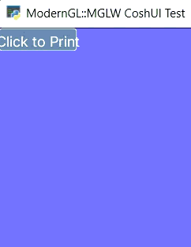
        <figcaption>Gif of button being clicked then falling.</figcaption>
    </figure>

    <details class="cui-collapse">
    <summary><span class="cui-collapse-chevron">▸</span>Properties and Easing Curves</summary>
    <div class="cui-collapse-content" markdown="1">

    As explained, CoshUI's animation system has many parameters, and some of them aren't very straightforward, especially the Node properties you can animate and the easing curves. Here's a comprehensive list of properties you can pass to CoshUI's `animate()` function.

    | Properties | Description |
    | :--- | :--- |
    | `background_color` | Smoothly shifts the Node's background to a new RGB color. |
    | `alpha` | Fades the Node in or out by easing its transparency toward the target value. |
    | `transform_position` | Glides the Node to a new offset position, without affecting layout. |
    | `transform_scale` | Grows or shrinks the Node toward the target scale, relative to its center. |
    | `transform_rotation` | Spins the Node counter-clockwise toward the target rotation, in degrees. |

    When it comes to easing curves, CoshUI's list is quite small currently but should be enough for most use cases. A quick note would be the `_in` suffix on the easing means the movement is applied at the beginning and the `_out` suffix means the movement is applied at the end. Here is CoshUI's list:

    | Easing Curves | Description |
    | :--- | :--- |
    | `linear` | Moves at a constant speed from start to finish — no acceleration or deceleration. |
    | `ease_in` | Starts slow and speeds up toward the end. |
    | `ease_out` | Starts fast and slows down toward the end. |
    | `ease_in_out` | Starts slow, speeds up in the middle, then slows down again at the end. |
    | `ease_in_bounce` | Bounces a few times right at the start before settling into motion. |
    | `ease_out_bounce` | Settles in with a few bounces at the end, like a ball coming to rest. |
    | `ease_in_elastic` | Winds up with a springy overshoot before snapping into motion. |
    | `ease_out_elastic` | Overshoots the target and wobbles back like a spring before settling. |

    To learn more about animations, check out the [Animation](../learn-the-api/animations/index.md) section in the API.

    </div>
    </details>

    ---

    ## Creating A Menu Screen
    Now that we've decently discussed CoshUI's capabilities, let's get on to actually creating something. We'll use the same boilerplate with the same `root_container` Container as declared but lets get back on track to actually making a basic version of something that you or someone might try making for a game. 

    ```python title="moderngl_mglw_test.py"
    with cui.CoshUIRenderer(self.coshui_backend):
        with cui.Container(id="root_container", width=cui.FILL, height=cui.FILL):
            pass
    ```
    With this container that fills the entire screen, we can then add a `Label()` widget acting as our game's title.

    ```python title="moderngl_mglw_test.py"
    with cui.CoshUIRenderer(self.coshui_backend):
        with cui.Container(id="root_container", width=cui.FILL, height=cui.FILL):
            cui.Label(id="title", text="CoshUI Test")
    ```
    If you run the file, you'll see our "CoshUI Test" label at the top-left. What we want is to put this at the very center, so let's use the `align` and `justify` parameters to put it to the center like this: 

    ```python title="moderngl_mglw_test.py"
    with cui.CoshUIRenderer(self.coshui_backend):
        with cui.Container(id="root_container", width=cui.FILL, height=cui.FILL, align=cui.ALIGN_CENTER, justify=cui.JUSTIFY_CENTER):
            cui.Label(id="title", text="CoshUI Test")
    ```
    If you followed everything correctly (or copy pasted the code), it should show "CoshUI Test" being at the middle of the screen. Let's add a couple of buttons to make it *look* like a menu screen shall we? Let's also wrap the `Label()` in a container so we can set the direction to `COLUMN` instead of `ROW`:

    ```python title="moderngl_mglw_test.py"
    with cui.CoshUIRenderer(self.coshui_backend):
        with cui.Container(id="root_container", width=cui.FILL, height=cui.FILL, align=cui.ALIGN_CENTER, justify=cui.JUSTIFY_CENTER):
            with cui.Container(id="menu_container", direction=cui.COLUMN, align=cui.ALIGN_CENTER, justify=cui.JUSTIFY_CENTER):
                cui.Label(id="title", text="CoshUI Test")
                cui.Button(id="start_btn", text="Start")
                cui.Button(id="quit_btn", text="Quit")
    ```

    <figure>
        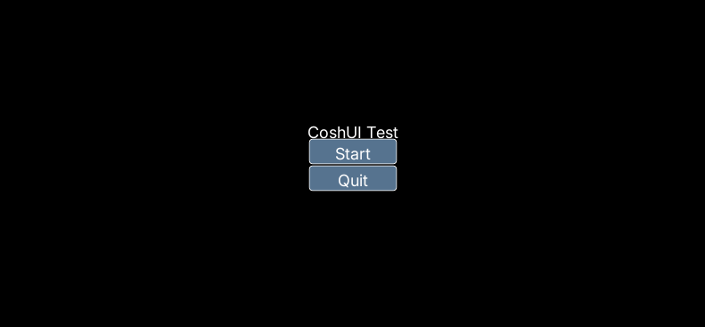
        <figcaption>Early Menu Screen</figcaption>
    </figure>

    If the image loaded properly, that's how your menu screen should look like. You might think: "This doesn't really look that good...", but that's okay, these are the default values. CoshUI supports styling overrides for the default styling. So lets start that:

    ```python title="moderngl_mglw_test.py"
    with cui.CoshUIRenderer(self.coshui_backend):
        with cui.Container(id="root_container", width=cui.FILL, height=cui.FILL, align=cui.ALIGN_CENTER, justify=cui.JUSTIFY_CENTER):
            with cui.Container(id="menu_container", direction=cui.COLUMN, align=cui.ALIGN_CENTER, justify=cui.JUSTIFY_CENTER, gap=10):
                cui.Label(id="title", text="CoshUI Test", font_size=56)
                cui.Button(id="start_btn", text="Start")
                cui.Button(id="quit_btn", text="Quit")
    ```
    We've added a small gap between all the children and also made the title bigger which mirrors most basic menu screens. Now let's style our buttons, if you've read the "Reusable Styling Through Classes" in this page's [Styling Your First Element](#styling-your-first-element), you'd know we can create classes to reuse. Let's do just that for buttons:

    ```python title="moderngl_mglw_test.py"
    cui.add_class(
        "menu_buttons", 
        cui.CoshStyling(background_color=(220, 165, 255), border=None, border_radius=(10, 0, 10, 0))
    )
    ```
    Reminder to place this code ***inside*** the `__init__` method. If you've set up the class, then you can do this to add the custom styling to your buttons:

    ```python title="moderngl_mglw_test.py"
    with cui.CoshUIRenderer(self.coshui_backend):
        with cui.Container(id="root_container", width=cui.FILL, height=cui.FILL, align=cui.ALIGN_CENTER, justify=cui.JUSTIFY_CENTER):
            with cui.Container(id="menu_container", direction=cui.COLUMN, align=cui.ALIGN_CENTER, justify=cui.JUSTIFY_CENTER, gap=10):
                cui.Label(id="title", text="CoshUI Test", font_size=56)
                cui.Button(id="start_btn", text="Start", classes="menu_buttons")
                cui.Button(id="quit_btn", text="Quit", classes="menu_buttons")
    ```

    <figure>
        
        <figcaption>Menu Screen with Custom Buttons</figcaption>
    </figure>

    Now lets add some interaction such as making it so when you click the "Quit" button it closes the window:

    ```python title="moderngl_mglw_test.py"
    with cui.CoshUIRenderer(self.coshui_backend):
        with cui.Container(id="root_container", width=cui.FILL, height=cui.FILL, align=cui.ALIGN_CENTER, justify=cui.JUSTIFY_CENTER):
            with cui.Container(id="menu_container", direction=cui.COLUMN, align=cui.ALIGN_CENTER, justify=cui.JUSTIFY_CENTER, gap=10):
                cui.Label(id="title", text="CoshUI Test", font_size=56)
                cui.Button(id="start_btn", text="Start", classes="menu_buttons")
                cui.Button(id="quit_btn", text="Quit", classes="menu_buttons")

    if cui.get_signal("quit_btn", cui.CLICKED):
        self.wnd.close()
    ```

    With that, the quit button should be fully functional. Before this tutorial ends though, let's add some functionality to our "Start" button, something simple like a fade out effect with CoshUI's animation system:

    ```python title="moderngl_mglw_test.py"
    with cui.CoshUIRenderer(self.coshui_backend):
        with cui.Container(id="root_container", width=cui.FILL, height=cui.FILL, align=cui.ALIGN_CENTER, justify=cui.JUSTIFY_CENTER):
            with cui.Container(id="menu_container", direction=cui.COLUMN, align=cui.ALIGN_CENTER, justify=cui.JUSTIFY_CENTER, gap=10):
                cui.Label(id="title", text="CoshUI Test", font_size=56)
                cui.Button(id="start_btn", text="Start", classes="menu_buttons")
                cui.Button(id="quit_btn", text="Quit", classes="menu_buttons")

    if cui.get_signal("start_btn", cui.CLICKED):
        cui.animate("alpha", "menu_container", 0, 1.5, "linear")
    if cui.get_signal("quit_btn", cui.CLICKED):
        self.wnd.close()
    ```

    <figure markdown>
        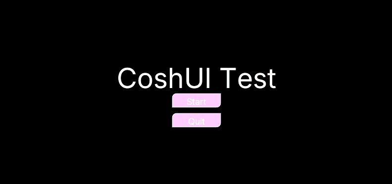
        <figcaption>Menu Screen fading when clicking Start</figcaption>
    </figure>

    Now you might worry about the UI still being rendered when alpha is set to 0 but you don't need to as Elements get skipped when `alpha` is set to 0 or if `background_color` has no value, so your frame budget will be less than what's necessarily there.

    ---

    ## Final Remarks 
    And with that, that should give you the basic understanding of how to use CoshUI. This tutorial can't cover everything like image rendering or other widgets such as `Grid`, `Modal`, `Slider`, and more. So if you want to dive even deeper and create cooler things with CoshUI, you can head on over to the [Learn The API](../learn-the-api/getting-started.md){ data-preview } section for more.

    And of course, here's the final code file we worked on:

    ```python title="moderngl_mglw_test.py"
    import moderngl_window as mglw
    import coshui as cui

    class MyRenderer(mglw.WindowConfig):
        gl_version = (3, 3)
        title = "ModernGL::MGLW CoshUI Test"
        window_size = (800, 800)
        aspect_ratio = 16 / 9
        resizable = True

        def __init__(self, **kwargs):
            super().__init__(**kwargs)
            self.mouse_x = 0
            self.mouse_y = 0
            self.coshui_backend = cui.ModernGLBackend(self.ctx, cui.MGLW)

            cui.add_class(
                "menu_buttons", 
                cui.CoshStyling(background_color=(220, 165, 255), border=None, border_radius=(10, 0, 10, 0))
            )

        def on_render(self, time: float, frametime: float):
            self.ctx.clear(0.0, 0.0, 0.0)

            with cui.CoshUIRenderer(self.coshui_backend):
                with cui.Container(id="root_container", width=cui.FILL, height=cui.FILL, align=cui.ALIGN_CENTER, justify=cui.JUSTIFY_CENTER):
                    with cui.Container(id="menu_container", direction=cui.COLUMN, align=cui.ALIGN_CENTER, justify=cui.JUSTIFY_CENTER, gap=10):
                        cui.Label(id="title", text="CoshUI Test", font_size=56)
                        cui.Button(id="start_btn", text="Start", classes="menu_buttons")
                        cui.Button(id="quit_btn", text="Quit", classes="menu_buttons")

            if cui.get_signal("start_btn", cui.CLICKED):
                cui.animate("alpha", "menu_container", 0, 1.5, "linear")
            if cui.get_signal("quit_btn", cui.CLICKED):
                self.wnd.close()

        def on_resize(self, width: int, height: int):
            self.ctx.viewport = (0, 0, width, height)

        def on_mouse_position_event(self, x, y, dx, dy):
            self.mouse_x = x
            self.mouse_y = y

            # NOTE: This `on_mouse_position_event` method and this _mouse_pos = (x, y) is
            # necessary for CoshUI's interaction system to work. 
            mglw.window()._mouse_pos = (x, y)

    if __name__ == '__main__':
        mglw.run_window_config(MyRenderer)
    ```