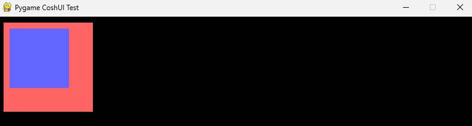

# Padding and Margin

### Introduction

As explained in the **Overview** section, `padding` and `margin` determines the space around and within your nodes, exactly like CSS.  

Do note, `padding` only exists for `ParentNodes` (e.g., `Container`, `Grid`, `Modal`), whilst `margin` exists for **all** Nodes.

```python title="Setting padding and margin"
with cui.CoshUIRenderer(...):
    with cui.Container(id="example_container", width=150, height=150, padding=10, margin=10, style=cui.CoshStyling(background_color=(255, 100, 100))):
        with cui.Container(id="sub_container", width=100, height=100, style=cui.CoshStyling(background_color=(100, 100, 255))):
            pass
```

The code-block above will show the inner container being 10 pixels offset from the top-left of the outer container. At the same time, the outer container should be 10 pixels offset from the top-left of the screen.

<figure>
    
</figure>

!!! info "Unlike CSS"
    CoshUI's `padding` and `margin` is a little primitive compared to CSS. With the current version (v{{ version }}) targeting specific sides is not supported as of yet. The attributes only take in integers/floats.

---

### Default Behavior

The default behavior of `padding` and `margin` is 0.0 if they aren't set and they're not set in the *Current Theme*.

```python title="Default Behavior"
with cui.CoshUIRenderer(...):
    # The padding and margin properties are set to the default of 0.0
    with cui.Container(id="example_container", width=150, height=150):
        pass
```